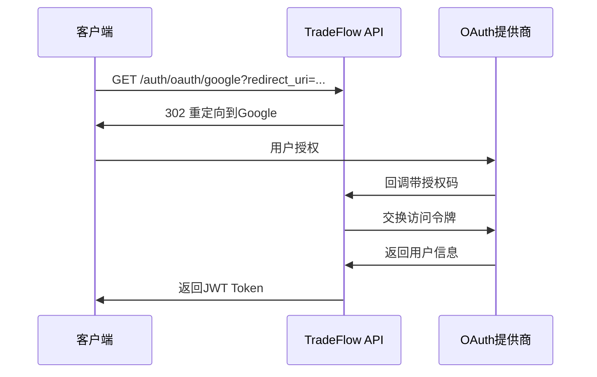

# TradeFlow API 安全设计

## 📋 文档概述

本文档定义了TradeFlow项目的API安全架构、认证授权机制、数据保护策略和安全实施标准。确保系统在处理敏感的贸易数据时达到企业级安全标准。

- **版本**: v1.0
- **创建日期**: 2025-01-07
- **安全等级**: 企业级
- **合规标准**: GDPR、SOC 2、ISO 27001
- **更新周期**: 月度安全评估

## 🛡️ 安全架构概述

### 核心安全原则
1. **零信任架构**: 永不信任，始终验证
2. **最小权限原则**: 仅授予必要的最小权限
3. **深度防御**: 多层安全控制
4. **数据保护**: 传输和存储全程加密
5. **审计追踪**: 完整的安全事件记录

### 安全边界定义
```yaml
外部边界:
  - 公网入口 (CDN + WAF)
  - API网关 (认证 + 限流 + 监控)
  
应用边界:
  - 前端应用 (CSP + CSRF + XSS防护)
  - 后端API (JWT + 权限控制)
  
数据边界:
  - 数据库 (连接加密 + 访问控制)
  - 文件存储 (加密存储 + 访问策略)
  - 缓存层 (敏感数据加密)
```

## 🔐 认证机制设计

### 1. OAuth 2.0 集成

#### 1.1 支持的OAuth提供商

```yaml
Google OAuth 2.0:
  - Client ID: 环境变量配置
  - Client Secret: 安全存储
  - Scopes: openid, email, profile
  - 回调URL: https://api.tradeflow.com/auth/oauth/google/callback

GitHub OAuth:
  - Client ID: 环境变量配置  
  - Client Secret: 安全存储
  - Scopes: user:email, read:user
  - 回调URL: https://api.tradeflow.com/auth/oauth/github/callback
```

#### 1.2 OAuth登录流程



#### 1.3 授权码交换安全

```python
# 安全实现示例
async def exchange_oauth_code(code: str, provider: str) -> UserToken:
    # 验证state参数防CSRF
    if not verify_state_token(request.args.get('state')):
        raise SecurityError("Invalid state parameter")
    
    # 验证授权码格式
    if not validate_auth_code_format(code):
        raise ValidationError("Invalid authorization code format")
        
    # 安全的HTTP请求
    async with httpx.AsyncClient(
        timeout=30,
        verify=True,  # 强制SSL证书验证
        limits=httpx.Limits(max_connections=10)
    ) as client:
        # 交换访问令牌
        token_response = await client.post(
            oauth_provider.token_url,
            data={
                'client_id': settings.oauth_client_id,
                'client_secret': settings.oauth_client_secret,
                'code': code,
                'grant_type': 'authorization_code'
            },
            headers={'Accept': 'application/json'}
        )
        
    # 验证响应
    if token_response.status_code != 200:
        log_security_event("oauth_token_exchange_failed", {
            "provider": provider,
            "status_code": token_response.status_code
        })
        raise AuthenticationError("Token exchange failed")
```

### 2. JWT Token管理

#### 2.1 Token结构设计

```json
{
  "header": {
    "alg": "RS256",
    "typ": "JWT",
    "kid": "key_id_2025_01"
  },
  "payload": {
    "iss": "https://api.tradeflow.com",
    "sub": "user_123456",
    "aud": "tradeflow-api",
    "exp": 1736161200,
    "iat": 1736074800,
    "nbf": 1736074800,
    "jti": "token_uuid",
    "user_id": "user_123456",
    "email": "user@example.com",
    "roles": ["user"],
    "permissions": ["chat:create", "files:upload"],
    "subscription_tier": "pro",
    "session_id": "session_uuid"
  }
}
```

#### 2.2 Token生命周期管理

```yaml
Access Token:
  生命周期: 24小时
  用途: API访问
  存储位置: 内存（不持久化到localStorage）
  刷新策略: 自动刷新

Refresh Token:
  生命周期: 30天
  用途: 刷新Access Token
  存储位置: HttpOnly Cookie
  安全属性: Secure, SameSite=Strict
  
Token黑名单:
  实现方式: Redis集合
  清理策略: Token过期后自动清理
  用途: 立即撤销Token访问权限
```

#### 2.3 Token签名和验证

```python
# 安全的Token生成
def generate_jwt_token(user: User, session_id: str) -> TokenPair:
    now = datetime.utcnow()
    
    # Access Token声明
    access_claims = {
        'iss': settings.jwt_issuer,
        'sub': user.id,
        'aud': 'tradeflow-api',
        'exp': now + timedelta(hours=24),
        'iat': now,
        'nbf': now,
        'jti': str(uuid4()),
        'user_id': user.id,
        'email': user.email,
        'roles': user.roles,
        'permissions': get_user_permissions(user),
        'subscription_tier': user.subscription_tier,
        'session_id': session_id
    }
    
    # 使用RS256算法签名
    access_token = jwt.encode(
        access_claims,
        get_private_key(),
        algorithm='RS256',
        headers={'kid': get_current_key_id()}
    )
    
    # Refresh Token声明（最小化信息）
    refresh_claims = {
        'iss': settings.jwt_issuer,
        'sub': user.id,
        'aud': 'tradeflow-refresh',
        'exp': now + timedelta(days=30),
        'iat': now,
        'jti': str(uuid4()),
        'session_id': session_id
    }
    
    refresh_token = jwt.encode(
        refresh_claims,
        get_private_key(),
        algorithm='RS256'
    )
    
    return TokenPair(access_token, refresh_token)

# 密钥轮换支持
def get_private_key() -> str:
    """获取当前私钥，支持密钥轮换"""
    key_id = get_current_key_id()
    return load_private_key(key_id)
    
def get_public_keys() -> Dict[str, str]:
    """返回所有有效公钥，用于Token验证"""
    return {
        key_id: load_public_key(key_id)
        for key_id in get_valid_key_ids()
    }
```

#### 2.4 Token刷新策略

```python
# 安全的Token刷新
@router.post("/auth/refresh")
async def refresh_token(
    refresh_token: str = Body(...),
    current_session: Session = Depends(get_current_session)
):
    try:
        # 验证Refresh Token
        payload = jwt.decode(
            refresh_token,
            get_public_key(get_key_id(refresh_token)),
            algorithms=['RS256'],
            audience='tradeflow-refresh'
        )
        
        # 检查Token黑名单
        if await is_token_blacklisted(payload['jti']):
            raise AuthenticationError("Token has been revoked")
            
        # 验证会话有效性
        session_id = payload['session_id']
        if not await is_session_valid(session_id):
            raise AuthenticationError("Session expired")
            
        # 获取用户信息
        user = await get_user_by_id(payload['sub'])
        if not user or not user.is_active:
            raise AuthenticationError("User not found or inactive")
            
        # 生成新Token对
        new_tokens = generate_jwt_token(user, session_id)
        
        # 将旧的Refresh Token加入黑名单
        await blacklist_token(payload['jti'])
        
        return {
            "access_token": new_tokens.access_token,
            "expires_in": 86400,  # 24小时
            "token_type": "Bearer"
        }
        
    except jwt.ExpiredSignatureError:
        raise AuthenticationError("Refresh token expired")
    except jwt.InvalidTokenError:
        raise AuthenticationError("Invalid refresh token")
```

### 3. Token黑名单机制

#### 3.1 黑名单实现

```python
# Redis黑名单管理
class TokenBlacklist:
    def __init__(self, redis_client):
        self.redis = redis_client
        self.blacklist_key = "token_blacklist"
        
    async def blacklist_token(self, jti: str, exp: datetime):
        """将Token加入黑名单"""
        ttl = int((exp - datetime.utcnow()).total_seconds())
        if ttl > 0:
            await self.redis.setex(
                f"{self.blacklist_key}:{jti}",
                ttl,
                "blacklisted"
            )
            
    async def is_blacklisted(self, jti: str) -> bool:
        """检查Token是否在黑名单中"""
        return await self.redis.exists(f"{self.blacklist_key}:{jti}")
        
    async def blacklist_user_tokens(self, user_id: str):
        """将用户所有Token加入黑名单（强制登出）"""
        # 获取用户所有活跃会话
        sessions = await get_user_sessions(user_id)
        for session in sessions:
            # 将会话相关的所有Token加入黑名单
            tokens = await get_session_tokens(session.id)
            for token in tokens:
                await self.blacklist_token(token.jti, token.exp)
```

#### 3.2 Token验证中间件

```python
# Token验证中间件
async def verify_jwt_token(
    authorization: str = Header(None),
    x_token: str = Header(None)
) -> TokenPayload:
    # 获取Token
    token = None
    if authorization and authorization.startswith("Bearer "):
        token = authorization[7:]
    elif x_token:
        token = x_token
    else:
        raise AuthenticationError("Missing authentication token")
        
    try:
        # 解码Token（不验证，只获取header）
        unverified_header = jwt.get_unverified_header(token)
        key_id = unverified_header.get('kid')
        
        if not key_id:
            raise AuthenticationError("Missing key ID in token")
            
        # 获取对应的公钥
        public_key = get_public_key(key_id)
        if not public_key:
            raise AuthenticationError("Invalid key ID")
            
        # 验证Token签名和声明
        payload = jwt.decode(
            token,
            public_key,
            algorithms=['RS256'],
            audience='tradeflow-api',
            issuer=settings.jwt_issuer
        )
        
        # 检查Token黑名单
        if await is_token_blacklisted(payload['jti']):
            raise AuthenticationError("Token has been revoked")
            
        # 验证会话状态
        session_id = payload.get('session_id')
        if session_id and not await is_session_valid(session_id):
            raise AuthenticationError("Session expired")
            
        return TokenPayload(**payload)
        
    except jwt.ExpiredSignatureError:
        raise AuthenticationError("Token expired")
    except jwt.InvalidTokenError as e:
        log_security_event("invalid_token", {"error": str(e)})
        raise AuthenticationError("Invalid token")
```

## 🔑 授权策略设计

### 4. 基于角色的访问控制 (RBAC)

#### 4.1 角色定义

```yaml
用户角色:
  guest:
    描述: 未注册用户
    权限: 查看公开信息
    限制: 无法使用AI功能
    
  user:
    描述: 注册用户
    权限: 基础AI对话、文件上传、买家开发
    限制: 有使用配额限制
    
  pro_user:
    描述: 付费用户
    权限: user权限 + 高级功能 + 更高配额
    限制: 企业功能受限
    
  enterprise_user:
    描述: 企业用户
    权限: 所有用户功能 + 企业级功能
    限制: 管理功能受限
    
  admin:
    描述: 系统管理员
    权限: 系统管理、用户管理、数据分析
    限制: 无
```

#### 4.2 权限矩阵

```yaml
功能模块权限:
  认证管理:
    auth:login: [guest, user, pro_user, enterprise_user, admin]
    auth:refresh: [user, pro_user, enterprise_user, admin]
    auth:logout: [user, pro_user, enterprise_user, admin]
    
  用户管理:
    user:view_profile: [user, pro_user, enterprise_user, admin]
    user:edit_profile: [user, pro_user, enterprise_user, admin]
    user:delete_account: [user, pro_user, enterprise_user, admin]
    user:view_usage: [user, pro_user, enterprise_user, admin]
    user:manage_users: [admin]
    
  AI对话:
    chat:create: [user, pro_user, enterprise_user, admin]
    chat:history: [user, pro_user, enterprise_user, admin]
    chat:delete: [user, pro_user, enterprise_user, admin]
    chat:export: [pro_user, enterprise_user, admin]
    
  文件管理:
    files:upload: [user, pro_user, enterprise_user, admin]
    files:view: [user, pro_user, enterprise_user, admin]
    files:download: [user, pro_user, enterprise_user, admin]
    files:delete: [user, pro_user, enterprise_user, admin]
    files:share: [pro_user, enterprise_user, admin]
    
  买家开发:
    buyers:search: [user, pro_user, enterprise_user, admin]
    buyers:recommend: [user, pro_user, enterprise_user, admin]
    buyers:export: [pro_user, enterprise_user, admin]
    buyers:bulk_operations: [enterprise_user, admin]
    
  供应商匹配:
    suppliers:search: [user, pro_user, enterprise_user, admin]
    suppliers:compare: [user, pro_user, enterprise_user, admin]
    suppliers:export: [pro_user, enterprise_user, admin]
    suppliers:bulk_operations: [enterprise_user, admin]
    
  订阅管理:
    subscription:view: [user, pro_user, enterprise_user, admin]
    subscription:create: [user, pro_user, enterprise_user, admin]
    subscription:cancel: [user, pro_user, enterprise_user, admin]
    subscription:manage_all: [admin]
    
  系统管理:
    system:health: [admin]
    system:metrics: [admin]
    system:logs: [admin]
    system:config: [admin]
```

#### 4.3 权限验证实现

```python
# 权限装饰器
def require_permission(permission: str):
    def decorator(func):
        async def wrapper(*args, **kwargs):
            # 从依赖注入获取当前用户
            current_user = kwargs.get('current_user')
            if not current_user:
                raise AuthenticationError("Authentication required")
                
            # 检查权限
            if not await has_permission(current_user, permission):
                log_security_event("permission_denied", {
                    "user_id": current_user.id,
                    "permission": permission,
                    "endpoint": func.__name__
                })
                raise AuthorizationError("Insufficient permissions")
                
            return await func(*args, **kwargs)
        return wrapper
    return decorator

# 权限检查函数
async def has_permission(user: User, permission: str) -> bool:
    """检查用户是否具有指定权限"""
    # 获取用户角色
    user_roles = user.roles
    
    # 检查每个角色是否有该权限
    for role in user_roles:
        role_permissions = await get_role_permissions(role)
        if permission in role_permissions:
            return True
            
    return False

# API端点权限验证
@router.get("/chat/history")
@require_permission("chat:history")
async def get_chat_history(
    current_user: User = Depends(get_current_user)
):
    # 业务逻辑
    pass
```

### 5. 资源访问控制

#### 5.1 资源所有权验证

```python
# 资源访问控制
async def verify_resource_access(
    user: User,
    resource_type: str,
    resource_id: str,
    action: str = "read"
) -> bool:
    """验证用户是否可以访问特定资源"""
    
    # 管理员可以访问所有资源
    if "admin" in user.roles:
        return True
        
    # 检查资源所有权
    resource_owner = await get_resource_owner(resource_type, resource_id)
    if resource_owner == user.id:
        return True
        
    # 检查共享权限
    shared_access = await check_shared_access(
        user.id, resource_type, resource_id, action
    )
    if shared_access:
        return True
        
    # 检查企业级访问权限
    if "enterprise_user" in user.roles:
        enterprise_access = await check_enterprise_access(
            user.company_id, resource_type, resource_id
        )
        if enterprise_access:
            return True
            
    return False

# 资源访问装饰器
def require_resource_access(resource_type: str, action: str = "read"):
    def decorator(func):
        async def wrapper(*args, **kwargs):
            current_user = kwargs.get('current_user')
            resource_id = kwargs.get('resource_id') or kwargs.get('id')
            
            if not await verify_resource_access(
                current_user, resource_type, resource_id, action
            ):
                raise AuthorizationError("Access denied to resource")
                
            return await func(*args, **kwargs)
        return wrapper
    return decorator
```

## 🚦 API限流设计

### 6. 限流策略

#### 6.1 限流规则设计

```yaml
基于用户等级的限流:
  guest用户:
    请求频率: 100 请求/小时
    并发连接: 2个
    文件上传: 禁止
    
  注册用户:
    请求频率: 1000 请求/小时
    并发连接: 5个
    文件上传: 10MB/次, 100MB/天
    
  付费用户:
    请求频率: 5000 请求/小时
    并发连接: 10个
    文件上传: 100MB/次, 1GB/天
    
  企业用户:
    请求频率: 20000 请求/小时
    并发连接: 50个
    文件上传: 1GB/次, 10GB/天

基于IP的限流:
  未认证IP: 100 请求/小时
  恶意IP: 永久封禁
  API爬取: 10 请求/分钟

端点级限流:
  高消耗端点:
    /chat: 100 请求/小时
    /files/upload: 50 请求/小时
    /buyers/recommend: 200 请求/小时
    
  普通端点:
    /auth/*: 1000 请求/小时
    /users/*: 500 请求/小时
```

#### 6.2 令牌桶算法实现

```python
# 令牌桶限流器
class TokenBucketRateLimiter:
    def __init__(self, redis_client):
        self.redis = redis_client
        
    async def is_allowed(
        self,
        key: str,
        limit: int,
        window: int,
        burst: int = None
    ) -> Tuple[bool, Dict[str, int]]:
        """
        检查请求是否被允许
        Args:
            key: 限流键（user_id或ip）
            limit: 时间窗口内允许的请求数
            window: 时间窗口（秒）
            burst: 突发请求数限制
        """
        if burst is None:
            burst = limit
            
        now = time.time()
        bucket_key = f"rate_limit:{key}"
        
        # 使用Redis Lua脚本保证原子性
        lua_script = """
        local bucket_key = KEYS[1]
        local limit = tonumber(ARGV[1])
        local window = tonumber(ARGV[2])
        local burst = tonumber(ARGV[3])
        local now = tonumber(ARGV[4])
        
        -- 获取当前桶状态
        local bucket = redis.call('HMGET', bucket_key, 'tokens', 'last_refill')
        local tokens = tonumber(bucket[1]) or burst
        local last_refill = tonumber(bucket[2]) or now
        
        -- 计算需要添加的令牌数
        local elapsed = now - last_refill
        local tokens_to_add = math.floor(elapsed * limit / window)
        tokens = math.min(burst, tokens + tokens_to_add)
        
        -- 检查是否有足够令牌
        if tokens >= 1 then
            tokens = tokens - 1
            -- 更新桶状态
            redis.call('HMSET', bucket_key, 
                'tokens', tokens, 
                'last_refill', now)
            redis.call('EXPIRE', bucket_key, window * 2)
            return {1, tokens, burst - tokens}
        else
            -- 更新最后检查时间但不消费令牌
            redis.call('HMSET', bucket_key, 
                'tokens', tokens, 
                'last_refill', now)
            redis.call('EXPIRE', bucket_key, window * 2)
            return {0, tokens, burst - tokens}
        end
        """
        
        result = await self.redis.eval(
            lua_script, 1, bucket_key, limit, window, burst, now
        )
        
        allowed = bool(result[0])
        remaining = int(result[1])
        used = int(result[2])
        
        return allowed, {
            'allowed': allowed,
            'remaining': remaining,
            'used': used,
            'reset_at': int(now + window)
        }

# 限流中间件
async def rate_limit_middleware(request: Request, call_next):
    # 获取用户标识
    user_id = getattr(request.state, 'user_id', None)
    client_ip = get_client_ip(request)
    
    # 确定限流策略
    if user_id:
        user = await get_user_by_id(user_id)
        limits = get_user_rate_limits(user)
        rate_limit_key = f"user:{user_id}"
    else:
        limits = get_ip_rate_limits()
        rate_limit_key = f"ip:{client_ip}"
    
    # 检查全局限流
    allowed, info = await rate_limiter.is_allowed(
        rate_limit_key,
        limits['requests_per_hour'],
        3600  # 1小时
    )
    
    if not allowed:
        # 记录限流事件
        log_security_event("rate_limit_exceeded", {
            "key": rate_limit_key,
            "endpoint": str(request.url),
            "user_agent": request.headers.get("user-agent")
        })
        
        # 返回限流响应
        return JSONResponse(
            status_code=429,
            content={
                "success": False,
                "error": {
                    "code": "RATE_LIMIT_EXCEEDED",
                    "message": "请求频率超过限制，请稍后重试"
                },
                "timestamp": datetime.utcnow().isoformat(),
                "request_id": str(uuid4())
            },
            headers={
                "X-RateLimit-Limit": str(limits['requests_per_hour']),
                "X-RateLimit-Remaining": str(info['remaining']),
                "X-RateLimit-Reset": str(info['reset_at']),
                "Retry-After": "3600"
            }
        )
    
    # 处理请求
    response = await call_next(request)
    
    # 添加限流头部
    response.headers["X-RateLimit-Limit"] = str(limits['requests_per_hour'])
    response.headers["X-RateLimit-Remaining"] = str(info['remaining'])
    response.headers["X-RateLimit-Reset"] = str(info['reset_at'])
    
    return response
```

### 7. 高级限流功能

#### 7.1 智能限流

```python
# 智能限流（基于异常行为检测）
class IntelligentRateLimiter:
    def __init__(self, redis_client):
        self.redis = redis_client
        self.ml_detector = AnomalyDetector()  # 机器学习异常检测
        
    async def detect_anomaly(self, user_id: str, request_pattern: Dict):
        """检测异常请求模式"""
        # 收集请求特征
        features = {
            'requests_per_minute': await self.get_recent_request_rate(user_id, 60),
            'unique_endpoints': await self.get_unique_endpoints_count(user_id, 3600),
            'error_rate': await self.get_error_rate(user_id, 3600),
            'file_upload_size': request_pattern.get('upload_size', 0),
            'geographic_spread': await self.get_geographic_spread(user_id, 3600)
        }
        
        # ML异常检测
        anomaly_score = await self.ml_detector.detect(features)
        
        if anomaly_score > 0.8:  # 高异常分数
            # 临时降低限流阈值
            await self.apply_temporary_restrictions(user_id, duration=1800)  # 30分钟
            
            # 记录安全事件
            log_security_event("anomaly_detected", {
                "user_id": user_id,
                "anomaly_score": anomaly_score,
                "features": features
            })
            
        return anomaly_score

    async def apply_temporary_restrictions(self, user_id: str, duration: int):
        """应用临时限制"""
        restrictions = {
            'requests_per_hour': 100,  # 降低到基础限制
            'file_upload_disabled': True,
            'high_cost_endpoints_blocked': True
        }
        
        await self.redis.setex(
            f"temp_restrictions:{user_id}",
            duration,
            json.dumps(restrictions)
        )
```

## 🔒 数据安全

### 8. HTTPS强制和传输安全

#### 8.1 TLS配置

```yaml
TLS配置:
  最低版本: TLS 1.2
  推荐版本: TLS 1.3
  密码套件: 
    - ECDHE-RSA-AES256-GCM-SHA384
    - ECDHE-RSA-AES128-GCM-SHA256
    - ECDHE-RSA-CHACHA20-POLY1305
  证书: 
    类型: EV SSL证书
    颁发机构: Let's Encrypt / DigiCert
    有效期: 90天自动续期
  HSTS配置:
    max-age: 31536000 (1年)
    includeSubDomains: true
    preload: true
```

#### 8.2 安全头部配置

```python
# 安全头部中间件
async def security_headers_middleware(request: Request, call_next):
    response = await call_next(request)
    
    # 强制HTTPS
    response.headers["Strict-Transport-Security"] = "max-age=31536000; includeSubDomains; preload"
    
    # 内容安全策略
    response.headers["Content-Security-Policy"] = (
        "default-src 'self'; "
        "script-src 'self' 'unsafe-inline' https://apis.google.com; "
        "style-src 'self' 'unsafe-inline'; "
        "img-src 'self' data: https:; "
        "connect-src 'self' https://api.tradeflow.com wss://api.tradeflow.com; "
        "frame-ancestors 'none';"
    )
    
    # XSS防护
    response.headers["X-Content-Type-Options"] = "nosniff"
    response.headers["X-Frame-Options"] = "DENY"
    response.headers["X-XSS-Protection"] = "1; mode=block"
    
    # 引用者策略
    response.headers["Referrer-Policy"] = "strict-origin-when-cross-origin"
    
    # 权限策略
    response.headers["Permissions-Policy"] = (
        "geolocation=(), microphone=(), camera=()"
    )
    
    return response
```

### 9. 请求签名验证

#### 9.1 API签名机制（可选的高安全场景）

```python
# 请求签名验证（针对高价值API）
class RequestSigner:
    def __init__(self, secret_key: str):
        self.secret_key = secret_key
        
    def sign_request(
        self, 
        method: str, 
        path: str, 
        body: str, 
        timestamp: int
    ) -> str:
        """生成请求签名"""
        # 构造签名字符串
        sign_string = f"{method}\n{path}\n{body}\n{timestamp}"
        
        # HMAC-SHA256签名
        signature = hmac.new(
            self.secret_key.encode(),
            sign_string.encode(),
            hashlib.sha256
        ).hexdigest()
        
        return signature
    
    def verify_signature(
        self, 
        signature: str,
        method: str,
        path: str,
        body: str,
        timestamp: int,
        max_age: int = 300  # 5分钟
    ) -> bool:
        """验证请求签名"""
        # 检查时间戳有效性
        now = int(time.time())
        if abs(now - timestamp) > max_age:
            return False
            
        # 计算期望签名
        expected_signature = self.sign_request(method, path, body, timestamp)
        
        # 常量时间比较防时序攻击
        return hmac.compare_digest(signature, expected_signature)

# 签名验证中间件
async def signature_verification_middleware(request: Request, call_next):
    # 只对特定端点要求签名
    protected_endpoints = ['/api/v1/payment/webhook']
    
    if str(request.url.path) in protected_endpoints:
        # 获取签名头部
        signature = request.headers.get('X-Signature')
        timestamp = request.headers.get('X-Timestamp')
        
        if not signature or not timestamp:
            return JSONResponse(
                status_code=401,
                content={"error": "Missing signature headers"}
            )
            
        # 读取请求体
        body = await request.body()
        
        # 验证签名
        signer = RequestSigner(settings.webhook_secret)
        if not signer.verify_signature(
            signature,
            request.method,
            str(request.url.path),
            body.decode(),
            int(timestamp)
        ):
            log_security_event("invalid_signature", {
                "path": str(request.url.path),
                "ip": get_client_ip(request)
            })
            return JSONResponse(
                status_code=401,
                content={"error": "Invalid signature"}
            )
    
    return await call_next(request)
```

### 10. 敏感数据加密

#### 10.1 数据加密策略

```yaml
加密范围:
  传输加密:
    - 所有API通信使用HTTPS/TLS
    - WebSocket连接使用WSS
    - 数据库连接使用SSL
    
  存储加密:
    - 用户密码: bcrypt哈希
    - OAuth令牌: AES-256-GCM加密
    - 文件内容: AES-256-GCM加密
    - 敏感配置: 环境变量 + Vault
    
  字段级加密:
    - 用户邮箱: 可逆加密（用于搜索）
    - 公司信息: AES-256-GCM
    - 聊天内容: 静态加密
```

#### 10.2 加密实现

```python
# 数据加密工具类
class DataEncryption:
    def __init__(self, master_key: str):
        self.master_key = master_key.encode()
        self.cipher_suite = Fernet(base64.urlsafe_b64encode(self.master_key[:32]))
        
    def encrypt_sensitive_field(self, data: str) -> str:
        """加密敏感字段"""
        if not data:
            return data
            
        # 添加随机盐
        salt = os.urandom(16)
        
        # AES-256-GCM加密
        cipher = AES.new(self.master_key[:32], AES.MODE_GCM, nonce=salt[:12])
        ciphertext, tag = cipher.encrypt_and_digest(data.encode())
        
        # 组合盐、标签和密文
        encrypted_data = salt + tag + ciphertext
        
        # Base64编码
        return base64.b64encode(encrypted_data).decode()
    
    def decrypt_sensitive_field(self, encrypted_data: str) -> str:
        """解密敏感字段"""
        if not encrypted_data:
            return encrypted_data
            
        try:
            # Base64解码
            data = base64.b64decode(encrypted_data)
            
            # 提取组件
            salt = data[:16]
            tag = data[16:32]
            ciphertext = data[32:]
            
            # AES-256-GCM解密
            cipher = AES.new(self.master_key[:32], AES.MODE_GCM, nonce=salt[:12])
            plaintext = cipher.decrypt_and_verify(ciphertext, tag)
            
            return plaintext.decode()
            
        except Exception as e:
            log_security_event("decryption_failed", {
                "error": str(e),
                "data_length": len(encrypted_data)
            })
            raise SecurityError("Failed to decrypt sensitive data")

# 数据模型加密字段
class User(BaseModel):
    id: str
    email_encrypted: str = Field(alias='email')  # 加密存储
    name: str
    
    def get_email(self) -> str:
        """获取解密的邮箱"""
        return encryption.decrypt_sensitive_field(self.email_encrypted)
    
    def set_email(self, email: str):
        """设置加密的邮箱"""
        self.email_encrypted = encryption.encrypt_sensitive_field(email)
```

### 11. SQL注入防护

#### 11.1 参数化查询

```python
# 安全的数据库查询
class SecureDatabase:
    def __init__(self, connection_pool):
        self.pool = connection_pool
        
    async def get_user_by_email(self, email: str) -> Optional[User]:
        """安全的用户查询"""
        # ✅ 使用参数化查询
        query = """
        SELECT id, email, name, created_at 
        FROM users 
        WHERE email = $1 AND is_active = true
        """
        
        async with self.pool.acquire() as conn:
            row = await conn.fetchrow(query, email)
            return User(**dict(row)) if row else None
    
    async def search_buyers_secure(
        self, 
        filters: BuyerSearchFilters
    ) -> List[Buyer]:
        """安全的买家搜索"""
        # 构建动态查询（安全方式）
        base_query = """
        SELECT b.id, b.company_name, b.country, b.industry
        FROM buyers b
        WHERE 1=1
        """
        
        params = []
        param_count = 0
        
        if filters.country:
            param_count += 1
            base_query += f" AND b.country = ${param_count}"
            params.append(filters.country)
            
        if filters.industry:
            param_count += 1
            base_query += f" AND b.industry = ${param_count}"
            params.append(filters.industry)
            
        if filters.company_name:
            param_count += 1
            # 使用ILIKE进行安全的模糊搜索
            base_query += f" AND b.company_name ILIKE ${param_count}"
            params.append(f"%{filters.company_name}%")
        
        # 添加排序和限制
        base_query += " ORDER BY b.created_at DESC LIMIT 100"
        
        async with self.pool.acquire() as conn:
            rows = await conn.fetch(base_query, *params)
            return [Buyer(**dict(row)) for row in rows]

# SQL注入检测中间件
async def sql_injection_detection(request: Request, call_next):
    """检测可能的SQL注入攻击"""
    # SQL注入特征模式
    sql_patterns = [
        r"(\bUNION\b|\bSELECT\b|\bINSERT\b|\bUPDATE\b|\bDELETE\b|\bDROP\b)",
        r"(\b(OR|AND)\b\s+\d+\s*=\s*\d+)",
        r"(\b(OR|AND)\b\s+\w+\s*=\s*\w+)",
        r"(--|#|/\*)",
        r"(\bEXEC\b|\bEXECUTE\b)"
    ]
    
    # 检查查询参数
    for key, value in request.query_params.items():
        for pattern in sql_patterns:
            if re.search(pattern, str(value), re.IGNORECASE):
                log_security_event("sql_injection_attempt", {
                    "ip": get_client_ip(request),
                    "parameter": key,
                    "value": str(value)[:100],  # 限制日志长度
                    "user_agent": request.headers.get("user-agent")
                })
                
                return JSONResponse(
                    status_code=400,
                    content={
                        "success": False,
                        "error": {
                            "code": "INVALID_INPUT",
                            "message": "检测到非法输入"
                        }
                    }
                )
    
    return await call_next(request)
```

### 12. XSS和CSRF防护

#### 12.1 XSS防护

```python
# XSS防护工具
class XSSProtection:
    # 允许的HTML标签和属性
    ALLOWED_TAGS = {
        'p', 'br', 'strong', 'em', 'u', 'ol', 'ul', 'li',
        'h1', 'h2', 'h3', 'h4', 'h5', 'h6', 'blockquote',
        'code', 'pre', 'a'
    }
    
    ALLOWED_ATTRIBUTES = {
        'a': ['href', 'title'],
        'code': ['class']
    }
    
    @staticmethod
    def sanitize_html(content: str) -> str:
        """清理HTML内容，防止XSS"""
        return bleach.clean(
            content,
            tags=XSSProtection.ALLOWED_TAGS,
            attributes=XSSProtection.ALLOWED_ATTRIBUTES,
            strip=True
        )
    
    @staticmethod
    def escape_user_input(text: str) -> str:
        """转义用户输入"""
        return html.escape(text, quote=True)

# 输入验证和清理
class SecureInputValidator:
    def __init__(self):
        self.xss_protection = XSSProtection()
        
    def validate_chat_message(self, message: str) -> str:
        """验证和清理聊天消息"""
        # 长度检查
        if len(message) > 5000:
            raise ValidationError("消息长度超过限制")
            
        # XSS清理
        cleaned_message = self.xss_protection.sanitize_html(message)
        
        # 检查是否为空（清理后）
        if not cleaned_message.strip():
            raise ValidationError("消息不能为空")
            
        return cleaned_message
    
    def validate_file_name(self, filename: str) -> str:
        """验证文件名安全性"""
        # 路径遍历检查
        if '..' in filename or '/' in filename or '\\' in filename:
            raise ValidationError("文件名包含非法字符")
            
        # 长度检查
        if len(filename) > 255:
            raise ValidationError("文件名过长")
            
        # 特殊字符检查
        if re.search(r'[<>:"|?*]', filename):
            raise ValidationError("文件名包含非法字符")
            
        return filename
```

#### 12.2 CSRF防护

```python
# CSRF Token管理
class CSRFProtection:
    def __init__(self, redis_client):
        self.redis = redis_client
        
    async def generate_csrf_token(self, session_id: str) -> str:
        """生成CSRF Token"""
        token = secrets.token_urlsafe(32)
        
        # 存储到Redis，设置过期时间
        await self.redis.setex(
            f"csrf_token:{session_id}:{token}",
            3600,  # 1小时
            "valid"
        )
        
        return token
    
    async def verify_csrf_token(self, session_id: str, token: str) -> bool:
        """验证CSRF Token"""
        if not session_id or not token:
            return False
            
        key = f"csrf_token:{session_id}:{token}"
        exists = await self.redis.exists(key)
        
        if exists:
            # 一次性Token，使用后删除
            await self.redis.delete(key)
            return True
            
        return False

# CSRF验证中间件
async def csrf_protection_middleware(request: Request, call_next):
    """CSRF保护中间件"""
    # 只对状态改变的请求进行CSRF检查
    if request.method in ['POST', 'PUT', 'PATCH', 'DELETE']:
        # 获取CSRF Token
        csrf_token = request.headers.get('X-CSRF-Token')
        session_id = request.cookies.get('session_id')
        
        if not csrf_token or not session_id:
            return JSONResponse(
                status_code=403,
                content={
                    "success": False,
                    "error": {
                        "code": "CSRF_TOKEN_MISSING",
                        "message": "CSRF token missing"
                    }
                }
            )
        
        # 验证CSRF Token
        csrf_protection = CSRFProtection(redis_client)
        if not await csrf_protection.verify_csrf_token(session_id, csrf_token):
            log_security_event("csrf_attack_attempt", {
                "ip": get_client_ip(request),
                "session_id": session_id,
                "user_agent": request.headers.get("user-agent")
            })
            
            return JSONResponse(
                status_code=403,
                content={
                    "success": False,
                    "error": {
                        "code": "CSRF_TOKEN_INVALID",
                        "message": "CSRF token invalid"
                    }
                }
            )
    
    return await call_next(request)
```

## 📊 审计日志

### 13. 安全事件记录

#### 13.1 日志分类和结构

```python
# 安全日志记录器
class SecurityLogger:
    def __init__(self, log_storage):
        self.storage = log_storage
        
    async def log_security_event(
        self,
        event_type: str,
        details: Dict[str, Any],
        severity: str = "info",
        user_id: str = None,
        ip_address: str = None
    ):
        """记录安全事件"""
        event = {
            "timestamp": datetime.utcnow().isoformat(),
            "event_type": event_type,
            "severity": severity,
            "user_id": user_id,
            "ip_address": ip_address,
            "details": self._sanitize_details(details),
            "request_id": str(uuid4())
        }
        
        # 根据严重程度选择存储方式
        if severity in ["critical", "high"]:
            await self._store_critical_event(event)
        else:
            await self._store_normal_event(event)
            
        # 实时告警
        if severity == "critical":
            await self._send_security_alert(event)
    
    def _sanitize_details(self, details: Dict) -> Dict:
        """清理敏感信息"""
        sanitized = {}
        sensitive_keys = ['password', 'token', 'secret', 'key']
        
        for key, value in details.items():
            if any(sensitive in key.lower() for sensitive in sensitive_keys):
                sanitized[key] = "***REDACTED***"
            else:
                sanitized[key] = value
                
        return sanitized

# 安全事件类型定义
class SecurityEventTypes:
    # 认证事件
    LOGIN_SUCCESS = "auth.login.success"
    LOGIN_FAILED = "auth.login.failed"
    LOGOUT = "auth.logout"
    TOKEN_REFRESH = "auth.token.refresh"
    TOKEN_REVOKED = "auth.token.revoked"
    
    # 授权事件  
    PERMISSION_DENIED = "authz.permission.denied"
    RESOURCE_ACCESS_DENIED = "authz.resource.denied"
    PRIVILEGE_ESCALATION = "authz.privilege.escalation"
    
    # 攻击检测
    RATE_LIMIT_EXCEEDED = "attack.rate_limit.exceeded"
    SQL_INJECTION_ATTEMPT = "attack.sql_injection.attempt"
    XSS_ATTEMPT = "attack.xss.attempt"
    CSRF_ATTACK_ATTEMPT = "attack.csrf.attempt"
    BRUTE_FORCE_ATTEMPT = "attack.brute_force.attempt"
    
    # 异常行为
    ANOMALY_DETECTED = "behavior.anomaly.detected"
    SUSPICIOUS_ACTIVITY = "behavior.suspicious.activity"
    UNUSUAL_ACCESS_PATTERN = "behavior.unusual_access.pattern"
    
    # 数据安全
    SENSITIVE_DATA_ACCESS = "data.sensitive.access"
    DATA_EXPORT_LARGE = "data.export.large"
    ENCRYPTION_FAILURE = "data.encryption.failure"
    DECRYPTION_FAILURE = "data.decryption.failure"
```

#### 13.2 审计日志存储策略

```yaml
日志存储配置:
  本地存储:
    路径: /var/log/tradeflow/security/
    轮换: 每日轮换，保留30天
    格式: JSON Lines
    
  远程存储:
    类型: ELK Stack / Splunk
    实时传输: 是
    加密: TLS 1.3
    
  长期存储:
    类型: AWS S3 / Azure Blob
    保留期: 2年
    压缩: gzip
    加密: AES-256

索引策略:
  实时索引: 近7天日志
  归档索引: 7-90天日志
  冷存储: 90天以上日志

查询优化:
  按时间范围索引
  按事件类型索引
  按用户ID索引
  按IP地址索引
```

### 14. 敏感信息脱敏

#### 14.1 数据脱敏策略

```python
# 数据脱敏工具
class DataMasking:
    @staticmethod
    def mask_email(email: str) -> str:
        """邮箱脱敏"""
        if '@' not in email:
            return email
            
        local, domain = email.split('@', 1)
        if len(local) <= 2:
            masked_local = local
        else:
            masked_local = local[0] + '*' * (len(local) - 2) + local[-1]
            
        return f"{masked_local}@{domain}"
    
    @staticmethod
    def mask_phone(phone: str) -> str:
        """手机号脱敏"""
        if len(phone) < 8:
            return phone
            
        return phone[:3] + '*' * (len(phone) - 6) + phone[-3:]
    
    @staticmethod
    def mask_ip(ip: str) -> str:
        """IP地址脱敏"""
        parts = ip.split('.')
        if len(parts) == 4:
            return f"{parts[0]}.{parts[1]}.***.**"
        return ip
    
    @staticmethod
    def mask_token(token: str) -> str:
        """Token脱敏"""
        if len(token) < 16:
            return "***TOKEN***"
        return f"{token[:8]}...{token[-8:]}"

# 日志脱敏中间件
class LogSanitizer:
    def __init__(self):
        self.masker = DataMasking()
        
    def sanitize_log_data(self, data: Dict[str, Any]) -> Dict[str, Any]:
        """清理日志数据中的敏感信息"""
        sanitized = {}
        
        for key, value in data.items():
            if isinstance(value, dict):
                sanitized[key] = self.sanitize_log_data(value)
            elif isinstance(value, str):
                sanitized[key] = self._sanitize_string_field(key, value)
            else:
                sanitized[key] = value
                
        return sanitized
    
    def _sanitize_string_field(self, field_name: str, value: str) -> str:
        """清理字符串字段"""
        field_lower = field_name.lower()
        
        if 'email' in field_lower:
            return self.masker.mask_email(value)
        elif 'phone' in field_lower:
            return self.masker.mask_phone(value)
        elif 'ip' in field_lower or 'address' in field_lower:
            return self.masker.mask_ip(value)
        elif 'token' in field_lower or 'password' in field_lower:
            return self.masker.mask_token(value)
        else:
            return value
```

## 🚨 实时监控和告警

### 15. 安全监控指标

#### 15.1 关键安全指标

```yaml
实时监控指标:
  认证相关:
    - 失败登录次数/分钟
    - Token验证失败率
    - 异常登录地理位置
    
  攻击检测:
    - SQL注入尝试次数
    - XSS攻击尝试次数  
    - 暴力破解尝试次数
    - API滥用次数
    
  资源访问:
    - 未授权访问尝试
    - 敏感数据访问频率
    - 大量数据导出
    
  系统安全:
    - 加密失败次数
    - 证书过期预警
    - 安全配置变更

告警阈值:
  Critical级别:
    - 5分钟内超过100次登录失败
    - 检测到SQL注入攻击
    - 敏感数据泄露
    
  High级别:
    - 单个IP 1小时内超过50次失败请求
    - 异常地理位置登录
    - 权限提升尝试
    
  Medium级别:
    - API使用量异常增长
    - 新的攻击模式
    - 配置变更
```

#### 15.2 监控实现

```python
# 安全监控器
class SecurityMonitor:
    def __init__(self, redis_client, alert_manager):
        self.redis = redis_client
        self.alert_manager = alert_manager
        
    async def track_failed_login(self, identifier: str, ip: str):
        """跟踪失败登录"""
        # 按用户统计
        user_key = f"failed_login:user:{identifier}"
        user_count = await self.redis.incr(user_key)
        await self.redis.expire(user_key, 3600)  # 1小时
        
        # 按IP统计
        ip_key = f"failed_login:ip:{ip}"
        ip_count = await self.redis.incr(ip_key)
        await self.redis.expire(ip_key, 3600)
        
        # 检查阈值
        if user_count >= 10:  # 单用户1小时内10次失败
            await self.alert_manager.send_alert(
                "SUSPICIOUS_LOGIN_ATTEMPTS",
                {
                    "identifier": identifier,
                    "count": user_count,
                    "ip": ip
                },
                severity="high"
            )
            
        if ip_count >= 50:  # 单IP 1小时内50次失败
            await self.alert_manager.send_alert(
                "BRUTE_FORCE_ATTACK",
                {
                    "ip": ip,
                    "count": ip_count
                },
                severity="critical"
            )
            
            # 自动封禁IP
            await self.block_ip(ip, duration=3600)
    
    async def track_api_anomaly(self, user_id: str, endpoint: str, request_count: int):
        """跟踪API异常使用"""
        # 计算基线
        baseline_key = f"api_baseline:{user_id}:{endpoint}"
        historical_data = await self.redis.lrange(baseline_key, 0, -1)
        
        if len(historical_data) >= 7:  # 至少7天数据
            baseline_avg = sum(int(x) for x in historical_data) / len(historical_data)
            
            # 异常检测（超过基线3倍）
            if request_count > baseline_avg * 3:
                await self.alert_manager.send_alert(
                    "API_USAGE_ANOMALY",
                    {
                        "user_id": user_id,
                        "endpoint": endpoint,
                        "current_count": request_count,
                        "baseline_avg": baseline_avg
                    },
                    severity="medium"
                )
        
        # 更新基线数据
        await self.redis.lpush(baseline_key, request_count)
        await self.redis.ltrim(baseline_key, 0, 29)  # 保留30天
        await self.redis.expire(baseline_key, 86400 * 30)
    
    async def block_ip(self, ip: str, duration: int):
        """封禁IP地址"""
        await self.redis.setex(f"blocked_ip:{ip}", duration, "blocked")
        
        log_security_event("ip_blocked", {
            "ip": ip,
            "duration": duration,
            "reason": "automated_security_response"
        })

# 告警管理器
class AlertManager:
    def __init__(self, notification_channels):
        self.channels = notification_channels
        
    async def send_alert(
        self,
        alert_type: str,
        details: Dict[str, Any],
        severity: str = "medium"
    ):
        """发送安全告警"""
        alert = {
            "timestamp": datetime.utcnow().isoformat(),
            "alert_type": alert_type,
            "severity": severity,
            "details": details,
            "alert_id": str(uuid4())
        }
        
        # 根据严重程度选择通知渠道
        if severity == "critical":
            await self._send_immediate_alert(alert)
        elif severity == "high":
            await self._send_urgent_alert(alert)
        else:
            await self._send_normal_alert(alert)
    
    async def _send_immediate_alert(self, alert: Dict):
        """发送紧急告警"""
        # 短信 + 邮件 + Slack + PagerDuty
        tasks = [
            self.channels.sms.send(alert),
            self.channels.email.send(alert),
            self.channels.slack.send(alert),
            self.channels.pagerduty.send(alert)
        ]
        await asyncio.gather(*tasks)
```

## ✅ 安全实施检查清单

### 开发阶段
- [ ] 实现OAuth 2.0集成（Google、GitHub）
- [ ] 配置JWT Token管理（生成、验证、刷新、黑名单）
- [ ] 实现RBAC权限控制
- [ ] 添加API限流机制
- [ ] 配置HTTPS强制和安全头部
- [ ] 实现请求签名验证（高价值API）
- [ ] 添加敏感数据加密
- [ ] 实现SQL注入防护
- [ ] 添加XSS和CSRF防护
- [ ] 配置安全事件日志记录

### 测试阶段
- [ ] 认证流程安全测试
- [ ] 权限控制测试
- [ ] API限流测试
- [ ] SQL注入测试
- [ ] XSS攻击测试
- [ ] CSRF攻击测试
- [ ] 暴力破解测试
- [ ] 数据加密测试
- [ ] 日志记录测试

### 部署阶段
- [ ] SSL证书配置和自动续期
- [ ] 安全头部配置验证
- [ ] 防火墙规则配置
- [ ] WAF规则配置
- [ ] 监控和告警配置
- [ ] 日志收集和分析配置
- [ ] 密钥管理配置
- [ ] 备份和恢复测试

### 运维阶段
- [ ] 定期安全扫描
- [ ] 漏洞评估和修复
- [ ] 日志分析和异常检测
- [ ] 访问控制审计
- [ ] 密钥轮换
- [ ] 安全培训和意识提升
- [ ] 应急响应计划测试
- [ ] 合规性检查

### 监控指标
- [ ] 认证成功/失败率
- [ ] API调用频率和异常
- [ ] 安全事件数量和类型
- [ ] 系统性能指标
- [ ] 证书有效期监控
- [ ] 配置变更监控

---

*本安全设计文档将根据威胁环境变化和安全最佳实践的发展持续更新，确保系统安全性始终保持在行业领先水平。*