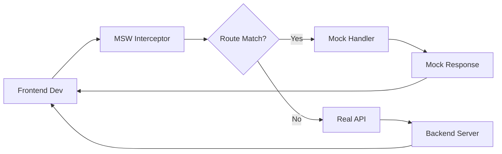

# TradeFlow Mock Service 配置指南

## 1. 概述

本文档定义了TradeFlow前后端分离开发中的Mock服务配置，使前端能够独立于后端进行开发和测试。

**版本**: v1.0.0  
**更新日期**: 2025-01-07  
**相关文档**: 
- [OpenAPI规范](./openapi_specification.yaml)
- [契约测试指南](./contract_testing_guide.md)

## 2. Mock服务架构

### 2.1 技术选型

```yaml
mock_framework: msw  # Mock Service Worker
api_spec: OpenAPI 3.1.0
data_generator: faker.js
state_management: localStorage
response_delay: 100-500ms  # 模拟网络延迟
```

### 2.2 部署模式



## 3. Mock服务配置

### 3.1 MSW初始化配置

```javascript
// src/mocks/browser.js
import { setupWorker } from 'msw'
import { handlers } from './handlers'

// 配置Mock Service Worker
export const worker = setupWorker(...handlers)

// 启动配置
const workerConfig = {
  onUnhandledRequest: 'bypass',  // 未匹配请求直接通过
  serviceWorker: {
    url: '/mockServiceWorker.js',
    options: {
      scope: '/'
    }
  }
}

// 环境判断
if (process.env.REACT_APP_USE_MOCK === 'true') {
  worker.start(workerConfig)
}
```

### 3.2 Mock数据生成器

```javascript
// src/mocks/generators/index.js
import { faker } from '@faker-js/faker'
import { v4 as uuidv4 } from 'uuid'

// 用户数据生成器
export const generateUser = (overrides = {}) => ({
  id: `usr_${uuidv4()}`,
  email: faker.internet.email(),
  name: faker.person.fullName(),
  avatar_url: faker.image.avatar(),
  auth_provider: faker.helpers.arrayElement(['google', 'github']),
  language_preference: faker.helpers.arrayElement(['zh-CN', 'en-US']),
  created_at: faker.date.past().toISOString(),
  ...overrides
})

// 买家数据生成器
export const generateBuyer = (overrides = {}) => ({
  id: `buyer_${uuidv4()}`,
  company_name: faker.company.name(),
  country: faker.location.countryCode(),
  city: faker.location.city(),
  match_score: faker.number.float({ min: 0.5, max: 0.95, precision: 0.01 }),
  buyer_profile: {
    company_type: faker.helpers.arrayElement(['distributor', 'retailer', 'manufacturer']),
    annual_purchase: `$${faker.number.int({ min: 1, max: 10 })}M+`,
    main_products: faker.helpers.arrayElements([
      'LED lights', 'Smart lighting', 'Industrial lighting', 
      'Commercial lighting', 'Residential lighting'
    ], 3),
    company_size: faker.helpers.arrayElement(['10-50', '50-200', '200-500', '500+']),
    established_year: faker.date.past({ years: 20 }).getFullYear()
  },
  trade_info: {
    preferred_terms: faker.helpers.arrayElement(['FOB', 'CIF', 'EXW']),
    payment_terms: faker.helpers.arrayElement(['T/T', 'L/C', '30% T/T, 70% L/C']),
    typical_order_size: `$${faker.number.int({ min: 10, max: 500 })}K`,
    order_frequency: faker.helpers.arrayElement(['Monthly', 'Quarterly', 'Yearly'])
  },
  ...overrides
})

// 文件数据生成器
export const generateFile = (overrides = {}) => ({
  id: `file_${uuidv4()}`,
  name: faker.system.fileName(),
  type: faker.helpers.arrayElement(['code', 'document', 'data', 'image']),
  mime_type: faker.helpers.arrayElement([
    'text/javascript', 'text/python', 'text/markdown',
    'application/pdf', 'text/csv', 'image/png'
  ]),
  size: faker.number.int({ min: 1024, max: 1048576 }),
  url: faker.internet.url(),
  created_at: faker.date.recent().toISOString(),
  ...overrides
})
```

### 3.3 Mock处理器实现

```javascript
// src/mocks/handlers/auth.js
import { rest } from 'msw'
import { generateUser } from '../generators'

export const authHandlers = [
  // OAuth登录回调
  rest.get('/api/v1/auth/oauth/:provider/callback', (req, res, ctx) => {
    const { code } = Object.fromEntries(req.url.searchParams)
    
    if (!code) {
      return res(
        ctx.status(401),
        ctx.json({
          success: false,
          error: {
            code: 'INVALID_CODE',
            message: '授权码无效'
          }
        })
      )
    }

    const user = generateUser()
    const mockToken = btoa(JSON.stringify({ userId: user.id, exp: Date.now() + 86400000 }))
    
    return res(
      ctx.delay(300),
      ctx.status(200),
      ctx.json({
        success: true,
        data: {
          access_token: mockToken,
          refresh_token: mockToken + '_refresh',
          expires_in: 86400,
          user
        }
      })
    )
  }),

  // 获取当前用户
  rest.get('/api/v1/auth/me', (req, res, ctx) => {
    const authHeader = req.headers.get('Authorization')
    
    if (!authHeader?.startsWith('Bearer ')) {
      return res(
        ctx.status(401),
        ctx.json({
          success: false,
          error: {
            code: 'UNAUTHORIZED',
            message: '未授权访问'
          }
        })
      )
    }

    return res(
      ctx.delay(200),
      ctx.status(200),
      ctx.json({
        success: true,
        data: {
          user: generateUser({
            company: {
              id: 'comp_123456',
              name: '上海贸易公司',
              verification_status: 'verified',
              trust_score: 85
            },
            subscription: {
              plan: 'professional',
              credits_remaining: 150,
              expires_at: new Date(Date.now() + 30 * 24 * 60 * 60 * 1000).toISOString()
            }
          })
        }
      })
    )
  })
]
```

```javascript
// src/mocks/handlers/chat.js
import { rest } from 'msw'
import { generateFile } from '../generators'

export const chatHandlers = [
  // 发起对话
  rest.post('/api/v1/chat', async (req, res, ctx) => {
    const { message, agent_type } = await req.json()
    
    // 模拟处理延迟
    await new Promise(resolve => setTimeout(resolve, 1500))
    
    // 根据agent_type生成不同响应
    const responses = {
      buyer: '根据您的需求，我为您找到了5家美国LED灯具买家...',
      supplier: '我找到了3家符合您要求的供应商...',
      general: '我理解您的需求，让我为您分析...'
    }
    
    // 生成mock文件
    const files = [
      generateFile({
        name: 'buyer_list.csv',
        type: 'data',
        mime_type: 'text/csv'
      }),
      generateFile({
        name: 'analysis_report.md',
        type: 'document',
        mime_type: 'text/markdown'
      })
    ]
    
    return res(
      ctx.status(200),
      ctx.json({
        success: true,
        data: {
          response: {
            content: responses[agent_type] || responses.general,
            agent_type,
            session_id: `sess_${Date.now()}`,
            files,
            metadata: {
              tokens_used: Math.floor(Math.random() * 200) + 50,
              processing_time: 1.5,
              confidence_score: Math.random() * 0.3 + 0.7
            }
          }
        }
      })
    )
  }),

  // SSE流式对话
  rest.get('/api/v1/chat/stream', (req, res, ctx) => {
    const stream = new ReadableStream({
      start(controller) {
        // 发送连接成功事件
        controller.enqueue('event: connected\n')
        controller.enqueue(`data: ${JSON.stringify({ session_id: 'sess_123456', agent_ready: true })}\n\n`)
        
        // 模拟流式响应
        const message = '根据您的需求，我为您找到了以下买家信息...'
        const words = message.split('')
        let index = 0
        
        const interval = setInterval(() => {
          if (index < words.length) {
            controller.enqueue('event: stream\n')
            controller.enqueue(`data: ${JSON.stringify({ chunk: words[index], chunk_id: index })}\n\n`)
            index++
          } else {
            // 发送完成事件
            controller.enqueue('event: complete\n')
            controller.enqueue(`data: ${JSON.stringify({ 
              session_id: 'sess_123456',
              total_recommendations: 5,
              tokens_used: 150
            })}\n\n`)
            clearInterval(interval)
            controller.close()
          }
        }, 50)
      }
    })
    
    return res(
      ctx.status(200),
      ctx.set('Content-Type', 'text/event-stream'),
      ctx.set('Cache-Control', 'no-cache'),
      ctx.set('Connection', 'keep-alive'),
      ctx.body(stream)
    )
  })
]
```

### 3.4 状态管理

```javascript
// src/mocks/state.js
class MockDataStore {
  constructor() {
    this.store = new Map()
    this.loadFromLocalStorage()
  }

  // 保存数据
  set(key, value) {
    this.store.set(key, value)
    this.saveToLocalStorage()
    return value
  }

  // 获取数据
  get(key, defaultValue = null) {
    return this.store.get(key) || defaultValue
  }

  // 更新数据
  update(key, updater) {
    const current = this.get(key, {})
    const updated = typeof updater === 'function' ? updater(current) : { ...current, ...updater }
    return this.set(key, updated)
  }

  // 删除数据
  delete(key) {
    this.store.delete(key)
    this.saveToLocalStorage()
  }

  // 持久化到localStorage
  saveToLocalStorage() {
    const data = Object.fromEntries(this.store)
    localStorage.setItem('mockDataStore', JSON.stringify(data))
  }

  // 从localStorage加载
  loadFromLocalStorage() {
    try {
      const data = localStorage.getItem('mockDataStore')
      if (data) {
        const parsed = JSON.parse(data)
        Object.entries(parsed).forEach(([key, value]) => {
          this.store.set(key, value)
        })
      }
    } catch (error) {
      console.error('Failed to load mock data:', error)
    }
  }

  // 清空数据
  clear() {
    this.store.clear()
    localStorage.removeItem('mockDataStore')
  }
}

export const mockStore = new MockDataStore()
```

## 4. Mock场景配置

### 4.1 成功场景

```javascript
// src/mocks/scenarios/success.js
export const successScenarios = {
  // 买家推荐成功
  buyerRecommendSuccess: {
    delay: 1000,
    response: {
      success: true,
      data: {
        recommendations: Array(5).fill(null).map(() => generateBuyer()),
        total: 15
      }
    }
  },
  
  // 文件上传成功
  fileUploadSuccess: {
    delay: 500,
    response: {
      success: true,
      data: generateFile()
    }
  }
}
```

### 4.2 错误场景

```javascript
// src/mocks/scenarios/errors.js
export const errorScenarios = {
  // 认证失败
  authenticationError: {
    status: 401,
    response: {
      success: false,
      error: {
        code: 'AUTH_ERROR',
        message: '认证失败，请重新登录'
      }
    }
  },
  
  // 限流错误
  rateLimitError: {
    status: 429,
    response: {
      success: false,
      error: {
        code: 'RATE_LIMIT_EXCEEDED',
        message: '请求频率过高，请稍后重试'
      }
    }
  },
  
  // 服务器错误
  serverError: {
    status: 500,
    response: {
      success: false,
      error: {
        code: 'INTERNAL_SERVER_ERROR',
        message: '服务器内部错误'
      }
    }
  }
}
```

### 4.3 边界场景

```javascript
// src/mocks/scenarios/edge.js
export const edgeScenarios = {
  // 空结果
  emptyResults: {
    response: {
      success: true,
      data: {
        items: [],
        total: 0
      }
    }
  },
  
  // 大量数据
  largeDataset: {
    response: {
      success: true,
      data: {
        items: Array(1000).fill(null).map(() => generateBuyer()),
        total: 5000
      }
    }
  },
  
  // 网络超时
  networkTimeout: {
    delay: 30000,
    response: null
  }
}
```

## 5. Mock控制面板

### 5.1 开发者工具集成

```javascript
// src/mocks/devtools.js
import { mockStore } from './state'

class MockDevTools {
  constructor() {
    this.setupUI()
    this.attachToWindow()
  }

  setupUI() {
    // 仅在开发环境显示
    if (process.env.NODE_ENV !== 'development') return

    const panel = document.createElement('div')
    panel.id = 'mock-devtools'
    panel.innerHTML = `
      <style>
        #mock-devtools {
          position: fixed;
          bottom: 20px;
          right: 20px;
          background: white;
          border: 1px solid #ddd;
          border-radius: 8px;
          padding: 16px;
          box-shadow: 0 2px 8px rgba(0,0,0,0.1);
          z-index: 9999;
          font-family: monospace;
          font-size: 12px;
        }
        #mock-devtools h3 {
          margin: 0 0 10px 0;
          font-size: 14px;
        }
        #mock-devtools button {
          margin: 2px;
          padding: 4px 8px;
          background: #4CAF50;
          color: white;
          border: none;
          border-radius: 4px;
          cursor: pointer;
        }
        #mock-devtools button:hover {
          background: #45a049;
        }
        #mock-devtools .error-btn {
          background: #f44336;
        }
        #mock-devtools .error-btn:hover {
          background: #da190b;
        }
      </style>
      <h3>🔧 Mock DevTools</h3>
      <div>
        <button onclick="window.__mockDevTools.setScenario('success')">✅ Success</button>
        <button onclick="window.__mockDevTools.setScenario('error')" class="error-btn">❌ Error</button>
        <button onclick="window.__mockDevTools.setScenario('slow')">🐌 Slow</button>
        <button onclick="window.__mockDevTools.clearData()">🗑️ Clear</button>
      </div>
      <div style="margin-top: 10px;">
        <label>
          <input type="checkbox" id="mock-delay" checked>
          Network Delay
        </label>
      </div>
      <div style="margin-top: 10px;">
        <small>Scenario: <span id="mock-scenario">default</span></small>
      </div>
    `
    document.body.appendChild(panel)
  }

  attachToWindow() {
    window.__mockDevTools = {
      setScenario: (scenario) => {
        mockStore.set('scenario', scenario)
        document.getElementById('mock-scenario').textContent = scenario
        console.log(`Mock scenario set to: ${scenario}`)
      },
      clearData: () => {
        mockStore.clear()
        console.log('Mock data cleared')
        window.location.reload()
      },
      toggleDelay: (enabled) => {
        mockStore.set('networkDelay', enabled)
      }
    }
  }
}

// 初始化DevTools
if (process.env.REACT_APP_USE_MOCK === 'true') {
  new MockDevTools()
}
```

## 6. 测试集成

### 6.1 单元测试中使用Mock

```javascript
// src/tests/setup.js
import { server } from '../mocks/server'

// 在所有测试前启动
beforeAll(() => server.listen({
  onUnhandledRequest: 'error'
}))

// 每个测试后重置
afterEach(() => server.resetHandlers())

// 所有测试后关闭
afterAll(() => server.close())
```

### 6.2 集成测试配置

```javascript
// src/tests/integration/auth.test.js
import { rest } from 'msw'
import { server } from '../../mocks/server'
import { render, screen, waitFor } from '@testing-library/react'
import { LoginPage } from '../../pages/Login'

describe('Authentication Flow', () => {
  it('should handle successful login', async () => {
    render(<LoginPage />)
    
    // 触发OAuth流程
    const googleButton = screen.getByText('Sign in with Google')
    fireEvent.click(googleButton)
    
    // 等待回调处理
    await waitFor(() => {
      expect(screen.getByText('Welcome')).toBeInTheDocument()
    })
  })

  it('should handle login error', async () => {
    // 覆盖默认handler
    server.use(
      rest.get('/api/v1/auth/oauth/google/callback', (req, res, ctx) => {
        return res(
          ctx.status(401),
          ctx.json({
            success: false,
            error: {
              code: 'AUTH_FAILED',
              message: '认证失败'
            }
          })
        )
      })
    )

    render(<LoginPage />)
    // ... 测试错误处理
  })
})
```

## 7. 环境配置

### 7.1 环境变量

```bash
# .env.development
REACT_APP_USE_MOCK=true
REACT_APP_MOCK_DELAY=true
REACT_APP_MOCK_SCENARIO=default
REACT_APP_API_BASE_URL=http://localhost:3000

# .env.staging
REACT_APP_USE_MOCK=false
REACT_APP_API_BASE_URL=https://staging-api.tradeflow.com

# .env.production
REACT_APP_USE_MOCK=false
REACT_APP_API_BASE_URL=https://api.tradeflow.com
```

### 7.2 启动脚本

```json
{
  "scripts": {
    "start:mock": "REACT_APP_USE_MOCK=true npm start",
    "start:dev": "REACT_APP_USE_MOCK=false npm start",
    "test:mock": "REACT_APP_USE_MOCK=true npm test",
    "build:mock": "REACT_APP_USE_MOCK=true npm run build"
  }
}
```

## 8. 最佳实践

### 8.1 Mock数据管理

1. **数据一致性**: Mock数据应与真实API响应结构完全一致
2. **数据关联性**: 相关联的数据应保持ID引用的一致性
3. **状态持久化**: 重要的状态变更应持久化到localStorage
4. **数据重置**: 提供清除Mock数据的便捷方式

### 8.2 性能考虑

1. **延迟模拟**: 添加合理的网络延迟(100-500ms)
2. **大数据处理**: 分页和虚拟滚动的Mock实现
3. **错误注入**: 随机注入错误以测试错误处理
4. **并发请求**: 正确处理并发Mock请求

### 8.3 开发流程

1. **API First**: 先定义OpenAPI规范，再生成Mock
2. **场景驱动**: 为每个用户场景创建Mock配置
3. **错误优先**: 先实现错误处理，再实现成功路径
4. **渐进集成**: 逐步从Mock切换到真实API

## 9. 故障排除

### 9.1 常见问题

| 问题 | 原因 | 解决方案 |
|-----|------|---------|
| Mock不生效 | Service Worker未注册 | 检查public/mockServiceWorker.js |
| 数据不一致 | 缓存问题 | 清除localStorage和Service Worker缓存 |
| 响应超时 | 延迟设置过长 | 调整Mock延迟配置 |
| CORS错误 | Mock配置错误 | 检查请求拦截配置 |

### 9.2 调试技巧

```javascript
// 启用Mock调试日志
if (process.env.REACT_APP_USE_MOCK === 'true') {
  window.MSW_DEBUG = true
  
  // 监听所有Mock请求
  window.addEventListener('msw:request', (event) => {
    console.log('Mock Request:', event.detail)
  })
  
  // 监听所有Mock响应
  window.addEventListener('msw:response', (event) => {
    console.log('Mock Response:', event.detail)
  })
}
```

## 10. 参考资源

- [MSW官方文档](https://mswjs.io/)
- [Faker.js文档](https://fakerjs.dev/)
- [OpenAPI Mock生成器](https://github.com/APIDevTools/swagger-mock-api)
- [React Testing Library](https://testing-library.com/docs/react-testing-library/intro/)

---

**维护团队**: TradeFlow前端团队  
**最后更新**: 2025-01-07  
**反馈邮箱**: frontend@tradeflow.com