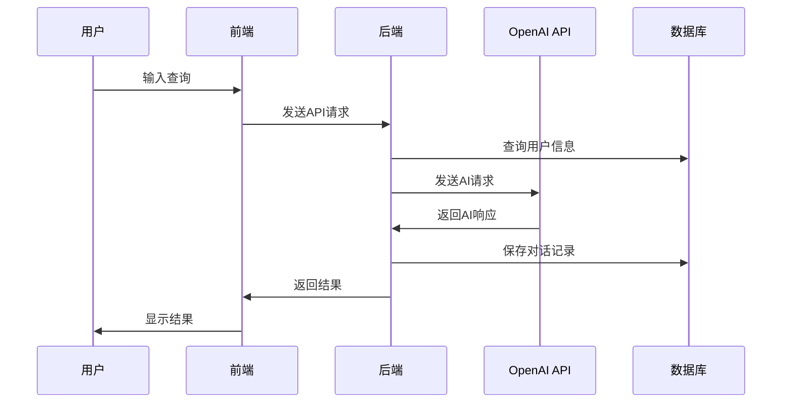

# TradeFlow B2B贸易智能助手 - 技术架构设计文档

## 执行摘要

TradeFlow是一款基于对话式AI的B2B贸易智能助手，通过自然语言交互帮助中小企业完成买家开发和供应商采购。本文档定义了MVP阶段的技术架构，优先考虑快速验证和低成本实现。

### 关键架构决策
- **简化技术栈**：FastAPI + React + PostgreSQL + Redis + OpenAI API
- **单体架构**：避免微服务复杂性，后期可重构
- **AI外包策略**：使用成熟的OpenAI API而非自研AI
- **渐进式数据模型**：从简单开始，逐步扩展

## 1. 系统架构概览

### 1.1 整体架构图

```
┌─────────────────┐    ┌─────────────────┐    ┌─────────────────┐
│   前端应用       │    │   后端API       │    │   外部服务       │
│   (React)       │◄──►│   (FastAPI)     │◄──►│   OpenAI API    │
│                 │    │                 │    │   第三方数据源   │
└─────────────────┘    └─────────────────┘    └─────────────────┘
                               │
                               ▼
                    ┌─────────────────┐
                    │   数据层        │
                    │ PostgreSQL+Redis│
                    └─────────────────┘
```

### 1.2 核心组件设计

#### 前端层 (React + TypeScript)
```typescript
src/
├── components/           # 通用组件
│   ├── Chat/            # 对话组件
│   ├── Forms/           # 表单组件
│   └── Layout/          # 布局组件
├── pages/               # 页面组件
│   ├── Auth/            # 认证页面
│   ├── Dashboard/       # 仪表板
│   ├── BuyerSearch/     # 买家搜索
│   └── SupplierSearch/  # 供应商搜索
├── services/            # API调用服务
├── hooks/               # 自定义Hooks
└── utils/               # 工具函数
```

#### 后端层 (FastAPI)
```python
src/backend/
├── api/                 # API路由
│   ├── auth.py         # 认证相关
│   ├── chat.py         # 对话接口
│   ├── buyers.py       # 买家推荐
│   └── suppliers.py    # 供应商匹配
├── core/               # 核心模块
│   ├── ai_service.py   # AI服务封装
│   ├── auth.py         # 认证逻辑
│   └── database.py     # 数据库连接
├── models/             # 数据模型
├── services/           # 业务逻辑
└── utils/              # 工具函数
```

### 1.3 数据流设计



## 2. 核心API设计

### 2.1 用户认证API

```python
# POST /api/auth/register
{
    "email": "user@company.com",
    "password": "password123",
    "company_name": "ABC Trading Co.",
    "contact_person": "John Smith",
    "country": "CN",
    "industry": "Electronics",
    "user_type": "both"  # buyer, supplier, both
}

# POST /api/auth/login
{
    "email": "user@company.com", 
    "password": "password123"
}

# Response
{
    "access_token": "jwt_token_here",
    "token_type": "bearer",
    "user": {
        "id": "uuid",
        "email": "user@company.com",
        "company_name": "ABC Trading Co."
    }
}
```

### 2.2 对话管理API

```python
# POST /api/chat/message
{
    "message": "I'm looking for smartphone suppliers in China",
    "conversation_id": "uuid",  # optional
    "context": {
        "session_type": "supplier_search",
        "user_preferences": {}
    }
}

# Response
{
    "conversation_id": "uuid",
    "response": "I can help you find smartphone suppliers...",
    "intent": "supplier_search",
    "extracted_entities": {
        "product": "smartphone",
        "location": "China",
        "user_type": "buyer"
    },
    "suggested_actions": [
        {
            "type": "search_suppliers",
            "label": "搜索供应商",
            "params": {...}
        }
    ]
}
```

### 2.3 AI交互API

```python
# POST /api/ai/analyze_requirement
{
    "user_input": "我需要寻找LED灯具的供应商，月需求量1000套",
    "user_context": {
        "company_info": {...},
        "previous_searches": [...]
    }
}

# Response
{
    "structured_requirement": {
        "product_category": "LED lighting",
        "quantity": 1000,
        "frequency": "monthly",
        "specifications": {...}
    },
    "search_strategy": {
        "keywords": ["LED lights", "lighting manufacturer"],
        "target_regions": ["China", "Taiwan"],
        "filters": {...}
    },
    "ai_insights": "基于您的需求，建议重点关注..."
}
```

## 3. 核心数据模型

### 3.1 用户相关表

```sql
-- 用户表 (简化版)
CREATE TABLE users (
    id UUID PRIMARY KEY DEFAULT gen_random_uuid(),
    email VARCHAR(255) UNIQUE NOT NULL,
    password_hash VARCHAR(255) NOT NULL,
    company_name VARCHAR(255) NOT NULL,
    contact_person VARCHAR(100) NOT NULL,
    country VARCHAR(10) NOT NULL,
    industry VARCHAR(100),
    user_type VARCHAR(20) NOT NULL CHECK (user_type IN ('buyer', 'supplier', 'both')),
    status VARCHAR(20) DEFAULT 'active',
    created_at TIMESTAMP DEFAULT NOW(),
    updated_at TIMESTAMP DEFAULT NOW()
);

-- 用户配置表
CREATE TABLE user_preferences (
    id UUID PRIMARY KEY DEFAULT gen_random_uuid(),
    user_id UUID REFERENCES users(id) ON DELETE CASCADE,
    language VARCHAR(10) DEFAULT 'zh-CN',
    timezone VARCHAR(50) DEFAULT 'Asia/Shanghai',
    notification_settings JSONB DEFAULT '{}',
    search_preferences JSONB DEFAULT '{}',
    updated_at TIMESTAMP DEFAULT NOW()
);
```

### 3.2 对话相关表

```sql
-- 对话会话表
CREATE TABLE conversations (
    id UUID PRIMARY KEY DEFAULT gen_random_uuid(),
    user_id UUID REFERENCES users(id) ON DELETE CASCADE,
    title VARCHAR(200),
    session_type VARCHAR(50) NOT NULL, -- buyer_search, supplier_search, general
    status VARCHAR(20) DEFAULT 'active',
    metadata JSONB DEFAULT '{}', -- 会话元数据
    created_at TIMESTAMP DEFAULT NOW(),
    updated_at TIMESTAMP DEFAULT NOW()
);

-- 消息记录表
CREATE TABLE messages (
    id UUID PRIMARY KEY DEFAULT gen_random_uuid(),
    conversation_id UUID REFERENCES conversations(id) ON DELETE CASCADE,
    role VARCHAR(20) NOT NULL CHECK (role IN ('user', 'assistant', 'system')),
    content TEXT NOT NULL,
    metadata JSONB DEFAULT '{}', -- AI模型、处理时间等
    created_at TIMESTAMP DEFAULT NOW()
);

-- 意图识别结果表
CREATE TABLE intent_extractions (
    id UUID PRIMARY KEY DEFAULT gen_random_uuid(),
    message_id UUID REFERENCES messages(id) ON DELETE CASCADE,
    intent VARCHAR(50) NOT NULL,
    entities JSONB DEFAULT '{}',
    confidence DECIMAL(3,2),
    created_at TIMESTAMP DEFAULT NOW()
);
```

### 3.3 贸易数据表

```sql
-- 产品信息表 (简化)
CREATE TABLE products (
    id UUID PRIMARY KEY DEFAULT gen_random_uuid(),
    user_id UUID REFERENCES users(id) ON DELETE CASCADE,
    name VARCHAR(255) NOT NULL,
    category VARCHAR(100) NOT NULL,
    subcategory VARCHAR(100),
    description TEXT,
    specifications JSONB DEFAULT '{}',
    price_range_min DECIMAL(10,2),
    price_range_max DECIMAL(10,2),
    currency VARCHAR(3) DEFAULT 'USD',
    moq INTEGER, -- Minimum Order Quantity
    images JSONB DEFAULT '[]',
    status VARCHAR(20) DEFAULT 'active',
    created_at TIMESTAMP DEFAULT NOW(),
    updated_at TIMESTAMP DEFAULT NOW()
);

-- 需求信息表
CREATE TABLE requirements (
    id UUID PRIMARY KEY DEFAULT gen_random_uuid(),
    user_id UUID REFERENCES users(id) ON DELETE CASCADE,
    title VARCHAR(255) NOT NULL,
    category VARCHAR(100) NOT NULL,
    description TEXT NOT NULL,
    specifications JSONB DEFAULT '{}',
    quantity_needed INTEGER,
    budget_min DECIMAL(10,2),
    budget_max DECIMAL(10,2),
    currency VARCHAR(3) DEFAULT 'USD',
    timeline_days INTEGER,
    status VARCHAR(20) DEFAULT 'active',
    created_at TIMESTAMP DEFAULT NOW(),
    updated_at TIMESTAMP DEFAULT NOW()
);

-- 推荐结果缓存表
CREATE TABLE recommendations (
    id UUID PRIMARY KEY DEFAULT gen_random_uuid(),
    user_id UUID REFERENCES users(id) ON DELETE CASCADE,
    rec_type VARCHAR(20) NOT NULL CHECK (rec_type IN ('buyer', 'supplier')),
    query_hash VARCHAR(64) NOT NULL, -- 查询参数的哈希值
    results JSONB NOT NULL,
    metadata JSONB DEFAULT '{}',
    expires_at TIMESTAMP NOT NULL,
    created_at TIMESTAMP DEFAULT NOW()
);
```

### 3.4 索引策略

```sql
-- 用户查询索引
CREATE INDEX idx_users_email ON users(email);
CREATE INDEX idx_users_country_industry ON users(country, industry);
CREATE INDEX idx_users_type ON users(user_type);

-- 对话查询索引
CREATE INDEX idx_conversations_user ON conversations(user_id);
CREATE INDEX idx_messages_conversation ON messages(conversation_id);
CREATE INDEX idx_messages_created ON messages(created_at DESC);

-- 产品和需求索引
CREATE INDEX idx_products_user ON products(user_id);
CREATE INDEX idx_products_category ON products(category, subcategory);
CREATE INDEX idx_requirements_user ON requirements(user_id);
CREATE INDEX idx_requirements_category ON requirements(category);

-- 推荐缓存索引
CREATE INDEX idx_recommendations_user_type ON recommendations(user_id, rec_type);
CREATE INDEX idx_recommendations_hash ON recommendations(query_hash);
CREATE INDEX idx_recommendations_expires ON recommendations(expires_at);
```

## 4. AI Agent集成方案

### 4.1 OpenAI集成架构

```python
from openai import AsyncOpenAI
from typing import Dict, List, Optional

class TradeAIService:
    def __init__(self):
        self.client = AsyncOpenAI(api_key=settings.OPENAI_API_KEY)
        self.models = {
            "chat": "gpt-4o-mini",  # 成本控制
            "analysis": "gpt-4o",   # 复杂分析
            "embedding": "text-embedding-3-small"
        }
        
    async def analyze_trade_query(self, user_input: str, context: Dict) -> Dict:
        """分析贸易查询意图和实体"""
        
        system_prompt = """
        你是一个专业的国际贸易分析助手。分析用户输入，提取以下信息：
        1. 意图类型：buyer_search（寻找买家）、supplier_search（寻找供应商）、market_analysis（市场分析）
        2. 产品信息：类别、规格、数量等
        3. 地理偏好：目标市场或供应地区
        4. 商务要求：价格范围、交货期等
        
        返回JSON格式结果。
        """
        
        response = await self.client.chat.completions.create(
            model=self.models["analysis"],
            messages=[
                {"role": "system", "content": system_prompt},
                {"role": "user", "content": f"查询：{user_input}\n上下文：{context}"}
            ],
            response_format={"type": "json_object"},
            temperature=0.1
        )
        
        return json.loads(response.choices[0].message.content)
    
    async def generate_trade_response(self, intent_data: Dict, 
                                    search_results: List[Dict]) -> str:
        """生成贸易咨询回复"""
        
        system_prompt = """
        你是TradeFlow的AI贸易助手。基于分析结果和搜索数据，
        为用户提供专业、有用的贸易建议。回复要：
        1. 专业且易懂
        2. 包含具体的行动建议
        3. 符合国际贸易惯例
        4. 中文回复
        """
        
        response = await self.client.chat.completions.create(
            model=self.models["chat"],
            messages=[
                {"role": "system", "content": system_prompt},
                {"role": "user", "content": f"意图分析：{intent_data}\n搜索结果：{search_results}"}
            ],
            temperature=0.7,
            max_tokens=1000
        )
        
        return response.choices[0].message.content
```

### 4.2 对话状态管理

```python
class ConversationManager:
    def __init__(self, redis_client):
        self.redis = redis_client
        self.session_ttl = 3600 * 2  # 2小时
        
    async def get_conversation_context(self, user_id: str, 
                                     conversation_id: str) -> Dict:
        """获取对话上下文"""
        key = f"conv:{conversation_id}"
        context = await self.redis.hgetall(key)
        
        if not context:
            # 从数据库加载历史对话
            context = await self.load_from_database(conversation_id)
            await self.cache_context(key, context)
            
        return context
    
    async def update_context(self, conversation_id: str, 
                           new_message: Dict) -> None:
        """更新对话上下文"""
        key = f"conv:{conversation_id}"
        
        # 更新缓存
        await self.redis.hset(key, mapping={
            "last_message": json.dumps(new_message),
            "updated_at": datetime.now().isoformat()
        })
        await self.redis.expire(key, self.session_ttl)
        
        # 异步保存到数据库
        await self.save_to_database(conversation_id, new_message)
```

### 4.3 贸易术语词典

```python
TRADE_TERMINOLOGY = {
    "payment_terms": {
        "L/C": "信用证 (Letter of Credit)",
        "T/T": "电汇 (Telegraphic Transfer)", 
        "D/P": "付款交单 (Documents against Payment)",
        "D/A": "承兑交单 (Documents against Acceptance)",
        "O/A": "记账交易 (Open Account)"
    },
    "incoterms": {
        "FOB": "离岸价格 (Free On Board)",
        "CIF": "到岸价格 (Cost, Insurance and Freight)",
        "CFR": "成本加运费 (Cost and Freight)",
        "EXW": "工厂交货 (Ex Works)",
        "DDP": "完税后交货 (Delivered Duty Paid)"
    },
    "product_categories": {
        "electronics": ["smartphone", "tablet", "laptop", "smartwatch"],
        "textiles": ["fabric", "clothing", "yarn", "leather"],
        "machinery": ["equipment", "tools", "parts", "automation"],
        "chemicals": ["raw materials", "additives", "specialty chemicals"]
    }
}

class TradeTerminologyService:
    def __init__(self):
        self.terminology = TRADE_TERMINOLOGY
        
    def explain_term(self, term: str) -> Optional[str]:
        """解释贸易术语"""
        for category, terms in self.terminology.items():
            if term.upper() in terms:
                return terms[term.upper()]
        return None
    
    def extract_terms(self, text: str) -> List[Dict]:
        """从文本中提取贸易术语"""
        found_terms = []
        text_upper = text.upper()
        
        for category, terms in self.terminology.items():
            for term in terms:
                if term in text_upper:
                    found_terms.append({
                        "term": term,
                        "category": category,
                        "explanation": terms[term]
                    })
        
        return found_terms
```

## 5. 安全设计要点

### 5.1 认证与授权

```python
from passlib.context import CryptContext
from jose import JWTError, jwt
from datetime import datetime, timedelta

class SecurityService:
    def __init__(self):
        self.pwd_context = CryptContext(schemes=["bcrypt"], deprecated="auto")
        self.secret_key = settings.SECRET_KEY
        self.algorithm = "HS256"
        self.access_token_expire_minutes = 30
        
    def hash_password(self, password: str) -> str:
        """加密密码"""
        return self.pwd_context.hash(password)
    
    def verify_password(self, plain_password: str, hashed_password: str) -> bool:
        """验证密码"""
        return self.pwd_context.verify(plain_password, hashed_password)
    
    def create_access_token(self, data: dict) -> str:
        """创建访问令牌"""
        to_encode = data.copy()
        expire = datetime.utcnow() + timedelta(minutes=self.access_token_expire_minutes)
        to_encode.update({"exp": expire})
        
        return jwt.encode(to_encode, self.secret_key, algorithm=self.algorithm)
    
    def verify_token(self, token: str) -> Optional[Dict]:
        """验证令牌"""
        try:
            payload = jwt.decode(token, self.secret_key, algorithms=[self.algorithm])
            return payload
        except JWTError:
            return None
```

### 5.2 数据保护

```python
from cryptography.fernet import Fernet
import hashlib

class DataProtectionService:
    def __init__(self):
        self.fernet = Fernet(settings.ENCRYPTION_KEY.encode())
        
    def encrypt_sensitive_data(self, data: str) -> str:
        """加密敏感数据"""
        return self.fernet.encrypt(data.encode()).decode()
    
    def decrypt_sensitive_data(self, encrypted_data: str) -> str:
        """解密敏感数据"""
        return self.fernet.decrypt(encrypted_data.encode()).decode()
    
    def hash_query_params(self, params: Dict) -> str:
        """生成查询参数哈希值用于缓存"""
        params_str = json.dumps(params, sort_keys=True)
        return hashlib.sha256(params_str.encode()).hexdigest()
    
    async def log_data_access(self, user_id: str, action: str, 
                            resource: str, ip_address: str):
        """记录数据访问日志"""
        log_entry = {
            "user_id": user_id,
            "action": action,
            "resource": resource,
            "ip_address": ip_address,
            "timestamp": datetime.utcnow(),
            "user_agent": request.headers.get("User-Agent", "")
        }
        
        # 异步写入日志
        await self.write_audit_log(log_entry)
```

### 5.3 API限流与监控

```python
from fastapi import HTTPException
import asyncio
from collections import defaultdict

class RateLimitService:
    def __init__(self):
        self.request_counts = defaultdict(list)
        self.limits = {
            "auth": {"requests": 5, "window": 300},      # 认证接口：5次/5分钟
            "chat": {"requests": 100, "window": 3600},   # 对话接口：100次/小时
            "search": {"requests": 50, "window": 3600},  # 搜索接口：50次/小时
        }
    
    async def check_rate_limit(self, user_id: str, endpoint_type: str) -> bool:
        """检查API限流"""
        now = time.time()
        limit_config = self.limits.get(endpoint_type, {"requests": 1000, "window": 3600})
        
        # 清理过期记录
        key = f"{user_id}:{endpoint_type}"
        self.request_counts[key] = [
            timestamp for timestamp in self.request_counts[key]
            if now - timestamp < limit_config["window"]
        ]
        
        # 检查是否超限
        if len(self.request_counts[key]) >= limit_config["requests"]:
            return False
        
        # 记录本次请求
        self.request_counts[key].append(now)
        return True
    
    async def enforce_rate_limit(self, user_id: str, endpoint_type: str):
        """强制执行限流"""
        if not await self.check_rate_limit(user_id, endpoint_type):
            raise HTTPException(
                status_code=429,
                detail=f"Rate limit exceeded for {endpoint_type}"
            )
```

## 6. MVP技术实现路线图

### 6.1 Phase 1: 基础架构 (2周)

**目标**: 建立可运行的基础系统

```yaml
技术任务:
  - FastAPI项目初始化和基础路由
  - PostgreSQL数据库设计和迁移脚本
  - Redis缓存集成
  - 用户认证系统实现
  - React前端项目搭建
  - 基础UI组件库选择和配置

交付标准:
  - 用户可以注册、登录
  - 前后端通信正常
  - 数据库连接稳定
  - 开发环境可复现
```

### 6.2 Phase 2: AI对话核心 (3周)

**目标**: 实现基础AI对话功能

```yaml
技术任务:
  - OpenAI API集成和错误处理
  - 对话界面开发
  - 意图识别和实体提取
  - 对话历史存储和检索
  - 贸易术语词典集成

交付标准:
  - 用户可以与AI进行基础对话
  - 系统能识别买家/供应商搜索意图
  - 对话历史正确保存
  - AI回复质量达到可用水平
```

### 6.3 Phase 3: 搜索推荐功能 (4周)

**目标**: 实现核心业务逻辑

```yaml
技术任务:
  - 买家推荐算法实现
  - 供应商匹配逻辑开发
  - 外部数据源接入 (贸易数据)
  - 推荐结果展示界面
  - 缓存策略优化

交付标准:
  - 能推荐相关买家/供应商
  - 推荐准确率达到60%以上
  - 搜索响应时间 < 3秒
  - 用户可以查看详细推荐信息
```

### 6.4 Phase 4: 优化和发布 (3周)

**目标**: 完善产品准备发布

```yaml
技术任务:
  - 性能优化和压力测试
  - 安全性检查和加固
  - 用户体验优化
  - 监控和日志系统
  - 生产环境部署

交付标准:
  - 系统稳定性 > 99%
  - 安全漏洞修复
  - 用户体验流畅
  - 监控告警正常
  - 生产环境可用
```

### 6.5 关键技术风险和缓解策略

| 风险 | 影响 | 缓解策略 |
|------|------|----------|
| OpenAI API成本过高 | 高 | 实施智能缓存、使用更便宜的模型、设置使用上限 |
| 数据质量不足 | 高 | 建立数据验证机制、多数据源交叉验证 |
| AI推荐准确率低 | 中 | 持续收集用户反馈、A/B测试优化算法 |
| 系统性能瓶颈 | 中 | 数据库索引优化、Redis缓存、CDN加速 |
| 安全漏洞 | 高 | 代码安全审查、第三方安全检测、定期更新依赖 |

### 6.6 技术债务管理

**可接受的技术债务** (MVP阶段):
- 简化的用户权限模型
- 基础的错误处理机制  
- 单一数据库架构
- 有限的API文档

**需要优先偿还的技术债务**:
- 数据一致性检查机制
- 完整的单元测试覆盖
- API速率限制和安全防护
- 监控和告警系统

---

## 总结

本技术架构设计专注于MVP快速验证，采用成熟技术栈降低开发风险。核心思路是：

1. **先验证再优化**: 用最简单的方式实现核心功能
2. **外包复杂性**: AI能力使用OpenAI，避免自研
3. **渐进式扩展**: 数据模型支持后续扩展
4. **重点关注用户价值**: 技术服务于业务目标

预计开发周期12周，团队规模3-4人（1个全栈，1个前端，1个后端，1个产品）。总预算控制在50万人民币以内，为后续融资和扩展留出空间。

---

**文档版本**: v1.0  
**最后更新**: 2024年8月2日  
**负责人**: 技术团队  
**审核状态**: 待评审