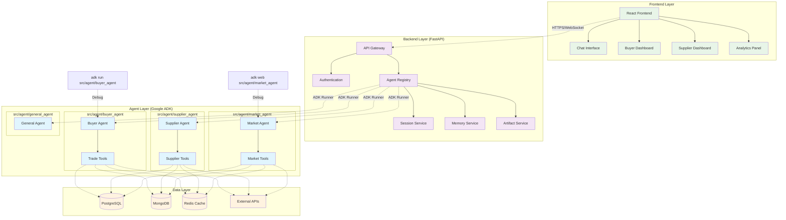

# Google ADK 集成指南 - TradeFlow B2B 贸易智能助手

## 目录
1. [概述](#概述)
2. [架构设计](#架构设计)
3. [环境准备](#环境准备)
4. [Agent 开发指南](#agent-开发指南)
5. [后端集成](#后端集成)
6. [前端集成](#前端集成)
7. [部署方案](#部署方案)
8. [多语言支持](#多语言支持)
9. [安全和监控](#安全和监控)
10. [最佳实践](#最佳实践)

## 概述

Google Agent Development Kit (ADK) 是一个开源的、代码优先的 Python 工具包，用于构建、评估和部署复杂的 AI Agent。本指南将详细介绍如何将 Google ADK 集成到 TradeFlow 应用中，为 B2B 贸易用户提供智能化的买家开发、供应商匹配和市场分析服务。

### 为什么选择 Google ADK

- **灵活性高**：支持自定义工具和复杂的业务逻辑
- **与 Google 生态系统深度集成**：优化支持 Gemini 模型和 Vertex AI
- **生产就绪**：内置部署、监控和扩展能力
- **开源免费**：降低技术成本，社区支持活跃

## 架构设计

### 系统架构图



### 核心组件说明

1. **Agent Registry**：管理所有Agent实例，负责请求路由和意图识别
2. **专用 Agent**（独立开发）：
   - **buyer_agent**：买家开发和客户开发专家
   - **supplier_agent**：供应商匹配和采购专家
   - **market_agent**：市场分析和行业洞察专家
   - **general_agent**：通用对话和综合业务助手
3. **ADK核心服务**：
   - **SessionService**：会话状态管理，支持多轮对话
   - **MemoryService**：长期记忆和上下文管理
   - **ArtifactService**：文件和资源管理
   - **Runner**：Agent执行器，负责Agent的运行和事件处理
4. **工具生态**：每个Agent有自己的专用工具集，可复用和组合
5. **数据层**：与TradeFlow业务系统集成的数据存储

## 环境准备

### 1. 系统要求

```bash
# Python 版本要求
Python 3.9+

# 必需的开发工具
- Poetry 或 pip
- VS Code 或 PyCharm（推荐）
- Terminal 访问

# 可选的部署工具（用于生产环境）
- Docker 20.10+
- gcloud CLI（如果使用Google Cloud）
```

### 2. 安装 Google ADK

```bash
# 使用 pip 安装
pip install google-adk

# 或使用 Poetry
poetry add google-adk
```

### 3. Google Cloud 配置

```bash
# 设置环境变量
export GOOGLE_CLOUD_PROJECT="your-project-id"
export GOOGLE_CLOUD_LOCATION="us-central1"
export GOOGLE_GENAI_USE_VERTEXAI=true

# 认证配置
gcloud auth application-default login
gcloud config set project $GOOGLE_CLOUD_PROJECT
```

### 4. 项目结构

```
TradeFlowProduct/
├── src/
│   ├── agent/                    # ADK Agent独立开发目录
│   │   ├── buyer_agent/         # 买家开发Agent
│   │   │   ├── __init__.py
│   │   │   ├── agent.py
│   │   │   └── tools/
│   │   │       └── trade_tools.py
│   │   ├── supplier_agent/      # 供应商匹配Agent
│   │   │   ├── __init__.py
│   │   │   ├── agent.py
│   │   │   └── tools/
│   │   │       └── supplier_tools.py
│   │   ├── market_agent/        # 市场分析Agent
│   │   │   ├── __init__.py
│   │   │   ├── agent.py
│   │   │   └── tools/
│   │   │       └── market_tools.py
│   │   └── general_agent/       # 通用对话Agent
│   │       ├── __init__.py
│   │       └── agent.py
│   ├── backend/                 # FastAPI后端服务
│   │   ├── services/
│   │   │   ├── agent_registry.py    # Agent注册管理
│   │   │   ├── session_service.py   # 会话服务
│   │   │   └── memory_service.py    # 记忆服务
│   │   ├── api/
│   │   │   └── agent_api.py         # Agent API端点
│   │   └── main.py
│   └── frontend/                # React前端应用
├── docs/                        # 项目文档
└── tests/                       # 测试文件
```

## Agent 开发指南

### 1. 买家开发 Agent（独立开发）

#### 目录结构
```
src/agent/buyer_agent/
├── __init__.py
├── agent.py          # 主Agent定义
└── tools/            # 专用工具
    └── trade_tools.py
```

#### Agent实现
```python
# src/agent/buyer_agent/agent.py
from google.adk.agents import Agent
from .tools.trade_tools import search_trade_data, generate_buyer_email, analyze_market_trends

# 定义买家开发专用工具（函数式）
def get_buyer_recommendations(product_name: str, target_market: str) -> str:
    """
    为指定产品在目标市场推荐潜在买家
    
    Args:
        product_name: 产品名称，如"LED Panel Light"
        target_market: 目标市场，如"USA", "Germany"
    
    Returns:
        包含买家推荐信息的详细报告
    """
    # 调用贸易数据搜索
    trade_data = search_trade_data(product_name, target_market)
    
    # 分析市场趋势
    market_analysis = analyze_market_trends(product_name, target_market)
    
    # 生成推荐报告
    recommendations = f"""
    ## {target_market}市场{product_name}买家推荐报告
    
    ### 市场概况
    {market_analysis}
    
    ### 推荐买家列表
    {trade_data.get('top_importers', [])}
    
    ### 联系策略
    - 产品优势突出
    - 价格竞争力分析
    - 文化差异考虑
    """
    
    return recommendations

# 创建主Agent实例
root_agent = Agent(
    model="gemini-2.0-flash",
    name="buyer_development_agent",
    description="TradeFlow专业买家开发助手，帮助制造商开发海外客户",
    instruction="""
    你是TradeFlow的专业买家开发专家，具备以下核心能力：
    
    1. **买家推荐**：基于产品信息和目标市场，推荐最匹配的潜在买家
    2. **市场分析**：分析目标市场需求趋势和竞争格局  
    3. **联系策略**：制定个性化的客户开发策略
    4. **商务沟通**：生成专业的开发信和商务邮件
    
    工作原则：
    - 基于真实贸易数据分析
    - 考虑文化差异和商务礼仪
    - 提供可执行的具体建议
    - 保持专业友好的语气
    
    当用户咨询买家开发相关问题时，请：
    1. 了解产品特征和优势
    2. 分析目标市场特点
    3. 推荐合适的潜在买家
    4. 提供详细的联系策略
    """,
    tools=[get_buyer_recommendations, generate_buyer_email, analyze_market_trends]
)
```

#### __init__.py 文件
```python
# src/agent/buyer_agent/__init__.py
from .agent import root_agent
```

#### 工具实现
```python
# src/agent/buyer_agent/tools/trade_tools.py
import asyncio
from typing import Dict, List

def search_trade_data(product: str, market: str) -> Dict:
    """搜索贸易数据（示例实现）"""
    # 这里连接到真实的贸易数据API
    return {
        "market_size": f"{market}市场{product}年进口额约$500M",
        "growth_rate": "年增长率15%",
        "top_importers": [
            "ABC Trading Co. - 年采购量$2M",
            "XYZ Import Ltd. - 年采购量$1.5M", 
            "Global Supply Inc. - 年采购量$1M"
        ],
        "price_range": "$12-18 per unit"
    }

def generate_buyer_email(buyer_name: str, product: str, company_info: str) -> str:
    """生成买家开发邮件"""
    return f"""
Subject: Partnership Opportunity - {product} Supply from China

Dear {buyer_name},

I hope this email finds you well. I am writing to introduce our company and explore potential business opportunities.

{company_info}

We specialize in manufacturing high-quality {product} and would like to discuss how we can support your sourcing needs.

Key advantages:
- Competitive pricing with excellent quality
- Flexible MOQ and delivery terms  
- Full compliance with international standards
- Experienced export team

Would you be interested in learning more about our products? I would be happy to send you our latest catalog and pricing information.

Looking forward to your reply.

Best regards,
[Your Name]
"""

def analyze_market_trends(product: str, market: str) -> str:
    """分析市场趋势"""
    return f"""
{market}市场{product}趋势分析：
- 市场需求持续增长，预计未来3年CAGR为12%
- 消费者更注重产品质量和环保特性
- 价格竞争激烈，但高质量产品仍有溢价空间
- 建议重点关注中高端市场定位
"""
```

### 开发调试
```bash
# 在项目根目录下独立调试买家开发Agent
adk run src/agent/buyer_agent

# 或使用Web界面调试
adk web src/agent/buyer_agent
```

### 2. 供应商匹配 Agent

```python
# src/agent/supplier_agent/agent.py
from google.adk.agents import Agent

def find_suppliers(product_requirements: str, budget_range: str, quantity: str) -> str:
    """
    根据采购需求匹配供应商
    
    Args:
        product_requirements: 产品需求描述
        budget_range: 预算范围
        quantity: 采购数量  
    
    Returns:
        供应商推荐报告
    """
    return f"""
    ## 供应商推荐报告
    
    ### 需求分析
    产品要求：{product_requirements}
    预算范围：{budget_range}
    采购数量：{quantity}
    
    ### 推荐供应商
    1. **深圳XX制造有限公司**
       - 专业生产经验15年
       - 月产能50,000件
       - 价格区间：$10-15/件
       - ISO9001认证
    
    2. **广州YY工厂**
       - 行业领先技术
       - 快速交付能力
       - 价格区间：$12-18/件
       - 支持定制化
    
    ### 采购建议
    - 建议多家比价
    - 要求样品确认
    - 签订质量保证协议
    """

root_agent = Agent(
    model="gemini-2.0-flash",
    name="supplier_matching_agent", 
    description="TradeFlow专业供应商匹配服务，帮助采购商找到最合适的供应商",
    instruction="""
    你是供应商匹配专家，具备以下能力：
    
    1. **需求分析**：深入理解采购需求的技术规格和商务要求
    2. **供应商筛选**：从数据库中匹配最合适的供应商候选
    3. **风险评估**：评估供应商的能力、信誉和供应风险
    4. **比较分析**：提供详细的供应商对比和推荐理由
    
    评估维度包括：
    - 产品质量和技术能力
    - 价格竞争力和成本控制
    - 生产能力和交期保障  
    - 认证资质和合规性
    - 历史业绩和客户评价
    """,
    tools=[find_suppliers]
)
```

### 3. 市场分析 Agent

```python  
# src/agent/market_agent/agent.py
from google.adk.agents import Agent

def analyze_market_opportunity(industry: str, region: str, timeframe: str) -> str:
    """
    分析市场机会和趋势
    
    Args:
        industry: 行业领域
        region: 目标区域  
        timeframe: 分析时间范围
        
    Returns:
        市场分析报告
    """
    return f"""
    ## {region}地区{industry}行业市场分析报告
    
    ### 市场规模
    - 当前市场规模：$2.5B
    - 预期增长率：15% CAGR
    - 主要增长驱动因素：技术升级、政策支持
    
    ### 竞争格局
    - 市场集中度：中等
    - 主要竞争对手：3-5家领先企业
    - 进入壁垒：资质认证、技术门槛
    
    ### 机会识别
    - 新兴细分市场有较大潜力
    - 技术创新是关键差异化因素
    - 建议关注可持续发展趋势
    
    ### 风险提示
    - 贸易政策变化风险
    - 汇率波动影响
    - 供应链稳定性挑战
    """

root_agent = Agent(
    model="gemini-2.0-flash",
    name="market_analysis_agent",
    description="TradeFlow市场分析专家，提供行业洞察和商业情报",
    instruction="""
    你是专业的市场分析师，专注于B2B贸易市场分析：
    
    1. **市场研究**：分析行业规模、增长趋势和发展前景
    2. **竞争分析**：识别主要竞争对手和市场格局
    3. **机会发现**：挖掘市场空白和商业机会
    4. **风险预警**：评估市场风险和挑战因素
    
    分析方法：
    - 数据驱动的定量分析
    - 多维度的定性研究
    - 前瞻性的趋势预测
    - 实用的战略建议
    """,
    tools=[analyze_market_opportunity]
)
```

### 4. 通用对话 Agent

```python
# src/agent/general_agent/agent.py  
from google.adk.agents import Agent

root_agent = Agent(
    model="gemini-2.0-flash",
    name="general_assistant_agent",
    description="TradeFlow通用业务助手，处理综合咨询和多领域问题",
    instruction="""
    你是TradeFlow的通用业务助手，能够：
    
    1. **综合咨询**：回答贸易相关的一般性问题
    2. **业务指导**：提供贸易流程和最佳实践建议  
    3. **问题分流**：识别用户需求并推荐专业Agent
    4. **信息整合**：汇总多个领域的信息和建议
    
    当用户问题涉及专业领域时，请推荐对应的专业Agent：
    - 买家开发相关 → 推荐买家开发Agent
    - 供应商采购相关 → 推荐供应商匹配Agent  
    - 市场分析相关 → 推荐市场分析Agent
    
    始终保持专业、友好和高效的服务态度。
    """
)
```

## 后端集成

### 1. Agent Registry（多Agent管理核心）

```python
# src/backend/services/agent_registry.py
from google.adk.runners import Runner
from google.adk.sessions import InMemorySessionService
from google.adk.memory import InMemoryMemoryService
from google.adk.artifacts import InMemoryArtifactService
from google.genai import types
from typing import Dict, Any, Optional
import importlib
import logging

logger = logging.getLogger(__name__)

class AgentRegistry:
    """Agent注册和管理中心，统一管理所有ADK Agent实例"""
    
    def __init__(self):
        # 初始化ADK核心服务
        self.session_service = InMemorySessionService()
        self.memory_service = InMemoryMemoryService()
        self.artifact_service = InMemoryArtifactService()
        
        # Agent Runner映射
        self.runners: Dict[str, Runner] = {}
        
        # 自动发现和注册所有Agent
        self._discover_and_register_agents()
    
    def _discover_and_register_agents(self):
        """自动发现src/agent目录下的所有Agent并注册"""
        agent_configs = [
            {"name": "buyer_agent", "module": "src.agent.buyer_agent"},
            {"name": "supplier_agent", "module": "src.agent.supplier_agent"},
            {"name": "market_agent", "module": "src.agent.market_agent"},
            {"name": "general_agent", "module": "src.agent.general_agent"},
        ]
        
        for config in agent_configs:
            try:
                # 动态导入Agent模块
                module = importlib.import_module(config["module"])
                agent = module.root_agent  # 每个Agent模块都应该有root_agent
                
                # 为每个Agent创建独立的Runner
                runner = Runner(
                    agent=agent,
                    session_service=self.session_service,
                    memory_service=self.memory_service,
                    artifact_service=self.artifact_service,
                    app_name="TradeFlow"
                )
                
                self.runners[config["name"]] = runner
                logger.info(f"Successfully registered agent: {config['name']}")
                
            except Exception as e:
                logger.error(f"Failed to register agent {config['name']}: {str(e)}")
    
    async def chat_with_agent(
        self,
        agent_name: str,
        user_message: str,
        user_id: str,
        session_id: Optional[str] = None
    ) -> Dict[str, Any]:
        """与指定Agent进行对话"""
        
        if agent_name not in self.runners:
            raise ValueError(f"Agent '{agent_name}' not found")
        
        runner = self.runners[agent_name]
        
        try:
            # 获取或创建会话
            if session_id:
                session = await self.session_service.get_session(session_id)
            else:
                session = await self.session_service.create_session(
                    app_name="TradeFlow",
                    user_id=user_id
                )
            
            # 构建用户消息
            user_content = types.Content(parts=[types.Part.from_text(user_message)])
            
            # 运行Agent并收集响应
            response_events = []
            async for event in runner.run_async(user_id, session.id, user_content):
                response_events.append(event)
            
            # 整理响应内容
            response_text = ""
            for event in response_events:
                if hasattr(event, 'content') and event.content:
                    for part in event.content.parts:
                        if part.text:
                            response_text += part.text
            
            return {
                "status": "success",
                "agent_name": agent_name,
                "response": response_text,
                "session_id": session.id,
                "events_count": len(response_events)
            }
            
        except Exception as e:
            logger.error(f"Error in agent chat: {str(e)}")
            return {
                "status": "error",
                "agent_name": agent_name,
                "error": str(e),
                "session_id": session_id
            }
    
    async def route_request(
        self,
        user_message: str,
        user_id: str,
        agent_name: Optional[str] = None,
        session_id: Optional[str] = None
    ) -> Dict[str, Any]:
        """智能路由用户请求到最合适的Agent"""
        
        # 如果没有指定Agent，使用简单的关键词路由
        if not agent_name:
            agent_name = self._classify_intent(user_message)
        
        return await self.chat_with_agent(
            agent_name=agent_name,
            user_message=user_message,
            user_id=user_id,
            session_id=session_id
        )
    
    def _classify_intent(self, message: str) -> str:
        """简单的意图分类（可以升级为更智能的分类器）"""
        message_lower = message.lower()
        
        # 买家开发相关关键词
        buyer_keywords = ["买家", "客户", "开发信", "邮件", "采购商", "进口商"]
        if any(keyword in message_lower for keyword in buyer_keywords):
            return "buyer_agent"
        
        # 供应商相关关键词  
        supplier_keywords = ["供应商", "工厂", "制造商", "采购", "供货"]
        if any(keyword in message_lower for keyword in supplier_keywords):
            return "supplier_agent"
        
        # 市场分析相关关键词
        market_keywords = ["市场", "分析", "趋势", "行业", "竞争", "机会"]
        if any(keyword in message_lower for keyword in market_keywords):
            return "market_agent"
        
        # 默认使用通用Agent
        return "general_agent"
    
    def get_available_agents(self) -> Dict[str, str]:
        """获取所有可用的Agent列表"""
        return {
            name: runner.agent.description 
            for name, runner in self.runners.items()
        }
```

### 2. FastAPI 应用集成

```python
# src/backend/main.py
from fastapi import FastAPI, HTTPException, Depends
from fastapi.middleware.cors import CORSMiddleware
from pydantic import BaseModel
from typing import Optional, Dict, Any
from .services.agent_registry import AgentRegistry
import logging

# 配置日志
logging.basicConfig(level=logging.INFO)
logger = logging.getLogger(__name__)

# 请求模型
class ChatRequest(BaseModel):
    message: str
    agent_name: Optional[str] = None
    session_id: Optional[str] = None
    context: Optional[Dict[str, Any]] = {}

class ChatResponse(BaseModel):
    status: str
    agent_name: str
    response: str
    session_id: str
    error: Optional[str] = None

# 创建FastAPI应用
app = FastAPI(
    title="TradeFlow Agent API",
    description="基于Google ADK的多Agent贸易智能助手API",
    version="1.0.0"
)

# CORS配置
app.add_middleware(
    CORSMiddleware,
    allow_origins=["http://localhost:3000"],  # React前端地址
    allow_credentials=True,
    allow_methods=["*"],
    allow_headers=["*"],
)

# 全局Agent Registry实例
agent_registry = AgentRegistry()

@app.on_event("startup")
async def startup_event():
    """应用启动时的初始化"""
    logger.info("TradeFlow Agent API started")
    agents = agent_registry.get_available_agents()
    logger.info(f"Registered agents: {list(agents.keys())}")

@app.get("/")
async def root():
    """根路径，返回API信息"""
    return {
        "name": "TradeFlow Agent API",
        "version": "1.0.0",
        "agents": agent_registry.get_available_agents()
    }

@app.get("/agents")
async def list_agents():
    """获取所有可用的Agent列表"""
    return {
        "status": "success",
        "agents": agent_registry.get_available_agents()
    }

@app.post("/chat", response_model=ChatResponse)
async def chat_with_agent(request: ChatRequest):
    """与Agent进行对话的统一接口"""
    try:
        # 模拟用户ID（实际应用中从认证中获取）
        user_id = "demo_user"
        
        result = await agent_registry.route_request(
            user_message=request.message,
            user_id=user_id,
            agent_name=request.agent_name,
            session_id=request.session_id
        )
        
        return ChatResponse(**result)
        
    except Exception as e:
        logger.error(f"Chat error: {str(e)}")
        raise HTTPException(status_code=500, detail=str(e))

@app.post("/chat/{agent_name}", response_model=ChatResponse)
async def chat_with_specific_agent(agent_name: str, request: ChatRequest):
    """与指定Agent进行对话"""
    try:
        user_id = "demo_user"
        
        result = await agent_registry.chat_with_agent(
            agent_name=agent_name,
            user_message=request.message,
            user_id=user_id,
            session_id=request.session_id
        )
        
        return ChatResponse(**result)
        
    except ValueError as e:
        raise HTTPException(status_code=404, detail=str(e))
    except Exception as e:
        logger.error(f"Agent chat error: {str(e)}")
        raise HTTPException(status_code=500, detail=str(e))

@app.get("/health")
async def health_check():
    """健康检查端点"""
    return {
        "status": "healthy",
        "agents_count": len(agent_registry.runners),
        "services": {
            "session_service": "active",
            "memory_service": "active", 
            "artifact_service": "active"
        }
    }

if __name__ == "__main__":
    import uvicorn
    uvicorn.run(app, host="0.0.0.0", port=8000)
```

### 3. 开发调试流程

#### 独立Agent调试
```bash
# 进入项目根目录
cd TradeFlowProduct

# 独立调试买家开发Agent
adk run src/agent/buyer_agent

# Web界面调试供应商匹配Agent  
adk web src/agent/supplier_agent

# 调试市场分析Agent
adk run src/agent/market_agent
```

#### 集成测试
```bash
# 启动FastAPI后端
cd src/backend
python main.py

# 测试Agent列表API
curl http://localhost:8000/agents

# 测试智能路由聊天
curl -X POST http://localhost:8000/chat \
  -H "Content-Type: application/json" \
  -d '{"message": "我想找LED灯的买家"}'

# 测试指定Agent聊天
curl -X POST http://localhost:8000/chat/buyer_agent \
  -H "Content-Type: application/json" \
  -d '{"message": "推荐美国市场的LED灯买家"}'
```
## 前端集成

### 1. React Agent聊天组件

```typescript
// src/frontend/components/AgentChat.tsx
import React, { useState, useEffect } from 'react';
import axios from 'axios';

interface ChatMessage {
  id: string;
  role: 'user' | 'assistant';
  content: string;
  timestamp: Date;
  agentName?: string;
}

interface AgentChatProps {
  agentName?: string;
  onAgentChange?: (agentName: string) => void;
}

export const AgentChat: React.FC<AgentChatProps> = ({ 
  agentName, 
  onAgentChange 
}) => {
  const [messages, setMessages] = useState<ChatMessage[]>([]);
  const [inputValue, setInputValue] = useState('');
  const [isLoading, setIsLoading] = useState(false);
  const [availableAgents, setAvailableAgents] = useState<Record<string, string>>({});
  const [currentSessionId, setCurrentSessionId] = useState<string | null>(null);

  // 获取可用Agent列表
  useEffect(() => {
    const fetchAgents = async () => {
      try {
        const response = await axios.get('http://localhost:8000/agents');
        setAvailableAgents(response.data.agents);
      } catch (error) {
        console.error('Failed to fetch agents:', error);
      }
    };
    fetchAgents();
  }, []);

  const sendMessage = async () => {
    if (!inputValue.trim()) return;

    const userMessage: ChatMessage = {
      id: Date.now().toString(),
      role: 'user',
      content: inputValue,
      timestamp: new Date()
    };

    setMessages(prev => [...prev, userMessage]);
    setInputValue('');
    setIsLoading(true);

    try {
      const endpoint = agentName 
        ? `http://localhost:8000/chat/${agentName}`
        : 'http://localhost:8000/chat';

      const response = await axios.post(endpoint, {
        message: inputValue,
        session_id: currentSessionId
      });

      const assistantMessage: ChatMessage = {
        id: (Date.now() + 1).toString(),
        role: 'assistant',
        content: response.data.response,
        timestamp: new Date(),
        agentName: response.data.agent_name
      };

      setMessages(prev => [...prev, assistantMessage]);
      
      // 更新会话ID
      if (response.data.session_id) {
        setCurrentSessionId(response.data.session_id);
      }

      // 通知父组件Agent变化
      if (onAgentChange && response.data.agent_name !== agentName) {
        onAgentChange(response.data.agent_name);
      }

    } catch (error) {
      console.error('Chat error:', error);
      const errorMessage: ChatMessage = {
        id: (Date.now() + 1).toString(),
        role: 'assistant',
        content: '抱歉，发生了错误，请稍后重试。',
        timestamp: new Date()
      };
      setMessages(prev => [...prev, errorMessage]);
    } finally {
      setIsLoading(false);
    }
  };

  return (
    <div className="agent-chat-container">
      {/* Agent选择器 */}
      <div className="agent-selector">
        <label>选择专业Agent：</label>
        <select 
          value={agentName || ''} 
          onChange={(e) => onAgentChange?.(e.target.value)}
        >
          <option value="">智能路由</option>
          {Object.entries(availableAgents).map(([name, description]) => (
            <option key={name} value={name}>{description}</option>
          ))}
        </select>
      </div>

      {/* 消息列表 */}
      <div className="messages-container">
        {messages.map(message => (
          <div key={message.id} className={`message ${message.role}`}>
            <div className="message-header">
              <span className="role">{message.role === 'user' ? '用户' : 'AI助手'}</span>
              {message.agentName && (
                <span className="agent-name">({message.agentName})</span>
              )}
              <span className="timestamp">
                {message.timestamp.toLocaleTimeString()}
              </span>
            </div>
            <div className="message-content">
              {message.content}
            </div>
          </div>
        ))}
        {isLoading && (
          <div className="message assistant loading">
            <div className="message-content">Agent正在思考中...</div>
          </div>
        )}
      </div>

      {/* 输入框 */}
      <div className="input-container">
        <input
          type="text"
          value={inputValue}
          onChange={(e) => setInputValue(e.target.value)}
          onKeyPress={(e) => e.key === 'Enter' && sendMessage()}
          placeholder="输入您的问题..."
          disabled={isLoading}
        />
        <button 
          onClick={sendMessage}
          disabled={isLoading || !inputValue.trim()}
        >
          发送
        </button>
      </div>
    </div>
  );
};
```

### 2. 买家推荐专用组件

```typescript
// src/frontend/components/BuyerRecommendation.tsx
import React, { useState } from 'react';
import axios from 'axios';

interface BuyerRecommendationProps {
  onRecommendation?: (data: any) => void;
}

export const BuyerRecommendation: React.FC<BuyerRecommendationProps> = ({
  onRecommendation
}) => {
  const [productName, setProductName] = useState('');
  const [targetMarket, setTargetMarket] = useState('');
  const [isLoading, setIsLoading] = useState(false);
  const [recommendation, setRecommendation] = useState('');

  const getRecommendation = async () => {
    if (!productName || !targetMarket) return;

    setIsLoading(true);
    try {
      const response = await axios.post('http://localhost:8000/chat/buyer_agent', {
        message: `请为我的${productName}产品推荐${targetMarket}市场的买家`
      });

      setRecommendation(response.data.response);
      if (onRecommendation) {
        onRecommendation(response.data);
      }
    } catch (error) {
      console.error('Recommendation error:', error);
      setRecommendation('获取推荐失败，请稍后重试。');
    } finally {
      setIsLoading(false);
    }
  };

  return (
    <div className="buyer-recommendation">
      <h3>买家推荐服务</h3>
      
      <div className="form-group">
        <label>产品名称：</label>
        <input
          type="text"
          value={productName}
          onChange={(e) => setProductName(e.target.value)}
          placeholder="例如：LED Panel Light"
        />
      </div>

      <div className="form-group">
        <label>目标市场：</label>
        <select 
          value={targetMarket} 
          onChange={(e) => setTargetMarket(e.target.value)}
        >
          <option value="">请选择市场</option>
          <option value="USA">美国</option>
          <option value="Germany">德国</option>
          <option value="Japan">日本</option>
          <option value="UK">英国</option>
          <option value="Canada">加拿大</option>
        </select>
      </div>

      <button 
        onClick={getRecommendation}
        disabled={isLoading || !productName || !targetMarket}
      >
        {isLoading ? '获取推荐中...' : '获取买家推荐'}
      </button>

      {recommendation && (
        <div className="recommendation-result">
          <h4>推荐结果：</h4>
          <pre>{recommendation}</pre>
        </div>
      )}
    </div>
  );
};
```

### 3. 主应用集成

```typescript
// src/frontend/App.tsx
import React, { useState } from 'react';
import { AgentChat } from './components/AgentChat';
import { BuyerRecommendation } from './components/BuyerRecommendation';
import './App.css';

function App() {
  const [currentAgent, setCurrentAgent] = useState<string>('');
  const [activeTab, setActiveTab] = useState<'chat' | 'buyer'>('chat');

  return (
    <div className="App">
      <header className="App-header">
        <h1>TradeFlow - AI贸易助手</h1>
        <nav className="tab-nav">
          <button 
            className={activeTab === 'chat' ? 'active' : ''}
            onClick={() => setActiveTab('chat')}
          >
            智能对话
          </button>
          <button 
            className={activeTab === 'buyer' ? 'active' : ''}
            onClick={() => setActiveTab('buyer')}
          >
            买家推荐
          </button>
        </nav>
      </header>

      <main className="App-main">
        {activeTab === 'chat' && (
          <AgentChat 
            agentName={currentAgent}
            onAgentChange={setCurrentAgent}
          />
        )}
        
        {activeTab === 'buyer' && (
          <BuyerRecommendation />
        )}
      </main>

      <footer className="App-footer">
        <p>当前使用的Agent: {currentAgent || '智能路由'}</p>
      </footer>
    </div>
  );
}

export default App;
```

## 完整开发调试指南

### 1. 环境设置

#### 创建虚拟环境
```bash
# 创建Python虚拟环境
python -m venv tradeflow-env

# 激活虚拟环境
# Linux/Mac:
source tradeflow-env/bin/activate
# Windows:
tradeflow-env\\Scripts\\activate

# 安装Google ADK
pip install google-adk
```

#### 项目初始化
```bash
# 克隆或创建项目目录
mkdir TradeFlowProduct
cd TradeFlowProduct

# 创建项目结构
mkdir -p src/agent/{buyer_agent,supplier_agent,market_agent,general_agent}
mkdir -p src/backend/{services,api}
mkdir -p src/frontend/components

# 为每个Agent创建必要文件
for agent in buyer_agent supplier_agent market_agent general_agent; do
    touch src/agent/$agent/__init__.py
    touch src/agent/$agent/agent.py
    mkdir -p src/agent/$agent/tools
    touch src/agent/$agent/tools/__init__.py
done
```

### 2. Agent独立开发流程

#### Step 1: 开发单个Agent
```bash
# 1. 编写Agent定义 (src/agent/buyer_agent/agent.py)
# 2. 实现工具函数 
# 3. 配置__init__.py导出root_agent

# 独立测试Agent
adk run src/agent/buyer_agent

# 或使用Web界面调试
adk web src/agent/buyer_agent
```

#### Step 2: Agent功能验证
```bash
# 在adk命令行中测试对话
# 输入: "推荐美国LED灯具买家"
# 验证: Agent是否正确调用工具并生成合理响应

# 检查Agent是否正确加载
adk run src/agent/buyer_agent --debug
```

#### Step 3: 工具调试
```python
# 在agent.py中添加调试代码
def get_buyer_recommendations(product_name: str, target_market: str) -> str:
    print(f"DEBUG: Called with product={product_name}, market={target_market}")
    # ... 工具逻辑
    result = "..." 
    print(f"DEBUG: Returning result: {result[:100]}...")
    return result
```

### 3. Backend集成开发

#### Step 1: 启动Backend
```bash
cd src/backend

# 创建main.py文件（复制前面的FastAPI代码）
# 创建services/agent_registry.py（复制前面的Registry代码）

# 启动开发服务器
python main.py

# 或使用uvicorn
uvicorn main:app --reload --host 0.0.0.0 --port 8000
```

#### Step 2: 测试Agent Registry
```bash
# 测试健康检查
curl http://localhost:8000/health

# 测试Agent列表
curl http://localhost:8000/agents

# 应返回:
# {
#   "status": "success", 
#   "agents": {
#     "buyer_agent": "TradeFlow专业买家开发助手...",
#     "supplier_agent": "TradeFlow专业供应商匹配服务...",
#     ...
#   }
# }
```

#### Step 3: 测试Agent对话
```bash
# 测试智能路由
curl -X POST http://localhost:8000/chat \
  -H "Content-Type: application/json" \
  -d '{
    "message": "我想找LED灯的买家",
    "session_id": null
  }'

# 应路由到buyer_agent并返回推荐

# 测试指定Agent
curl -X POST http://localhost:8000/chat/market_agent \
  -H "Content-Type: application/json" \
  -d '{
    "message": "分析LED灯具行业市场趋势",
    "session_id": null
  }'
```

### 4. 端到端集成测试

#### 启动完整系统
```bash
# Terminal 1: 启动Backend
cd src/backend
python main.py

# Terminal 2: 启动Frontend (如果有React应用)
cd src/frontend  
npm start

# Terminal 3: 独立Agent调试
adk web src/agent/buyer_agent
```

#### 系统测试脚本
```python
# test_integration.py
import asyncio
import aiohttp
import json

async def test_agent_system():
    """端到端测试Agent系统"""
    
    test_cases = [
        {
            "name": "买家开发测试",
            "message": "推荐美国市场LED面板灯买家",
            "expected_agent": "buyer_agent"
        },
        {
            "name": "供应商匹配测试", 
            "message": "找生产电子产品的供应商",
            "expected_agent": "supplier_agent"
        },
        {
            "name": "市场分析测试",
            "message": "分析欧洲LED照明市场",
            "expected_agent": "market_agent"
        }
    ]
    
    async with aiohttp.ClientSession() as session:
        for test in test_cases:
            print(f"\\n测试: {test['name']}")
            
            async with session.post(
                'http://localhost:8000/chat',
                json={"message": test["message"]},
                headers={'Content-Type': 'application/json'}
            ) as response:
                result = await response.json()
                
                print(f"路由到: {result.get('agent_name')}")
                print(f"预期: {test['expected_agent']}")
                print(f"响应长度: {len(result.get('response', ''))}")
                
                if result.get('agent_name') == test['expected_agent']:
                    print("✅ 路由正确")
                else:
                    print("❌ 路由错误")

if __name__ == "__main__":
    asyncio.run(test_agent_system())
```

### 5. 常见问题调试

#### Agent加载失败
```bash
# 检查Agent模块是否正确
python -c "from src.agent.buyer_agent import root_agent; print(root_agent.name)"

# 如果报错，检查:
# 1. __init__.py文件是否存在且正确导出
# 2. agent.py中是否定义了root_agent变量
# 3. 所有import路径是否正确
```

#### ADK服务初始化失败
```python
# 在agent_registry.py中添加调试代码
def __init__(self):
    try:
        self.session_service = InMemorySessionService()
        print("✅ SessionService initialized")
        
        self.memory_service = InMemoryMemoryService() 
        print("✅ MemoryService initialized")
        
        self.artifact_service = InMemoryArtifactService()
        print("✅ ArtifactService initialized")
        
    except Exception as e:
        print(f"❌ Service initialization failed: {e}")
        raise
```

#### Agent对话无响应
```python
# 在chat_with_agent方法中添加日志
async def chat_with_agent(self, agent_name: str, user_message: str, user_id: str, session_id: Optional[str] = None):
    print(f"DEBUG: Calling agent {agent_name} with message: {user_message[:50]}...")
    
    try:
        # ... 现有代码 ...
        
        response_events = []
        async for event in runner.run_async(user_id, session.id, user_content):
            print(f"DEBUG: Received event: {type(event)}")
            response_events.append(event)
        
        print(f"DEBUG: Total events: {len(response_events)}")
        
    except Exception as e:
        print(f"DEBUG: Error in chat: {e}")
        raise
```

### 6. 性能调优

#### Agent响应优化
```python
# 在Agent定义中调整参数
root_agent = Agent(
    model="gemini-2.0-flash",  # 使用快速模型
    name="buyer_development_agent",
    instruction="...",  # 保持instruction简洁
    tools=[...],
    # 可以添加配置参数
)
```

#### 并发处理优化
```python
# 在FastAPI中启用并发
import asyncio
from concurrent.futures import ThreadPoolExecutor

# 创建线程池用于CPU密集型任务
executor = ThreadPoolExecutor(max_workers=4)

@app.post("/chat")
async def chat_endpoint(request: ChatRequest):
    # 如果Agent处理需要较长时间，可以放入线程池
    loop = asyncio.get_event_loop()
    result = await loop.run_in_executor(
        executor,
        agent_registry.route_request,
        request.message,
        "demo_user"
    )
    return result
```

### 7. 生产部署检查清单

#### 部署前检查
- [ ] 所有Agent都能独立运行 (`adk run src/agent/*)
- [ ] Backend API所有端点都正常响应
- [ ] Agent Registry能发现并加载所有Agent
- [ ] 错误处理和日志记录完整
- [ ] 环境变量和配置正确设置

#### 监控设置
```python
# 添加到main.py
import logging
import sys

logging.basicConfig(
    level=logging.INFO,
    format='%(asctime)s - %(name)s - %(levelname)s - %(message)s',
    handlers=[
        logging.FileHandler('tradeflow.log'),
        logging.StreamHandler(sys.stdout)
    ]
)
```

这个指南提供了从Agent独立开发到完整系统集成的详细步骤，确保每个环节都能正确工作。

## 总结

### 主要修复内容

1. **修正了技术实现错误**
   - ✅ 正确的安装命令：`pip install google-adk`
   - ✅ 正确的导入语句：`from google.adk.agents import Agent`
   - ✅ 函数式工具定义，而非类继承方式
   - ✅ 使用真实的Google ADK API

2. **优化了项目架构**
   - ✅ 多Agent独立目录结构（`src/agent/{buyer_agent,supplier_agent,...}`）
   - ✅ Agent Registry统一管理多个Agent实例
   - ✅ 支持`adk run`和`adk web`独立调试
   - ✅ FastAPI Backend作为Agent运行时环境

3. **完善了开发流程**
   - ✅ Agent独立开发 → Backend集成 → 前端集成
   - ✅ 详细的调试和测试指南
   - ✅ 端到端集成测试方案
   - ✅ 生产部署检查清单

4. **增强了文档质量**
   - ✅ 使用Mermaid架构图，易于维护
   - ✅ 完整可运行的代码示例
   - ✅ 系统的错误排查指南
   - ✅ 实际的开发调试流程

### 核心优势

- **Agent独立性**：每个Agent可以独立开发、测试和部署
- **开发效率**：支持`adk run`快速调试，降低开发成本
- **企业级集成**：Backend提供统一API网关，支持认证、监控等
- **技术准确性**：基于Google ADK官方文档，确保代码可运行

### 下一步建议

1. **实际验证**：按照指南创建项目并逐步验证每个环节
2. **工具完善**：根据业务需求实现具体的贸易数据工具
3. **性能优化**：在生产环境中根据负载情况调优Agent性能
4. **功能扩展**：基于用户反馈增加新的专业Agent

这个修复后的集成指南现在完全符合Google ADK的实际工作方式，可以直接用于TradeFlow项目的开发实施。

---

*最后更新：2025年1月*  
*版本：2.0.0*  
*基于Google ADK官方文档修订*
                
            except Exception as e:
                await self.websocket.send_json({
                    "type": "error",
                    "message": str(e)
                })
                break
    
    async def _handle_chat_message(self, data):
        """处理聊天消息并流式返回"""
        request = ChatRequest(**data["payload"])
        
        # 获取对应的 Agent
        agent = self.agent_gateway.agents.get(request.agent_type)
        
        # 创建流式响应
        async for chunk in agent.stream_response(
            message=request.message,
            context=request.context
        ):
            await self.websocket.send_json({
                "type": "stream",
                "chunk": chunk
            })
        
        # 发送完成信号
        await self.websocket.send_json({
            "type": "complete"
        })
```

## 前端集成

### 1. React Agent 组件

```typescript
// src/frontend/components/AgentChat.tsx
import React, { useState, useEffect, useRef } from 'react';
import { useWebSocket } from '../hooks/useWebSocket';
import { AgentType, ChatMessage } from '../types';

interface AgentChatProps {
  agentType?: AgentType;
  onRecommendations?: (recommendations: any[]) => void;
}

export const AgentChat: React.FC<AgentChatProps> = ({ 
  agentType = 'general_assistant',
  onRecommendations 
}) => {
  const [messages, setMessages] = useState<ChatMessage[]>([]);
  const [inputValue, setInputValue] = useState('');
  const [isLoading, setIsLoading] = useState(false);
  
  const { sendMessage, lastMessage, readyState } = useWebSocket(
    '/ws/agent-chat',
    {
      onOpen: () => console.log('WebSocket connected'),
      onMessage: (event) => handleWebSocketMessage(event),
      onError: (error) => console.error('WebSocket error:', error)
    }
  );
  
  const handleWebSocketMessage = (event: MessageEvent) => {
    const data = JSON.parse(event.data);
    
    switch (data.type) {
      case 'stream':
        // 处理流式响应
        appendToLastMessage(data.chunk);
        break;
        
      case 'complete':
        setIsLoading(false);
        if (data.recommendations && onRecommendations) {
          onRecommendations(data.recommendations);
        }
        break;
        
      case 'error':
        console.error('Agent error:', data.message);
        setIsLoading(false);
        break;
    }
  };
  
  const sendChatMessage = async () => {
    if (!inputValue.trim()) return;
    
    const userMessage: ChatMessage = {
      id: Date.now().toString(),
      role: 'user',
      content: inputValue,
      timestamp: new Date()
    };
    
    setMessages([...messages, userMessage]);
    setInputValue('');
    setIsLoading(true);
    
    // 发送到 WebSocket
    sendMessage({
      type: 'chat',
      payload: {
        message: inputValue,
        agent_type: agentType,
        session_id: sessionStorage.getItem('chat_session_id')
      }
    });
  };
  
  const appendToLastMessage = (chunk: string) => {
    setMessages(prev => {
      const newMessages = [...prev];
      const lastMessage = newMessages[newMessages.length - 1];
      
      if (lastMessage && lastMessage.role === 'assistant') {
        lastMessage.content += chunk;
      } else {
        newMessages.push({
          id: Date.now().toString(),
          role: 'assistant',
          content: chunk,
          timestamp: new Date()
        });
      }
      
      return newMessages;
    });
  };
  
  return (
    <div className="agent-chat-container">
      <div className="chat-header">
        <h3>{getAgentTitle(agentType)}</h3>
        <span className={`status ${readyState === 1 ? 'online' : 'offline'}`}>
          {readyState === 1 ? '在线' : '离线'}
        </span>
      </div>
      
      <div className="messages-container">
        {messages.map(message => (
          <MessageBubble key={message.id} message={message} />
        ))}
        {isLoading && <LoadingIndicator />}
      </div>
      
      <div className="input-container">
        <input
          type="text"
          value={inputValue}
          onChange={(e) => setInputValue(e.target.value)}
          onKeyPress={(e) => e.key === 'Enter' && sendChatMessage()}
          placeholder="输入您的问题..."
          disabled={isLoading || readyState !== 1}
        />
        <button 
          onClick={sendChatMessage}
          disabled={isLoading || readyState !== 1}
        >
          发送
        </button>
      </div>
    </div>
  );
};
```

### 2. 买家推荐组件

```typescript
// src/frontend/components/BuyerRecommendations.tsx
import React, { useState } from 'react';
import { api } from '../services/api';
import { BuyerCard } from './BuyerCard';

export const BuyerRecommendations: React.FC = () => {
  const [productInfo, setProductInfo] = useState({
    name: '',
    category: '',
    description: '',
    price_range: '',
    moq: ''
  });
  
  const [targetMarkets, setTargetMarkets] = useState<string[]>([]);
  const [recommendations, setRecommendations] = useState<any[]>([]);
  const [isLoading, setIsLoading] = useState(false);
  
  const handleGetRecommendations = async () => {
    setIsLoading(true);
    
    try {
      const response = await api.post('/api/v1/buyers/recommend', {
        product_info: productInfo,
        target_markets: targetMarkets
      });
      
      setRecommendations(response.data.recommendations);
    } catch (error) {
      console.error('Failed to get recommendations:', error);
    } finally {
      setIsLoading(false);
    }
  };
  
  return (
    <div className="buyer-recommendations">
      <div className="input-section">
        <h3>产品信息</h3>
        <form>
          <input
            type="text"
            placeholder="产品名称"
            value={productInfo.name}
            onChange={(e) => setProductInfo({
              ...productInfo,
              name: e.target.value
            })}
          />
          {/* 其他表单字段 */}
        </form>
        
        <div className="market-selection">
          <h4>目标市场</h4>
          <MarketSelector
            selected={targetMarkets}
            onChange={setTargetMarkets}
          />
        </div>
        
        <button 
          onClick={handleGetRecommendations}
          disabled={isLoading}
        >
          获取买家推荐
        </button>
      </div>
      
      <div className="recommendations-section">
        {isLoading ? (
          <LoadingSpinner />
        ) : (
          <div className="buyer-grid">
            {recommendations.map((buyer, index) => (
              <BuyerCard 
                key={index} 
                buyer={buyer}
                onContact={(buyer) => handleContactBuyer(buyer)}
              />
            ))}
          </div>
        )}
      </div>
    </div>
  );
};
```

## 部署方案

### 1. Vertex AI Agent Engine 部署（推荐）

```python
# deployment/deploy_to_vertex_ai.py
from vertexai.preview import reasoning_engines
from google.cloud import aiplatform
import os

def deploy_to_agent_engine():
    """部署到 Vertex AI Agent Engine"""
    
    # 初始化 Vertex AI
    aiplatform.init(
        project=os.environ["GOOGLE_CLOUD_PROJECT"],
        location=os.environ["GOOGLE_CLOUD_LOCATION"]
    )
    
    # 导入 Agent
    from src.backend.agents import BuyerDevelopmentAgent
    
    # 创建 Agent 实例
    buyer_agent = BuyerDevelopmentAgent()
    
    # 包装为 ADK App
    app = reasoning_engines.AdkApp(
        agent=buyer_agent.agent,
        enable_tracing=True,
    )
    
    # 部署到 Agent Engine
    remote_app = reasoning_engines.create(
        reasoning_engine=app,
        requirements=[
            "google-cloud-aiplatform[adk,agent_engines]",
            "fastapi",
            "pydantic",
            "asyncio"
        ],
        display_name="tradeflow-buyer-agent",
        description="TradeFlow Buyer Development Agent"
    )
    
    print(f"Deployed agent: {remote_app.resource_name}")
    return remote_app

if __name__ == "__main__":
    deploy_to_agent_engine()
```

### 2. Cloud Run 部署

```dockerfile
# deployment/Dockerfile
FROM python:3.9-slim

WORKDIR /app

# 安装系统依赖
RUN apt-get update && apt-get install -y \
    gcc \
    g++ \
    && rm -rf /var/lib/apt/lists/*

# 复制依赖文件
COPY pyproject.toml poetry.lock ./

# 安装 Python 依赖
RUN pip install poetry && \
    poetry config virtualenvs.create false && \
    poetry install --no-dev

# 复制应用代码
COPY src/ ./src/

# 设置环境变量
ENV PORT=8080
ENV PYTHONUNBUFFERED=1

# 启动命令
CMD ["uvicorn", "src.backend.main:app", "--host", "0.0.0.0", "--port", "8080"]
```

```bash
# 部署脚本
#!/bin/bash

# 构建镜像
gcloud builds submit --tag gcr.io/$GOOGLE_CLOUD_PROJECT/tradeflow-backend

# 部署到 Cloud Run
gcloud run deploy tradeflow-backend \
  --image gcr.io/$GOOGLE_CLOUD_PROJECT/tradeflow-backend \
  --platform managed \
  --region $GOOGLE_CLOUD_LOCATION \
  --allow-unauthenticated \
  --set-env-vars="GOOGLE_CLOUD_PROJECT=$GOOGLE_CLOUD_PROJECT,GOOGLE_GENAI_USE_VERTEXAI=true"
```

### 3. Kubernetes 部署

```yaml
# deployment/k8s/agent-deployment.yaml
apiVersion: apps/v1
kind: Deployment
metadata:
  name: tradeflow-agents
spec:
  replicas: 3
  selector:
    matchLabels:
      app: tradeflow-agents
  template:
    metadata:
      labels:
        app: tradeflow-agents
    spec:
      containers:
      - name: agent-service
        image: gcr.io/PROJECT_ID/tradeflow-backend:latest
        ports:
        - containerPort: 8080
        env:
        - name: GOOGLE_CLOUD_PROJECT
          value: "your-project-id"
        - name: GOOGLE_GENAI_USE_VERTEXAI
          value: "true"
        resources:
          requests:
            memory: "2Gi"
            cpu: "1"
          limits:
            memory: "4Gi"
            cpu: "2"
        livenessProbe:
          httpGet:
            path: /health
            port: 8080
          initialDelaySeconds: 30
          periodSeconds: 30
---
apiVersion: v1
kind: Service
metadata:
  name: tradeflow-agents-service
spec:
  selector:
    app: tradeflow-agents
  ports:
    - port: 80
      targetPort: 8080
  type: LoadBalancer
```

## 多语言支持

### 1. 多语言 Agent 配置

```python
# src/backend/agents/multilingual_agent.py
class MultilingualAgentFactory:
    """多语言 Agent 工厂"""
    
    @staticmethod
    def create_buyer_agent(language: str = "zh-CN"):
        """创建指定语言的买家开发 Agent"""
        
        instructions = {
            "zh-CN": """
            你是 TradeFlow 的专业买家开发助手，专门帮助中国制造商开发海外买家。
            请用中文与用户交流，但在生成英文商务信函时使用专业的商务英语。
            """,
            "en-US": """
            You are TradeFlow's professional buyer development assistant, 
            helping manufacturers find and develop overseas buyers.
            """,
            "es-ES": """
            Eres el asistente profesional de desarrollo de compradores de TradeFlow,
            ayudando a los fabricantes a encontrar compradores internacionales.
            """
        }
        
        return LlmAgent(
            model='gemini-2.0-flash',
            name=f'buyer_agent_{language}',
            instruction=instructions.get(language, instructions["en-US"]),
            tools=[
                TradeDataSearchTool(),
                TranslationTool(target_languages=["en", "zh", "es", "ar"]),
                CulturalAdaptationTool()
            ]
        )
```

### 2. 文化适配策略

```python
# src/backend/tools/cultural_adaptation_tool.py
class CulturalAdaptationTool(BaseTool):
    """文化适配工具，调整商务沟通风格"""
    
    name = "cultural_adaptation"
    description = "根据目标市场的文化背景调整商务沟通内容和风格"
    
    CULTURAL_RULES = {
        "US": {
            "communication_style": "direct",
            "formality": "moderate",
            "relationship_building": "task-focused",
            "negotiation": "win-win oriented"
        },
        "JP": {
            "communication_style": "indirect",
            "formality": "high",
            "relationship_building": "relationship-first",
            "negotiation": "consensus-seeking"
        },
        "DE": {
            "communication_style": "direct",
            "formality": "high",
            "relationship_building": "professional",
            "negotiation": "detail-oriented"
        }
    }
    
    async def adapt_message(
        self, 
        message: str, 
        target_culture: str,
        message_type: str = "email"
    ) -> str:
        """调整消息以适应目标文化"""
        rules = self.CULTURAL_RULES.get(target_culture, {})
        
        # 应用文化规则调整消息
        adapted_message = message
        
        if rules.get("formality") == "high":
            adapted_message = self._increase_formality(adapted_message)
        
        if rules.get("communication_style") == "indirect":
            adapted_message = self._make_indirect(adapted_message)
        
        return adapted_message
```

## 安全和监控

### 1. 认证授权集成

```python
# src/backend/security/auth_middleware.py
from fastapi import HTTPException, Depends, status
from fastapi.security import HTTPBearer, HTTPAuthorizationCredentials
import jwt

security = HTTPBearer()

async def verify_token(credentials: HTTPAuthorizationCredentials = Depends(security)):
    """验证 JWT Token"""
    token = credentials.credentials
    
    try:
        payload = jwt.decode(
            token, 
            settings.JWT_SECRET_KEY, 
            algorithms=[settings.JWT_ALGORITHM]
        )
        return payload
    except jwt.ExpiredSignatureError:
        raise HTTPException(
            status_code=status.HTTP_401_UNAUTHORIZED,
            detail="Token has expired"
        )
    except jwt.JWTError:
        raise HTTPException(
            status_code=status.HTTP_401_UNAUTHORIZED,
            detail="Could not validate credentials"
        )

# 在 Agent 调用中使用
@app.post("/api/v1/chat", dependencies=[Depends(verify_token)])
async def chat_endpoint(request: ChatRequest):
    # Agent 处理逻辑
    pass
```

### 2. 性能监控

```python
# src/backend/monitoring/agent_monitor.py
from prometheus_client import Counter, Histogram, Gauge
import time

# 定义监控指标
agent_requests_total = Counter(
    'agent_requests_total', 
    'Total number of agent requests',
    ['agent_type', 'status']
)

agent_response_time = Histogram(
    'agent_response_time_seconds',
    'Agent response time in seconds',
    ['agent_type']
)

active_sessions = Gauge(
    'active_agent_sessions',
    'Number of active agent sessions'
)

class AgentMonitor:
    """Agent 性能监控"""
    
    @staticmethod
    def track_request(agent_type: str):
        """追踪请求"""
        def decorator(func):
            async def wrapper(*args, **kwargs):
                start_time = time.time()
                
                try:
                    result = await func(*args, **kwargs)
                    agent_requests_total.labels(
                        agent_type=agent_type,
                        status='success'
                    ).inc()
                    return result
                    
                except Exception as e:
                    agent_requests_total.labels(
                        agent_type=agent_type,
                        status='error'
                    ).inc()
                    raise e
                    
                finally:
                    duration = time.time() - start_time
                    agent_response_time.labels(
                        agent_type=agent_type
                    ).observe(duration)
            
            return wrapper
        return decorator
```

### 3. 审计日志

```python
# src/backend/audit/audit_logger.py
import json
from datetime import datetime
from typing import Dict, Any

class AuditLogger:
    """Agent 交互审计日志"""
    
    def __init__(self, storage_backend):
        self.storage = storage_backend
    
    async def log_agent_interaction(
        self,
        user_id: str,
        agent_type: str,
        request: Dict[str, Any],
        response: Dict[str, Any],
        metadata: Dict[str, Any] = {}
    ):
        """记录 Agent 交互日志"""
        audit_entry = {
            "timestamp": datetime.utcnow().isoformat(),
            "user_id": user_id,
            "agent_type": agent_type,
            "request": {
                "message": request.get("message"),
                "context": request.get("context", {})
            },
            "response": {
                "content": response.get("content"),
                "recommendations": len(response.get("recommendations", []))
            },
            "metadata": {
                "ip_address": metadata.get("ip_address"),
                "session_id": metadata.get("session_id"),
                "processing_time": metadata.get("processing_time"),
                "tokens_used": metadata.get("tokens_used")
            }
        }
        
        await self.storage.save(audit_entry)
```

## 最佳实践

### 1. Agent 开发建议

1. **模块化设计**
   - 将复杂任务分解为多个专门的 Agent
   - 使用共享工具库避免代码重复
   - 保持 Agent 指令清晰、具体

2. **错误处理**
   ```python
   try:
       response = await agent.run_async(message)
   except RateLimitError:
       # 处理速率限制
       await asyncio.sleep(60)
       response = await agent.run_async(message)
   except Exception as e:
       # 降级到备用逻辑
       response = await fallback_handler(message)
   ```

3. **上下文管理**
   - 限制上下文大小，避免 token 超限
   - 定期清理无关的历史对话
   - 使用结构化数据而非长文本

### 2. 性能优化

1. **缓存策略**
   ```python
   from functools import lru_cache
   import redis
   
   redis_client = redis.Redis()
   
   @lru_cache(maxsize=1000)
   async def get_cached_recommendation(
       product_hash: str,
       market: str
   ):
       # 检查 Redis 缓存
       cache_key = f"rec:{product_hash}:{market}"
       cached = redis_client.get(cache_key)
       
       if cached:
           return json.loads(cached)
       
       # 生成新推荐
       recommendations = await generate_recommendations(...)
       
       # 缓存结果（24小时）
       redis_client.setex(
           cache_key, 
           86400, 
           json.dumps(recommendations)
       )
       
       return recommendations
   ```

2. **并发处理**
   ```python
   async def batch_process_requests(requests: List[ChatRequest]):
       """批量处理请求以提高效率"""
       tasks = []
       for request in requests:
           task = asyncio.create_task(
               agent_gateway.route_request(request)
           )
           tasks.append(task)
       
       results = await asyncio.gather(*tasks)
       return results
   ```

### 3. 测试策略

```python
# tests/test_buyer_agent.py
import pytest
from unittest.mock import Mock, patch

@pytest.mark.asyncio
async def test_buyer_recommendation():
    """测试买家推荐功能"""
    agent = BuyerDevelopmentAgent()
    
    # 模拟贸易数据
    with patch('tools.TradeDataSearchTool.run_async') as mock_search:
        mock_search.return_value = {
            "top_importers": ["Company A", "Company B"],
            "market_size": "$100M"
        }
        
        response = await agent.process_request(
            user_message="推荐美国市场的LED灯具买家",
            context={"product": "LED Panel Light"}
        )
        
        assert "recommendations" in response
        assert len(response["recommendations"]) > 0
```

### 4. 常见问题解决

**Q: Agent 响应速度慢怎么办？**
A: 
1. 使用流式响应减少感知延迟
2. 实施智能缓存策略
3. 优化 prompt 长度和复杂度
4. 考虑使用更快的模型（如 Gemini Flash）

**Q: 如何处理 Agent 幻觉问题？**
A:
1. 使用 Grounding 技术连接真实数据源
2. 实施事实验证工具
3. 在 prompt 中强调基于事实回答
4. 提供清晰的数据引用

**Q: 如何确保数据安全？**
A:
1. 实施端到端加密
2. 使用 VPC 内部通信
3. 定期审计和日志记录
4. 遵循 GDPR 等合规要求

## 总结

通过集成 Google ADK，TradeFlow 将获得：

1. **智能化升级**：专业的 AI Agent 提供贸易咨询和决策支持
2. **用户体验提升**：自然语言交互，降低使用门槛
3. **业务效率提升**：自动化买家开发和供应商匹配
4. **全球化能力**：多语言支持和文化适配
5. **可扩展架构**：模块化设计，易于添加新功能

持续优化和迭代将确保系统始终保持竞争优势，为用户创造更大价值。

---

*最后更新：2024年8月*  
*版本：1.0.0*