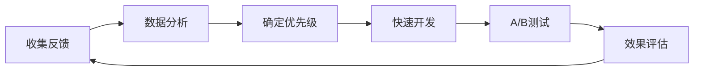

# TradeFlow - B2B贸易智能助手产品需求规格书 (PRD)

## 1. 项目概述

### 1.1 产品背景和愿景

**产品名称**: TradeFlow  
**产品类型**: B2B贸易智能助手平台  
**产品愿景**: 构建全球领先的对话式AI贸易助手，通过自然语言交互帮助中小企业完成买家开发、供应商采购等核心贸易业务，降低国际贸易门槛

**核心价值主张**:
- **贸易专家级智能**: AI掌握国际贸易专业知识，提供专业级贸易咨询和操作指导
- **全球商机发现**: 智能分析全球贸易数据，精准匹配买家和供应商商机
- **多语言贸易沟通**: 支持主要贸易语言，消除国际贸易语言障碍
- **端到端贸易流程**: 从商机发现到交易达成的全流程智能支持

### 1.2 商业目标

**主要商业目标**:
1. **用户规模**: 12个月内获得5,000+中小企业用户，月活跃用户达到2,000+
2. **收入目标**: 18个月内实现月收入$100,000，主要来源于订阅和交易佣金
3. **市场定位**: 成为中小企业国际贸易的首选AI助手
4. **转化率**: 免费试用到付费用户转化率达到25%

**成功指标**:
- 用户平均会话时长 > 15分钟 (贸易咨询复杂度高)
- 商机匹配成功率 > 80%
- 用户月活跃度 > 60%
- 客户成交转化率 > 5% (用户通过平台实现成交)
- NPS (净推荐值) > 60

### 1.3 目标市场分析

**主要目标用户群体**:
1. **中小制造企业** (35%): 寻求海外买家的制造商和出口商
2. **贸易公司** (30%): 专业从事进出口贸易的中介机构
3. **跨境电商** (20%): B2B跨境电商平台和独立站经营者
4. **采购商** (15%): 寻找优质供应商的国际采购商

**地理市场重点**:
- **一级市场**: 中国大陆、东南亚 (制造业集中)
- **二级市场**: 印度、土耳其、墨西哥 (新兴制造业)
- **目标买家市场**: 北美、欧盟、日韩 (主要进口市场)

**市场规模估算**:
- TAM (总体市场): $500亿 (全球B2B贸易服务市场)
- SAM (可服务市场): $50亿 (数字化贸易服务市场)
- SOM (可获得市场): $5亿 (AI驱动的贸易助手市场)

## 2. B2B贸易用户研究与分析

### 2.1 Jobs-to-be-Done (JTBD) 框架分析

#### 2.1.1 核心贸易任务 (Core Jobs)

**主要任务1: 买家开发与客户获取**
- **当用户需要**: 寻找潜在海外买家，扩大出口市场
- **他们想要**: 精准匹配与自己产品对应的优质买家
- **但是现在**: 需要花费大量时间在各种平台搜索，语言障碍严重
- **理想结果**: 用自然语言描述产品和目标市场，AI自动推荐匹配的买家列表

**主要任务2: 供应商采购与源头寻找**
- **当用户需要**: 为采购需求寻找适合的供应商或制造商
- **他们想要**: 快速找到性价比最高、质量可靠的供应商
- **但是现在**: 信息不对称，难以评估供应商实力，沟通成本高
- **理想结果**: 输入采购需求，AI提供经过审查的供应商列表和详细评估

**主要任务3: 贸易数据分析与市场洞察**
- **当用户需要**: 分析市场趋势、价格走势、竞争对手情况
- **他们想要**: 基于数据的决策支持，了解市场机会和风险
- **但是现在**: 缺乏专业的贸易数据分析工具和技能
- **理想结果**: AI自动收集贸易数据，生成可视化的市场分析报告

#### 2.1.2 贸易相关任务 (Related Jobs)

**贸易文档处理**: 自动生成和填写各类贸易文档(报价单、合同、发票等)  
**多语言沟通**: 实时翻译和跨文化沟通支持  
**贸易知识学习**: 提供国际贸易规则、流程和最佳实践指导  
**风险评估**: 评估交易对手的信用状况和政治风险  
**物流优化**: 帮助规划最优运输方案和成本控制

#### 2.1.3 贸易情感任务 (Emotional Jobs)

**建立专业形象**: 在国际贸易中展现专业能力和可信度  
**减少焦虑压力**: 减少对国际贸易复杂流程和风险的担心  
**扩大全球市场**: 突破地理和语言限制，进入更广阔的国际市场  
**获得竞争优势**: 通过AI助手获得对大企业的竞争优势  
**实现业务增长**: 提高贸易效率，实现业务规模的快速增长

### 2.2 B2B贸易用户画像定义

#### 2.2.1 主要用户画像1: 出口制造商 Michael

**基本信息**:
- 年龄: 35-45岁
- 职业: 中小型制造企业销售经理/创始人
- 经验: 8-15年制造业和出口经验
- 技能: 熟悉产品制造，有一定英语水平，使用B2B平台经验

**痛点**:
- 找到潜在海外买家时间成本高，效率低
- 语言障碍影响与国际买家的沟通效果
- 缺乏对目标市场深入了解，难以制定针对性策略
- 传统展会模式成本高且受限制较多

**使用场景**:
- 每月需要开发新的海外客户群体
- 定期分析目标市场的需求趋势和价格变化
- 需要制作专业的产品介绍和报价文档
- 参与国际贸易谈判和合同签署

**成功标准**:
- 海外客户获取效率提升75%以上
- 客户询盘响应率提升到50%
- 节省市场开发成本60%以上

#### 2.2.2 主要用户画像2: 贸易公司采购 Emma

**基本信息**:
- 年龄: 28-38岁
- 职业: 贸易公司采购经理/项目经理
- 经验: 5-10年国际贸易和采购经验
- 技能: 熟悉贸易流程，英语流利，有丰富的供应商管理经验

**痛点**:
- 寻找符合要求的新供应商耗时费力
- 供应商质量和可靠性评估难度大
- 多供应商价格比较和谈判工作量大
- 贸易风险评估和管理缺乏专业工具

**使用场景**:
- 每月处理多个采购项目，需要寻找10-20个潜在供应商
- 定期评估现有供应商的表现和市场竞争力
- 需要制作详细的采购分析报告和成本对比
- 应对突发的紧急采购需求

**成功标准**:
- 供应商寻找效率提升80%以上
- 采购成本降低15-25%
- 风险供应商筛查准确率达90%以上

#### 2.2.3 主要用户画像3: 跨境电商 Lisa

**基本信息**:
- 年龄: 25-35岁
- 职业: 跨境电商创业者/运营经理
- 经验: 3-8年电商和数字营销经验
- 技能: 熟悉电商平台运营，数据分析能力强，多语言能力

**痛点**:
- 产品选品和市场定位缺乏数据支持
- 供应链管理复杂，难以平衡质量和成本
- 竞争激烈，需要不断发现新的利基商品
- 多平台运营管理工作量大

**使用场景**:
- 每周分析市场热点产品和趋势
- 定期评估和优化产品组合
- 寻找可靠的优质供应商合作伙伴
- 制定精准的市场推广和定价策略

**成功标准**:
- 产品选品成功率提升60%以上
- 供应商管理效率提升50%
- 整体运营效率和利润率提升40%

### 2.3 B2B贸易用户旅程映射

#### 2.3.1 买家开发任务用户旅程

**阶段1: 市场调研** (Research)
- **触发事件**: 企业决定拓展海外市场
- **用户行为**: 分析目标市场，研究买家需求
- **情感状态**: 兴奋但担心市场不熟悉
- **痛点**: 缺乏海外市场数据和洞察
- **机会点**: AI提供智能市场分析和买家画像

**阶段2: 买家搜寻** (Search)
- **用户行为**: 在各种平台搜索潜在买家
- **期望**: 找到精准匹配的目标买家
- **情感状态**: 焦虑（担心找不到合适买家）
- **痛点**: 信息分散，筛选效率低
- **机会点**: AI智能买家推荐和匹配系统

**阶段3: 初步接触** (Contact)
- **用户行为**: 向潜在买家发送询盘或产品介绍
- **期望**: 获得买家积极回应
- **情感状态**: 紧张期待
- **痛点**: 语言沟通障碍，文化差异
- **机会点**: AI辅助多语言沟通和文化适配

**阶段4: 商务谈判** (Negotiate)
- **用户行为**: 价格谈判，条款协商
- **期望**: 达成互利的合作协议
- **情感状态**: 压力和期待并存
- **痛点**: 专业谈判技巧不足
- **机会点**: AI提供谈判策略和风险评估

**阶段5: 合同签署** (Contract)
- **用户行为**: 起草合同，确认条款
- **期望**: 合同条款清晰，风险可控
- **情感状态**: 谨慎和兴奋
- **痛点**: 法律条款复杂，风险识别困难
- **机会点**: AI辅助合同审查和风险提醒

**阶段6: 交易执行** (Execute)
- **用户行为**: 生产发货，处理物流和支付
- **期望**: 顺利完成交易
- **情感状态**: 紧张关注进度
- **痛点**: 物流追踪，支付风险
- **机会点**: AI提供全程交易状态跟踪

#### 2.3.2 供应商采购任务用户旅程

**阶段1: 需求定义** (Define)
- **触发事件**: 收到采购需求或订单
- **用户行为**: 明确产品规格、质量要求、交期
- **情感状态**: 专注分析需求细节
- **痛点**: 需求描述不够清晰准确
- **机会点**: AI辅助需求标准化和细化

**阶段2: 供应商搜索** (Search)
- **用户行为**: 在各平台搜索合适供应商
- **期望**: 快速找到符合要求的供应商
- **情感状态**: 急迫但要求谨慎
- **痛点**: 供应商信息真实性难以验证
- **机会点**: AI提供经过验证的供应商推荐

**阶段3: 供应商评估** (Evaluate)
- **用户行为**: 比较供应商实力、价格、服务
- **期望**: 全面了解供应商能力
- **情感状态**: 紧张评估，担心选错
- **痛点**: 评估标准复杂，信息不对称
- **机会点**: AI提供多维度供应商评分

**阶段4: 询价谈判** (Quote)
- **用户行为**: 向多个供应商询价，进行谈判
- **期望**: 获得最优价格和条件
- **情感状态**: 期待获得满意报价
- **痛点**: 价格对比繁琐，谈判技巧不足
- **机会点**: AI辅助价格分析和谈判策略

**阶段5: 供应商选择** (Select)
- **用户行为**: 综合评估后选择最优供应商
- **期望**: 选择决策准确可靠
- **情感状态**: 压力大，怕做错决定
- **痛点**: 多因素决策复杂
- **机会点**: AI提供决策支持和风险预警

**阶段6: 合作管理** (Manage)
- **用户行为**: 订单管理，质量监控，关系维护
- **期望**: 长期稳定的合作关系
- **情感状态**: 希望合作顺利
- **痛点**: 供应商管理工作量大
- **机会点**: AI辅助供应商关系管理

## 3. TradeFlow AI Agent功能需求规格

### 3.1 Epic层级功能规划

#### Epic 1: 用户管理与身份认证
**业务价值**: 为B2B贸易用户提供安全可靠的身份验证和企业信息管理  
**优先级**: Must Have  
**预估工期**: 2-3个Sprint

#### Epic 2: 智能对话与贸易咨询
**业务价值**: 核心AI对话引擎，理解贸易专业术语和业务场景  
**优先级**: Must Have  
**预估工期**: 4-6个Sprint

#### Epic 3: 买家开发智能推荐
**业务价值**: 基于产品和市场数据智能匹配潜在买家  
**优先级**: Must Have  
**预估工期**: 5-7个Sprint

#### Epic 4: 供应商采购智能匹配
**业务价值**: 为采购需求智能推荐合适的供应商  
**优先级**: Must Have  
**预估工期**: 5-7个Sprint

#### Epic 5: 贸易数据分析与洞察
**业务价值**: 提供市场趋势、价格分析等数据洞察  
**优先级**: Should Have  
**预估工期**: 4-5个Sprint

#### Epic 6: 多语言贸易沟通
**业务价值**: 支持多语言实时翻译和跨文化沟通  
**优先级**: Should Have  
**预估工期**: 3-4个Sprint

#### Epic 7: 贸易文档智能处理
**业务价值**: 自动生成和处理各类贸易文档  
**优先级**: Could Have  
**预估工期**: 4-5个Sprint

#### Epic 8: 风险评估与合规管理
**业务价值**: 评估交易风险，确保合规性  
**优先级**: Should Have  
**预估工期**: 3-4个Sprint

### 3.2 Feature层级功能详述

#### Feature 1.1: 企业用户注册与认证

**Feature描述**: 为B2B企业用户提供专业的注册认证系统

**包含的User Story**:

**Story 1.1.1: 企业用户注册**
- **作为** 企业用户
- **我希望** 通过企业邮箱和营业执照注册账户
- **以便** 使用TradeFlow的专业贸易服务

**验收标准**:
- [ ] 用户可以输入企业邮箱、公司名称、联系人信息
- [ ] 系统验证企业邮箱的有效性
- [ ] 支持上传营业执照等企业资质文件
- [ ] 发送企业邮箱验证链接
- [ ] 企业信息通过初步审核后账户激活
- [ ] 提供企业认证状态展示

**Story 1.1.2: 企业实名认证**
- **作为** 注册企业用户
- **我希望** 完成企业实名认证
- **以便** 获得更高的信任度和更多功能权限

**验收标准**:
- [ ] 上传营业执照、税务登记证等证件
- [ ] 支持企业法人身份验证
- [ ] 集成第三方企业信息验证服务
- [ ] 认证状态实时显示和通知
- [ ] 不同认证等级对应不同功能权限
- [ ] 认证失败时提供明确的改进建议

#### Feature 2.1: 贸易专业对话引擎

**Story 2.1.1: 贸易专业术语理解**
- **作为** 贸易用户
- **我希望** AI能理解专业的贸易术语和表达
- **以便** 进行准确的贸易业务咨询

**验收标准**:
- [ ] 识别常用贸易术语(FOB、CIF、L/C等)
- [ ] 理解产品规格和技术参数描述
- [ ] 支持贸易流程相关的专业表达
- [ ] 术语理解准确率 > 95%
- [ ] 不理解时主动澄清确认
- [ ] 支持术语解释和知识普及

**Story 2.1.2: 多轮对话上下文管理**
- **作为** 用户
- **我希望** AI能记住对话历史和上下文
- **以便** 进行连续的深入业务讨论

**验收标准**:
- [ ] 维护对话会话状态和历史
- [ ] 记忆用户的产品信息和偏好设置
- [ ] 支持话题切换和回溯
- [ ] 上下文保持时长 > 30分钟
- [ ] 支持会话摘要和关键信息提取
- [ ] 跨会话的信息关联和引用

#### Feature 3.1: 买家智能推荐系统

**Story 3.1.1: 产品-买家智能匹配**
- **作为** 出口制造商
- **我希望** 基于我的产品信息获得潜在买家推荐
- **以便** 高效地开发海外客户

**验收标准**:
- [ ] 用户输入产品类别、规格、价格等信息
- [ ] AI分析产品特征和目标市场
- [ ] 推荐匹配度高的潜在买家列表
- [ ] 买家信息包含联系方式、采购历史、信用评级
- [ ] 匹配准确率 > 80%
- [ ] 支持推荐理由说明和匹配度评分

**Story 3.1.2: 市场需求分析报告**
- **作为** 用户
- **我希望** 了解我的产品在目标市场的需求情况
- **以便** 制定更好的市场策略

**验收标准**:
- [ ] 分析目标市场的需求趋势
- [ ] 提供价格区间和竞争分析
- [ ] 生成可视化的市场报告
- [ ] 包含季节性需求和增长预测
- [ ] 提供市场进入建议和风险提醒
- [ ] 支持多个市场的对比分析

#### Feature 4.1: 供应商智能匹配系统

**Story 4.1.1: 采购需求-供应商匹配**
- **作为** 采购商
- **我希望** 根据采购需求获得合适的供应商推荐
- **以便** 快速找到可靠的供应来源

**验收标准**:
- [ ] 用户描述采购需求(产品、数量、质量、交期)
- [ ] AI理解需求并转换为搜索条件
- [ ] 推荐符合条件的供应商列表
- [ ] 供应商信息包含能力认证、历史表现、联系方式
- [ ] 推荐准确率 > 85%
- [ ] 支持多维度筛选和排序

**Story 4.1.2: 供应商实力评估**
- **作为** 采购商
- **我希望** 获得供应商的详细实力评估
- **以便** 做出更明智的选择决策

**验收标准**:
- [ ] 多维度评估供应商(质量、价格、交期、服务)
- [ ] 整合第三方认证和评价数据
- [ ] 生成供应商评估报告和评分
- [ ] 提供风险预警和建议
- [ ] 支持供应商对比分析
- [ ] 历史合作数据和信用记录展示

#### Feature 5.1: 贸易数据分析引擎

**Story 5.1.1: 市场趋势分析**
- **作为** 贸易用户
- **我希望** 了解相关产品的市场趋势
- **以便** 制定业务策略和时机选择

**验收标准**:
- [ ] 收集和分析全球贸易数据
- [ ] 生成产品价格趋势图表
- [ ] 分析进出口量变化趋势
- [ ] 识别市场热点和机会
- [ ] 提供趋势预测和建议
- [ ] 支持自定义时间段和地区分析

**Story 5.1.2: 竞争对手分析**
- **作为** 用户
- **我希望** 了解主要竞争对手的情况
- **以便** 调整自己的竞争策略

**验收标准**:
- [ ] 识别主要竞争对手
- [ ] 分析竞争对手的产品和价格策略
- [ ] 对比市场份额和优劣势
- [ ] 生成竞争分析报告
- [ ] 提供差异化建议
- [ ] 监控竞争对手动态变化

#### Feature 6.1: 多语言智能翻译

**Story 6.1.1: 实时对话翻译**
- **作为** 贸易用户
- **我希望** 与海外客户沟通时得到准确的翻译支持
- **以便** 克服语言障碍进行有效沟通

**验收标准**:
- [ ] 支持主要贸易语言(英语、西班牙语、阿拉伯语等)
- [ ] 准确翻译贸易专业术语
- [ ] 保持原文的商务语调和礼貌用语
- [ ] 翻译准确率 > 95%
- [ ] 支持语音输入和输出
- [ ] 提供翻译质量评估和优化建议

**Story 6.1.2: 文档智能翻译**
- **作为** 用户
- **我希望** 翻译贸易相关文档
- **以便** 理解和处理多语言商务文件

**验收标准**:
- [ ] 支持PDF、Word、Excel等格式翻译
- [ ] 保持文档原有格式和布局
- [ ] 准确翻译表格和图表中的内容
- [ ] 支持批量文档翻译
- [ ] 提供翻译前后对比查看
- [ ] 支持专业术语词典自定义

## 4. 贸易数据模型设计

### 4.1 核心实体关系设计

#### 4.1.1 用户与企业实体

```sql
-- 企业用户表
CREATE TABLE companies (
    id UUID PRIMARY KEY,
    company_name VARCHAR(255) NOT NULL,
    business_license VARCHAR(100) UNIQUE,
    company_type VARCHAR(50), -- manufacturer, trader, buyer, supplier
    industry_category VARCHAR(100),
    established_year INTEGER,
    employee_count INTEGER,
    annual_revenue DECIMAL(15,2),
    country VARCHAR(50),
    city VARCHAR(100),
    address TEXT,
    website VARCHAR(255),
    verification_status VARCHAR(20) DEFAULT 'pending', -- pending, verified, rejected
    created_at TIMESTAMP DEFAULT CURRENT_TIMESTAMP,
    updated_at TIMESTAMP DEFAULT CURRENT_TIMESTAMP
);

-- 用户表
CREATE TABLE users (
    id UUID PRIMARY KEY,
    company_id UUID REFERENCES companies(id),
    email VARCHAR(255) UNIQUE NOT NULL,
    password_hash VARCHAR(255),
    full_name VARCHAR(100),
    position VARCHAR(100),
    phone VARCHAR(20),
    language_preference VARCHAR(10) DEFAULT 'en',
    role VARCHAR(20) DEFAULT 'user', -- user, admin, owner
    status VARCHAR(20) DEFAULT 'active',
    last_login TIMESTAMP,
    created_at TIMESTAMP DEFAULT CURRENT_TIMESTAMP
);
```

#### 4.1.2 产品与分类实体

```sql
-- 产品分类表
CREATE TABLE product_categories (
    id UUID PRIMARY KEY,
    parent_id UUID REFERENCES product_categories(id),
    name VARCHAR(255) NOT NULL,
    name_en VARCHAR(255),
    level INTEGER, -- 1,2,3 for different hierarchy levels
    hs_code VARCHAR(20), -- Harmonized System code
    description TEXT,
    created_at TIMESTAMP DEFAULT CURRENT_TIMESTAMP
);

-- 产品表
CREATE TABLE products (
    id UUID PRIMARY KEY,
    company_id UUID REFERENCES companies(id),
    category_id UUID REFERENCES product_categories(id),
    name VARCHAR(255) NOT NULL,
    name_en VARCHAR(255),
    model VARCHAR(100),
    specifications JSONB, -- 产品规格参数
    description TEXT,
    description_en TEXT,
    images JSONB, -- 产品图片URL数组
    price_range JSONB, -- {min: 100, max: 500, currency: 'USD'}
    moq INTEGER, -- Minimum Order Quantity
    supply_capacity INTEGER,
    lead_time INTEGER, -- days
    certifications JSONB, -- 认证信息
    keywords JSONB, -- 搜索关键词
    status VARCHAR(20) DEFAULT 'active',
    created_at TIMESTAMP DEFAULT CURRENT_TIMESTAMP,
    updated_at TIMESTAMP DEFAULT CURRENT_TIMESTAMP
);
```

#### 4.1.3 买家需求与供应商能力实体

```sql
-- 买家需求表
CREATE TABLE buyer_requirements (
    id UUID PRIMARY KEY,
    buyer_id UUID REFERENCES companies(id),
    category_id UUID REFERENCES product_categories(id),
    title VARCHAR(255) NOT NULL,
    description TEXT,
    specifications JSONB,
    quantity_required INTEGER,
    budget_range JSONB, -- {min: 1000, max: 5000, currency: 'USD'}
    target_price DECIMAL(10,2),
    delivery_time INTEGER, -- days
    destination_country VARCHAR(50),
    destination_port VARCHAR(100),
    quality_requirements TEXT,
    certification_requirements JSONB,
    payment_terms VARCHAR(100),
    status VARCHAR(20) DEFAULT 'active', -- active, closed, fulfilled
    deadline DATE,
    created_at TIMESTAMP DEFAULT CURRENT_TIMESTAMP,
    updated_at TIMESTAMP DEFAULT CURRENT_TIMESTAMP
);

-- 供应商能力表
CREATE TABLE supplier_capabilities (
    id UUID PRIMARY KEY,
    supplier_id UUID REFERENCES companies(id),
    category_id UUID REFERENCES product_categories(id),
    production_capacity INTEGER,
    minimum_order_quantity INTEGER,
    lead_time_days INTEGER,
    quality_certifications JSONB,
    export_markets JSONB, -- 主要出口市场
    price_range JSONB,
    payment_terms JSONB,
    competitive_advantages TEXT,
    created_at TIMESTAMP DEFAULT CURRENT_TIMESTAMP,
    updated_at TIMESTAMP DEFAULT CURRENT_TIMESTAMP
);
```

#### 4.1.4 商机匹配与交易记录实体

```sql
-- 商机匹配表
CREATE TABLE business_opportunities (
    id UUID PRIMARY KEY,
    buyer_id UUID REFERENCES companies(id),
    supplier_id UUID REFERENCES companies(id),
    product_id UUID REFERENCES products(id),
    requirement_id UUID REFERENCES buyer_requirements(id),
    matching_score DECIMAL(3,2), -- 0.00 to 1.00
    matching_factors JSONB, -- 匹配因素详情
    status VARCHAR(20) DEFAULT 'pending', -- pending, contacted, negotiating, closed, failed
    ai_recommendation TEXT, -- AI推荐理由
    created_by VARCHAR(20), -- system, user
    created_at TIMESTAMP DEFAULT CURRENT_TIMESTAMP,
    updated_at TIMESTAMP DEFAULT CURRENT_TIMESTAMP
);

-- 询盘记录表
CREATE TABLE inquiries (
    id UUID PRIMARY KEY,
    opportunity_id UUID REFERENCES business_opportunities(id),
    sender_id UUID REFERENCES companies(id),
    receiver_id UUID REFERENCES companies(id),
    subject VARCHAR(255),
    message TEXT,
    product_details JSONB,
    quantity INTEGER,
    target_price DECIMAL(10,2),
    currency VARCHAR(3),
    delivery_terms VARCHAR(50),
    payment_terms VARCHAR(100),
    response_status VARCHAR(20) DEFAULT 'pending', -- pending, replied, ignored
    ai_generated BOOLEAN DEFAULT false,
    created_at TIMESTAMP DEFAULT CURRENT_TIMESTAMP
);

-- 交易记录表
CREATE TABLE transactions (
    id UUID PRIMARY KEY,
    inquiry_id UUID REFERENCES inquiries(id),
    buyer_id UUID REFERENCES companies(id),
    supplier_id UUID REFERENCES companies(id),
    product_details JSONB,
    quantity INTEGER,
    unit_price DECIMAL(10,2),
    total_amount DECIMAL(15,2),
    currency VARCHAR(3),
    payment_terms VARCHAR(100),
    delivery_terms VARCHAR(50),
    status VARCHAR(20) DEFAULT 'negotiating', -- negotiating, confirmed, shipped, completed, cancelled
    contract_signed_at TIMESTAMP,
    estimated_delivery DATE,
    actual_delivery DATE,
    commission_rate DECIMAL(3,2), -- TradeFlow佣金比例
    commission_amount DECIMAL(10,2),
    created_at TIMESTAMP DEFAULT CURRENT_TIMESTAMP,
    updated_at TIMESTAMP DEFAULT CURRENT_TIMESTAMP
);
```

#### 4.1.5 AI对话与分析实体

```sql
-- 对话会话表
CREATE TABLE conversations (
    id UUID PRIMARY KEY,
    user_id UUID REFERENCES users(id),
    title VARCHAR(200),
    context_type VARCHAR(50), -- buyer_search, supplier_search, market_analysis, general
    session_data JSONB, -- 会话上下文数据
    language VARCHAR(10) DEFAULT 'en',
    status VARCHAR(20) DEFAULT 'active',
    created_at TIMESTAMP DEFAULT CURRENT_TIMESTAMP,
    updated_at TIMESTAMP DEFAULT CURRENT_TIMESTAMP
);

-- 消息记录表
CREATE TABLE messages (
    id UUID PRIMARY KEY,
    conversation_id UUID REFERENCES conversations(id),
    role VARCHAR(20), -- user, assistant, system
    content TEXT,
    content_type VARCHAR(20) DEFAULT 'text', -- text, image, document, structured
    metadata JSONB, -- 消息元数据(翻译、意图识别结果等)
    ai_model VARCHAR(50), -- 使用的AI模型
    processing_time INTEGER, -- 处理时间(毫秒)
    created_at TIMESTAMP DEFAULT CURRENT_TIMESTAMP
);

-- 市场分析报告表
CREATE TABLE market_reports (
    id UUID PRIMARY KEY,
    user_id UUID REFERENCES users(id),
    report_type VARCHAR(50), -- trend_analysis, competitor_analysis, price_analysis
    product_category VARCHAR(100),
    target_market VARCHAR(50),
    time_period JSONB, -- {start: '2024-01', end: '2024-12'}
    report_data JSONB, -- 分析结果数据
    charts JSONB, -- 图表配置和数据
    insights TEXT, -- AI洞察和建议
    generated_at TIMESTAMP DEFAULT CURRENT_TIMESTAMP
);
```

### 4.2 数据关系与索引设计

#### 4.2.1 关键索引策略

```sql
-- 企业搜索索引
CREATE INDEX idx_companies_type_country ON companies(company_type, country);
CREATE INDEX idx_companies_industry ON companies(industry_category);
CREATE INDEX idx_companies_verification ON companies(verification_status);

-- 产品搜索索引
CREATE INDEX idx_products_category ON products(category_id);
CREATE INDEX idx_products_company ON products(company_id);
CREATE INDEX idx_products_keywords ON products USING GIN(keywords);
CREATE INDEX idx_products_status ON products(status);

-- 商机匹配索引
CREATE INDEX idx_opportunities_buyer ON business_opportunities(buyer_id);
CREATE INDEX idx_opportunities_supplier ON business_opportunities(supplier_id);
CREATE INDEX idx_opportunities_score ON business_opportunities(matching_score DESC);
CREATE INDEX idx_opportunities_status ON business_opportunities(status);

-- 对话检索索引
CREATE INDEX idx_conversations_user ON conversations(user_id);
CREATE INDEX idx_messages_conversation ON messages(conversation_id);
CREATE INDEX idx_messages_created ON messages(created_at DESC);
```

#### 4.2.2 数据完整性约束

```sql
-- 确保交易金额为正数
ALTER TABLE transactions ADD CONSTRAINT chk_positive_amount 
CHECK (total_amount > 0);

-- 确保匹配分数在合理范围内
ALTER TABLE business_opportunities ADD CONSTRAINT chk_matching_score 
CHECK (matching_score >= 0 AND matching_score <= 1);

-- 确保用户属于某个企业
ALTER TABLE users ADD CONSTRAINT chk_user_company 
CHECK (company_id IS NOT NULL);

-- 确保产品有分类
ALTER TABLE products ADD CONSTRAINT chk_product_category 
CHECK (category_id IS NOT NULL);
```

## 5. 多语言和国际化需求

### 5.1 多语言支持策略

#### 5.1.1 目标语言覆盖

**一级支持语言** (完整功能):
- **英语 (English)**: 国际贸易通用语言，必须支持
- **中文简体 (Simplified Chinese)**: 中国制造业用户主要语言
- **西班牙语 (Spanish)**: 拉美市场重要语言
- **阿拉伯语 (Arabic)**: 中东市场重要语言

**二级支持语言** (基础功能):
- **德语 (German)**: 欧洲制造业发达地区
- **法语 (French)**: 非洲法语区重要语言
- **日语 (Japanese)**: 亚洲重要贸易伙伴
- **韩语 (Korean)**: 亚洲制造业发达地区
- **葡萄牙语 (Portuguese)**: 巴西等南美市场
- **俄语 (Russian)**: 俄罗斯及周边地区

#### 5.1.2 多语言技术实现

**前端国际化 (i18n)**:
```javascript
// 多语言资源文件结构
/src/locales/
  ├── en/
  │   ├── common.json
  │   ├── trade.json
  │   ├── products.json
  │   └── errors.json
  ├── zh-CN/
  │   ├── common.json
  │   ├── trade.json
  │   ├── products.json
  │   └── errors.json
  └── es/
      ├── common.json
      ├── trade.json
      ├── products.json
      └── errors.json

// 贸易专业术语翻译示例
{
  "trade_terms": {
    "fob": "离岸价格",
    "cif": "到岸价格", 
    "letter_of_credit": "信用证",
    "bill_of_lading": "提单",
    "commercial_invoice": "商业发票"
  }
}
```

**后端多语言数据模型**:
```sql
-- 多语言内容表
CREATE TABLE multilingual_content (
    id UUID PRIMARY KEY,
    entity_type VARCHAR(50), -- product, category, company
    entity_id UUID,
    field_name VARCHAR(50), -- name, description, etc.
    language_code VARCHAR(10),
    content TEXT,
    created_at TIMESTAMP DEFAULT CURRENT_TIMESTAMP
);

-- 产品多语言支持示例
INSERT INTO multilingual_content VALUES
('uuid1', 'product', 'product-uuid', 'name', 'en', 'Wireless Bluetooth Speaker'),
('uuid2', 'product', 'product-uuid', 'name', 'zh-CN', '无线蓝牙音响'),
('uuid3', 'product', 'product-uuid', 'name', 'es', 'Altavoz Bluetooth Inalámbrico');
```

#### 5.1.3 智能翻译引擎

**AI翻译功能需求**:

**Story 5.1.1: 贸易文档智能翻译**
- **作为** 贸易用户
- **我希望** AI能准确翻译贸易相关文档
- **以便** 与不同语言的客户进行有效沟通

**验收标准**:
- [ ] 支持10种主要贸易语言互译
- [ ] 贸易专业术语翻译准确率 > 98%
- [ ] 保持商务文档的正式语调
- [ ] 支持PDF、Word、Excel等格式
- [ ] 保留原文档格式和排版
- [ ] 提供翻译质量评分和置信度

**技术实现**:
```python
# AI翻译服务接口设计
class TradeTranslationService:
    def __init__(self):
        self.translation_models = {
            'general': OpenAITranslator(),
            'trade_specific': CustomTradeTranslator(),
            'document': DocumentTranslator()
        }
        self.trade_glossary = TradeGlossaryManager()
    
    async def translate_text(self, text: str, source_lang: str, 
                           target_lang: str, context: str = 'general'):
        # 识别贸易术语
        trade_terms = self.trade_glossary.extract_terms(text)
        
        # 选择合适的翻译模型
        translator = self.translation_models.get(context, 
                                                self.translation_models['general'])
        
        # 执行翻译
        result = await translator.translate(text, source_lang, target_lang)
        
        # 术语一致性检查
        result = self.ensure_term_consistency(result, trade_terms, target_lang)
        
        return {
            'translated_text': result,
            'confidence_score': result.confidence,
            'detected_terms': trade_terms
        }
```

### 5.2 文化适配与本地化

#### 5.2.1 地区特定功能

**货币和计量单位**:
```javascript
// 地区化配置
const regionSettings = {
  'US': {
    currency: 'USD',
    measurement: 'imperial',
    dateFormat: 'MM/DD/YYYY',
    numberFormat: '1,234.56'
  },
  'CN': {
    currency: 'CNY',
    measurement: 'metric', 
    dateFormat: 'YYYY-MM-DD',
    numberFormat: '1,234.56'
  },
  'DE': {
    currency: 'EUR',
    measurement: 'metric',
    dateFormat: 'DD.MM.YYYY',
    numberFormat: '1.234,56'
  }
};
```

**贸易术语本地化**:
```sql
-- 地区特定贸易术语表
CREATE TABLE regional_trade_terms (
    id UUID PRIMARY KEY,
    region VARCHAR(10),
    term_code VARCHAR(20), -- FOB, CIF, etc.
    local_name VARCHAR(100),
    description TEXT,
    legal_implications TEXT,
    common_usage_note TEXT
);

-- 示例数据
INSERT INTO regional_trade_terms VALUES
('uuid1', 'US', 'FOB', 'Free On Board', 'Seller delivers goods on board...', '...', '...'),
('uuid2', 'CN', 'FOB', '离岸价', '卖方在指定装运港将货物交至买方指定的承运人...', '...', '...'),
('uuid3', 'DE', 'FOB', 'Frei an Bord', 'Der Verkäufer liefert die Ware an Bord...', '...', '...');
```

#### 5.2.2 商务礼仪适配

**AI对话风格调整**:
```python
class CulturalAdaptationEngine:
    def __init__(self):
        self.cultural_rules = {
            'formal_cultures': ['DE', 'JP', 'KR'],  # 正式文化
            'relationship_cultures': ['CN', 'AR', 'MX'],  # 关系文化
            'direct_cultures': ['US', 'AU', 'NL'],  # 直接文化
            'hierarchical_cultures': ['JP', 'KR', 'IN']  # 等级文化
        }
    
    def adapt_message(self, message: str, sender_culture: str, 
                     receiver_culture: str) -> str:
        """根据文化背景调整消息风格"""
        adapted_message = message
        
        # 正式程度调整
        if receiver_culture in self.cultural_rules['formal_cultures']:
            adapted_message = self.make_more_formal(adapted_message)
        
        # 关系建立元素
        if receiver_culture in self.cultural_rules['relationship_cultures']:
            adapted_message = self.add_relationship_elements(adapted_message)
        
        # 直接性调整
        if receiver_culture not in self.cultural_rules['direct_cultures']:
            adapted_message = self.make_less_direct(adapted_message)
        
        return adapted_message
```

### 5.3 时区和法规适配

#### 5.3.1 全球时区支持

**时区处理策略**:
```python
# 贸易时间管理
class TradeTimeManager:
    def __init__(self):
        self.major_trade_timezones = {
            'NYSE': 'America/New_York',      # 纽约证券交易所
            'LSE': 'Europe/London',          # 伦敦证券交易所  
            'TSE': 'Asia/Tokyo',             # 东京证券交易所
            'SSE': 'Asia/Shanghai',          # 上海证券交易所
            'BSE': 'Asia/Kolkata',           # 孟买证券交易所
            'FSE': 'Europe/Frankfurt'        # 法兰克福证券交易所
        }
    
    def get_market_hours(self, market_code: str, date: datetime) -> dict:
        """获取指定市场的交易时间"""
        timezone = self.major_trade_timezones.get(market_code)
        if not timezone:
            return None
            
        # 返回该市场的开盘和收盘时间
        return {
            'open': self.localize_time('09:00', timezone, date),
            'close': self.localize_time('17:00', timezone, date),
            'timezone': timezone
        }
```

#### 5.3.2 国际贸易法规适配

**合规性检查框架**:
```sql
-- 贸易合规规则表
CREATE TABLE trade_compliance_rules (
    id UUID PRIMARY KEY,
    rule_type VARCHAR(50), -- export_control, import_restriction, sanctions
    country_from VARCHAR(10),
    country_to VARCHAR(10),
    product_category VARCHAR(100),
    hs_code VARCHAR(20),
    rule_description TEXT,
    compliance_requirements JSONB,
    penalty_info TEXT,
    effective_date DATE,
    expiry_date DATE,
    authority VARCHAR(100), -- 监管机构
    created_at TIMESTAMP DEFAULT CURRENT_TIMESTAMP
);

-- 示例合规规则
INSERT INTO trade_compliance_rules VALUES
('uuid1', 'export_control', 'US', '*', 'Electronics', '8517', 
 'US export controls on telecommunications equipment', 
 '{"license_required": true, "end_user_certificate": true}',
 'Up to $1M fine and/or 20 years imprisonment',
 '2024-01-01', '2025-12-31', 'US Bureau of Industry and Security', 
 NOW());
```

## 6. 贸易数据安全和合规要求

### 6.1 数据安全架构

#### 6.1.1 数据分类与保护

**敏感数据分类**:
```python
class TradeDataClassification:
    # 数据敏感级别定义
    SENSITIVITY_LEVELS = {
        'PUBLIC': 0,         # 公开信息(产品目录、展会信息)
        'INTERNAL': 1,       # 内部信息(用户偏好、搜索历史)
        'CONFIDENTIAL': 2,   # 商业机密(报价、合同条款)
        'RESTRICTED': 3      # 限制信息(银行账户、身份证明)
    }
    
    # 数据类型映射
    DATA_CLASSIFICATION = {
        'company_financial': 'CONFIDENTIAL',
        'product_pricing': 'CONFIDENTIAL', 
        'client_list': 'CONFIDENTIAL',
        'bank_details': 'RESTRICTED',
        'identity_documents': 'RESTRICTED',
        'trade_secrets': 'RESTRICTED',
        'product_catalog': 'INTERNAL',
        'market_reports': 'INTERNAL'
    }
```

**数据加密策略**:
```sql
-- 敏感数据加密存储
CREATE TABLE encrypted_business_data (
    id UUID PRIMARY KEY,
    company_id UUID REFERENCES companies(id),
    data_type VARCHAR(50),
    encrypted_content BYTEA, -- AES-256加密内容
    encryption_key_id VARCHAR(100), -- 密钥管理系统引用
    checksum VARCHAR(64), -- 数据完整性校验
    created_at TIMESTAMP DEFAULT CURRENT_TIMESTAMP,
    expires_at TIMESTAMP -- 数据过期时间
);

-- 审计日志表
CREATE TABLE data_access_logs (
    id UUID PRIMARY KEY,
    user_id UUID REFERENCES users(id),
    data_type VARCHAR(50),
    action VARCHAR(20), -- read, write, delete, export
    resource_id UUID,
    ip_address INET,
    user_agent TEXT,
    success BOOLEAN,
    failure_reason TEXT,
    timestamp TIMESTAMP DEFAULT CURRENT_TIMESTAMP
);
```

#### 6.1.2 访问控制与权限管理

**基于角色的访问控制 (RBAC)**:
```sql
-- 角色定义表
CREATE TABLE user_roles (
    id UUID PRIMARY KEY,
    role_name VARCHAR(50) UNIQUE,
    description TEXT,
    permissions JSONB, -- 权限列表
    created_at TIMESTAMP DEFAULT CURRENT_TIMESTAMP
);

-- 权限示例数据
INSERT INTO user_roles VALUES
('uuid1', 'company_owner', 'Company owner with full access', 
 '{"read": ["*"], "write": ["*"], "delete": ["company_data"], "export": ["company_data"]}'),
('uuid2', 'sales_manager', 'Sales manager with limited access',
 '{"read": ["products", "buyers", "inquiries"], "write": ["inquiries"], "export": ["inquiries"]}'),
('uuid3', 'purchasing_manager', 'Purchasing manager role',
 '{"read": ["suppliers", "products", "quotes"], "write": ["purchase_orders"], "export": ["supplier_data"]}');

-- 用户角色关联表
CREATE TABLE user_role_assignments (
    user_id UUID REFERENCES users(id),
    role_id UUID REFERENCES user_roles(id),
    assigned_by UUID REFERENCES users(id),
    assigned_at TIMESTAMP DEFAULT CURRENT_TIMESTAMP,
    expires_at TIMESTAMP,
    PRIMARY KEY (user_id, role_id)
);
```

**动态权限检查服务**:
```python
class TradePermissionService:
    def __init__(self):
        self.permission_cache = Redis()
    
    async def check_permission(self, user_id: str, action: str, 
                             resource: str) -> bool:
        """检查用户权限"""
        # 从缓存获取用户权限
        permissions = await self.get_user_permissions(user_id)
        
        # 检查具体权限
        if self.has_wildcard_permission(permissions, action):
            return True
            
        return resource in permissions.get(action, [])
    
    async def check_data_access(self, user_id: str, company_id: str, 
                              data_type: str) -> bool:
        """检查数据访问权限"""
        user = await self.get_user(user_id)
        
        # 只能访问自己公司的数据
        if user.company_id != company_id:
            return False
        
        # 检查数据类型权限
        return await self.check_permission(user_id, 'read', data_type)
```

### 6.2 合规性要求

#### 6.2.1 数据保护法规合规

**GDPR (通用数据保护条例) 合规**:
```python
class GDPRComplianceManager:
    def __init__(self):
        self.data_retention_policies = {
            'user_data': timedelta(days=2555),  # 7年
            'conversation_logs': timedelta(days=1095),  # 3年
            'transaction_records': timedelta(days=2555),  # 7年
            'marketing_data': timedelta(days=730)  # 2年
        }
    
    async def handle_data_subject_request(self, request_type: str, 
                                        user_id: str) -> dict:
        """处理数据主体请求"""
        if request_type == 'access':
            return await self.export_user_data(user_id)
        elif request_type == 'deletion':
            return await self.delete_user_data(user_id)
        elif request_type == 'portability':
            return await self.export_portable_data(user_id)
        elif request_type == 'rectification':
            return await self.correct_user_data(user_id)
    
    async def auto_delete_expired_data(self):
        """自动删除过期数据"""
        for data_type, retention_period in self.data_retention_policies.items():
            cutoff_date = datetime.now() - retention_period
            await self.delete_data_before_date(data_type, cutoff_date)
```

**用户隐私控制**:
```sql
-- 用户隐私设置表
CREATE TABLE user_privacy_settings (
    user_id UUID PRIMARY KEY REFERENCES users(id),
    data_processing_consent BOOLEAN DEFAULT false,
    marketing_consent BOOLEAN DEFAULT false,
    third_party_sharing BOOLEAN DEFAULT false,
    data_retention_preference VARCHAR(20) DEFAULT 'standard', -- minimal, standard, extended
    anonymization_preference BOOLEAN DEFAULT true,
    consent_date TIMESTAMP,
    consent_ip INET,
    last_updated TIMESTAMP DEFAULT CURRENT_TIMESTAMP
);

-- 数据删除请求表
CREATE TABLE data_deletion_requests (
    id UUID PRIMARY KEY,
    user_id UUID REFERENCES users(id),
    request_type VARCHAR(20), -- full_deletion, anonymization, specific_data
    data_types JSONB, -- 指定要删除的数据类型
    reason TEXT,
    status VARCHAR(20) DEFAULT 'pending', -- pending, processing, completed, failed
    requested_at TIMESTAMP DEFAULT CURRENT_TIMESTAMP,
    processed_at TIMESTAMP,
    completion_certificate VARCHAR(255) -- 删除证明文件路径
);
```

#### 6.2.2 国际贸易合规

**反洗钱 (AML) 合规**:
```python
class AMLComplianceEngine:
    def __init__(self):
        self.risk_scoring_model = AMLRiskModel()
        self.sanctions_lists = SanctionsListManager()
        self.suspicious_patterns = SuspiciousPatternDetector()
    
    async def screen_transaction(self, transaction: dict) -> dict:
        """交易合规筛查"""
        risk_score = 0
        alerts = []
        
        # 制裁名单检查
        if await self.sanctions_lists.check_entity(transaction['counterparty']):
            risk_score += 100
            alerts.append('SANCTIONS_LIST_MATCH')
        
        # 可疑模式检测
        patterns = await self.suspicious_patterns.analyze(transaction)
        risk_score += len(patterns) * 20
        alerts.extend(patterns)
        
        # 风险评分
        overall_risk = await self.risk_scoring_model.calculate_risk(transaction)
        
        return {
            'risk_score': min(risk_score + overall_risk, 100),
            'risk_level': self.get_risk_level(risk_score),
            'alerts': alerts,
            'requires_manual_review': risk_score > 70
        }
```

**出口管制合规**:
```sql
-- 出口管制检查表
CREATE TABLE export_control_checks (
    id UUID PRIMARY KEY,
    transaction_id UUID REFERENCES transactions(id),
    product_hs_code VARCHAR(20),
    destination_country VARCHAR(10),
    end_user_type VARCHAR(50),
    control_list_items JSONB, -- 管制清单项目
    license_requirements JSONB, -- 许可证要求
    risk_assessment JSONB,
    compliance_status VARCHAR(20), -- compliant, requires_license, prohibited
    checked_at TIMESTAMP DEFAULT CURRENT_TIMESTAMP,
    expires_at TIMESTAMP
);

-- 管制实体清单
CREATE TABLE controlled_entities (
    id UUID PRIMARY KEY,
    entity_name VARCHAR(255),
    entity_type VARCHAR(50), -- company, individual, organization
    country VARCHAR(10),
    control_reason VARCHAR(100),
    restrictions JSONB,
    list_source VARCHAR(50), -- BIS, OFAC, UN, EU
    added_date DATE,
    removed_date DATE
);
```

### 6.3 安全监控与响应

#### 6.3.1 安全事件监控

**实时威胁检测**:
```python
class SecurityMonitoringService:
    def __init__(self):
        self.anomaly_detector = AnomalyDetector()
        self.threat_intelligence = ThreatIntelligenceAPI()
        self.alert_manager = SecurityAlertManager()
    
    async def monitor_user_behavior(self, user_id: str, action: dict):
        """监控用户行为异常"""
        # 获取用户正常行为基线
        baseline = await self.get_user_baseline(user_id)
        
        # 异常行为检测
        anomaly_score = await self.anomaly_detector.score(action, baseline)
        
        if anomaly_score > 0.8:  # 高风险阈值
            await self.alert_manager.create_alert({
                'type': 'BEHAVIORAL_ANOMALY',
                'user_id': user_id,
                'risk_score': anomaly_score,
                'details': action,
                'timestamp': datetime.now()
            })
    
    async def detect_data_exfiltration(self, user_id: str, export_request: dict):
        """检测数据泄露风险"""
        # 分析导出请求
        risk_factors = []
        
        # 大量数据导出
        if export_request['record_count'] > 10000:
            risk_factors.append('LARGE_DATA_EXPORT')
        
        # 非工作时间导出
        if not self.is_business_hours():
            risk_factors.append('OFF_HOURS_EXPORT')
        
        # 异常访问模式
        if await self.is_unusual_access_pattern(user_id):
            risk_factors.append('UNUSUAL_ACCESS_PATTERN')
        
        if risk_factors:
            await self.alert_manager.create_alert({
                'type': 'DATA_EXFILTRATION_RISK',
                'user_id': user_id,
                'risk_factors': risk_factors,
                'export_details': export_request
            })
```

#### 6.3.2 事件响应流程

**安全事件响应自动化**:
```python
class SecurityIncidentResponse:
    def __init__(self):
        self.response_playbooks = {
            'DATA_BREACH': DataBreachPlaybook(),
            'UNAUTHORIZED_ACCESS': UnauthorizedAccessPlaybook(),
            'SUSPICIOUS_TRANSACTION': SuspiciousTransactionPlaybook()
        }
    
    async def handle_security_incident(self, incident: dict):
        """处理安全事件"""
        incident_type = incident['type']
        playbook = self.response_playbooks.get(incident_type)
        
        if not playbook:
            return await self.default_response(incident)
        
        # 执行响应剧本
        response_actions = await playbook.execute(incident)
        
        # 记录响应过程
        await self.log_incident_response(incident, response_actions)
        
        # 通知相关人员
        await self.notify_stakeholders(incident, response_actions)
        
        return response_actions

class DataBreachPlaybook:
    async def execute(self, incident: dict) -> list:
        """数据泄露响应流程"""
        actions = []
        
        # 1. 立即遏制
        actions.append(await self.contain_breach(incident))
        
        # 2. 评估影响
        impact = await self.assess_impact(incident)
        actions.append(impact)
        
        # 3. 通知监管机构 (如果需要)
        if impact['severity'] >= 'HIGH':
            actions.append(await self.notify_regulators(incident, impact))
        
        # 4. 通知受影响用户
        actions.append(await self.notify_affected_users(incident, impact))
        
        # 5. 修复和恢复
        actions.append(await self.remediate_and_recover(incident))
        
        return actions
```

## 7. MVP版本建议

### 7.1 MVP核心功能定义

#### 7.1.1 核心价值验证目标

**产品假设验证**:
1. **假设1**: 中小贸易企业愿意使用AI助手进行买家开发和供应商寻找
2. **假设2**: AI能够有效提高贸易商机匹配的准确性和效率
3. **假设3**: 用户愿意为高质量的贸易智能服务付费
4. **假设4**: 多语言支持能够显著降低国际贸易沟通障碍

**MVP成功标准**:
- 用户注册转化率 > 15%
- 日活跃用户 > 200人
- 商机匹配满意度 > 4.0/5.0
- 用户月留存率 > 40%
- 免费到付费转化率 > 20%

#### 7.1.2 MVP功能优先级 (MoSCoW)

**Must Have (核心功能)**:
```yaml
用户管理:
  - 企业用户注册和基础认证
  - 用户登录和会话管理
  - 基础企业信息管理

AI对话引擎:
  - 支持中英文贸易专业对话
  - 基础意图识别和实体提取
  - 对话历史记录和上下文管理

买家开发功能:
  - 产品信息录入和管理
  - 基于产品的买家推荐 (Top 10)
  - 简化的市场分析报告

供应商匹配功能:
  - 采购需求录入
  - 供应商推荐列表 (Top 10)
  - 基础供应商信息展示

基础数据支持:
  - 产品分类数据库 (主要类别)
  - 国家/地区基础数据
  - 基础贸易术语支持
```

**Should Have (重要功能)**:
```yaml
增强对话:
  - 多轮对话优化
  - 贸易建议和指导
  - 简单的文档生成 (询盘模板)

数据分析:
  - 基础价格趋势分析
  - 简单的竞争对手信息
  - 出口/进口数据统计

用户体验:
  - 移动端响应式设计
  - 用户反馈收集
  - 基础帮助文档

安全功能:
  - 基础数据加密
  - 访问日志记录
  - 简单的权限控制
```

**Could Have (增值功能)**:
```yaml
高级分析:
  - 详细市场报告
  - 风险评估功能
  - 价格预测分析

社交功能:
  - 企业间简单消息功能
  - 商机分享功能
  - 用户评价系统

集成功能:
  - 第三方数据源整合
  - 基础API开放
  - 简单的CRM集成
```

**Won't Have (暂不实现)**:
```yaml
企业级功能:
  - 复杂的工作流管理
  - 高级权限和审批
  - 企业级数据分析

高级AI功能:
  - 自动合同生成
  - 复杂的风险建模
  - 预测性分析

第三方集成:
  - 复杂的ERP集成
  - 银行支付集成
  - 物流系统集成
```

### 7.2 MVP技术架构简化

#### 7.2.1 技术栈选择约束

**前端技术栈**:
```javascript
// 简化的技术选择
{
  "framework": "React 18 + TypeScript",
  "ui_library": "Ant Design", // 快速开发，组件丰富
  "state_management": "React Context + useState", // 简化状态管理
  "http_client": "Axios",
  "routing": "React Router v6",
  "build_tool": "Vite", // 快速构建
  "deployment": "Vercel" // 简单部署
}
```

**后端技术栈**:
```python
# 简化的后端架构
{
  "framework": "FastAPI", # 快速API开发
  "database": "PostgreSQL", # 单一数据库，简化管理
  "cache": "Redis", # 基础缓存
  "ai_service": "OpenAI API", # 减少自研AI成本
  "auth": "JWT + Passlib", # 简单认证
  "deployment": "Docker + Railway", # 简化部署
  "monitoring": "Sentry" # 基础错误监控
}
```

#### 7.2.2 数据模型简化

**MVP数据模型**:
```sql
-- 简化的核心表结构
-- 用户和企业 (合并表)
CREATE TABLE users (
    id UUID PRIMARY KEY,
    email VARCHAR(255) UNIQUE NOT NULL,
    password_hash VARCHAR(255),
    company_name VARCHAR(255),
    contact_person VARCHAR(100),
    country VARCHAR(50),
    industry VARCHAR(100),
    user_type VARCHAR(20), -- buyer, supplier, both
    status VARCHAR(20) DEFAULT 'active',
    created_at TIMESTAMP DEFAULT CURRENT_TIMESTAMP
);

-- 产品信息 (简化)
CREATE TABLE products (
    id UUID PRIMARY KEY,
    user_id UUID REFERENCES users(id),
    name VARCHAR(255),
    category VARCHAR(100),
    description TEXT,
    price_range VARCHAR(50), -- "100-500 USD"
    images JSONB,
    created_at TIMESTAMP DEFAULT CURRENT_TIMESTAMP
);

-- 需求信息 (简化)
CREATE TABLE requirements (
    id UUID PRIMARY KEY,
    user_id UUID REFERENCES users(id),
    title VARCHAR(255),
    category VARCHAR(100),
    description TEXT,
    quantity VARCHAR(50),
    budget VARCHAR(50),
    created_at TIMESTAMP DEFAULT CURRENT_TIMESTAMP
);

-- 对话记录 (简化)
CREATE TABLE conversations (
    id UUID PRIMARY KEY,
    user_id UUID REFERENCES users(id),
    messages JSONB, -- 存储完整对话
    session_type VARCHAR(50), -- buyer_search, supplier_search
    created_at TIMESTAMP DEFAULT CURRENT_TIMESTAMP
);

-- 推荐结果缓存
CREATE TABLE recommendations (
    id UUID PRIMARY KEY,
    user_id UUID REFERENCES users(id),
    rec_type VARCHAR(20), -- buyer, supplier
    query_params JSONB,
    results JSONB,
    expires_at TIMESTAMP,
    created_at TIMESTAMP DEFAULT CURRENT_TIMESTAMP
);
```

### 7.3 MVP开发计划

#### 7.3.1 Sprint规划 (2周/Sprint)

**Sprint 1-2: 基础设施** (4周)
```yaml
目标: 建立MVP开发基础
交付物:
  - 项目架构搭建和环境配置
  - 用户注册登录系统
  - 基础UI框架和设计系统
  - 数据库设计和初始化
  - CI/CD流水线建立

验收标准:
  - 用户可以注册并登录系统
  - 基础页面和导航可用
  - 开发环境稳定运行
```

**Sprint 3-4: 核心AI对话** (4周)
```yaml
目标: 实现基础AI对话功能
交付物:
  - OpenAI API集成
  - 基础对话界面
  - 贸易术语词典
  - 意图识别 (买家搜索/供应商搜索)
  - 对话历史存储

验收标准:
  - 用户可以与AI进行基础贸易咨询
  - AI能识别买家开发和供应商寻找需求
  - 对话历史正确保存和显示
```

**Sprint 5-6: 买家推荐功能** (4周)
```yaml
目标: 实现买家开发核心功能
交付物:
  - 产品信息录入界面
  - 买家数据库构建 (基础数据)
  - 买家推荐算法 (简化版)
  - 推荐结果展示页面
  - 基础筛选和排序

验收标准:
  - 用户可以录入产品信息
  - 系统能推荐10个潜在买家
  - 推荐结果包含基本联系信息
  - 推荐准确率 > 60%
```

**Sprint 7-8: 供应商匹配功能** (4周)  
```yaml
目标: 实现供应商采购核心功能
交付物:
  - 采购需求录入界面
  - 供应商数据库构建
  - 供应商匹配算法
  - 匹配结果展示页面
  - 基础评分系统

验收标准:
  - 用户可以录入采购需求
  - 系统能推荐10个合适供应商
  - 供应商信息包含能力和联系方式
  - 匹配准确率 > 65%
```

**Sprint 9-10: 数据分析和优化** (4周)
```yaml
目标: 提供基础数据洞察
交付物:
  - 简单市场趋势展示
  - 价格区间分析
  - 用户行为分析仪表板
  - 推荐算法优化
  - 性能优化

验收标准:
  - 用户可以查看市场基础数据
  - 价格信息准确展示
  - 系统响应时间 < 3秒
  - 推荐质量提升10%
```

**Sprint 11-12: 测试和发布** (4周)
```yaml
目标: 完善产品并准备发布
交付物:
  - 全面功能测试
  - 用户体验优化
  - 帮助文档和引导
  - 反馈收集系统
  - 生产环境部署

验收标准:
  - 所有核心功能稳定运行
  - 用户体验流畅友好
  - 系统安全性检查通过
  - 生产环境可用性 > 99%
```

#### 7.3.2 MVP里程碑节点

**M1 (1个月后)**: 用户可以注册登录，完成基础信息设置  
**M2 (2个月后)**: 用户可以与AI进行贸易相关对话  
**M3 (3个月后)**: 用户可以获得买家推荐，查看基础信息  
**M4 (4个月后)**: 用户可以进行供应商搜索和匹配  
**M5 (5个月后)**: 提供基础数据分析和市场洞察  
**M6 (6个月后)**: MVP正式发布，开始用户获取

### 7.4 MVP运营和验证策略

#### 7.4.1 用户获取策略

**种子用户获取** (前100个用户):
- 创始团队个人网络中的贸易企业
- 专业贸易论坛和社群推广
- 针对性的LinkedIn外联
- 免费使用激励和推荐奖励

**早期用户扩展** (100-1000用户):
- 内容营销 (贸易知识分享)
- SEO优化 (贸易相关关键词)
- 合作伙伴推荐 (贸易协会、咨询公司)
- 社交媒体精准投放

#### 7.4.2 数据收集和分析

**关键指标监控**:
```python
# MVP关键指标定义
MVP_METRICS = {
    # 用户获取指标
    'user_acquisition': {
        'daily_signups': {'target': 5, 'alert_threshold': 2},
        'signup_conversion_rate': {'target': 0.15, 'alert_threshold': 0.10},
        'user_onboarding_completion': {'target': 0.80, 'alert_threshold': 0.60}
    },
    
    # 用户活跃指标  
    'user_engagement': {
        'daily_active_users': {'target': 50, 'alert_threshold': 30},
        'session_duration': {'target': 600, 'alert_threshold': 300}, # 10分钟
        'conversations_per_user': {'target': 3, 'alert_threshold': 1}
    },
    
    # 产品价值指标
    'product_value': {
        'recommendation_satisfaction': {'target': 4.0, 'alert_threshold': 3.5},
        'successful_matches': {'target': 0.10, 'alert_threshold': 0.05}, # 10%用户找到满意匹配
        'repeat_usage_rate': {'target': 0.60, 'alert_threshold': 0.40}
    },
    
    # 商业化指标
    'business_metrics': {
        'free_to_paid_conversion': {'target': 0.20, 'alert_threshold': 0.10},
        'monthly_recurring_revenue': {'target': 1000, 'alert_threshold': 500}, # USD
        'customer_acquisition_cost': {'target': 50, 'alert_threshold': 100} # USD
    }
}
```

#### 7.4.3 用户反馈收集

**多渠道反馈机制**:
1. **应用内反馈**: 每次推荐后的满意度评分
2. **用户访谈**: 每周2-3个深度用户访谈
3. **问卷调查**: 月度用户体验调研
4. **行为数据**: 用户操作路径和停留时间分析
5. **客服记录**: 用户问题和建议汇总

**快速迭代流程**:


通过这个完整的需求文档，TradeFlow将能够为B2B贸易用户提供专业、智能、安全的贸易助手服务，帮助中小企业更好地参与国际贸易，实现业务增长。

---

**文档版本**: v1.0  
**创建日期**: 2024年8月2日  
**文档状态**: 初始版本  
**适用范围**: TradeFlow MVP开发

**需求负责人**: 产品团队  
**技术负责人**: 开发团队  
**业务负责人**: 产品经理

---

*本需求文档将作为TradeFlow产品开发的核心指导文件，后续将根据用户反馈、市场验证和技术演进持续更新优化。*