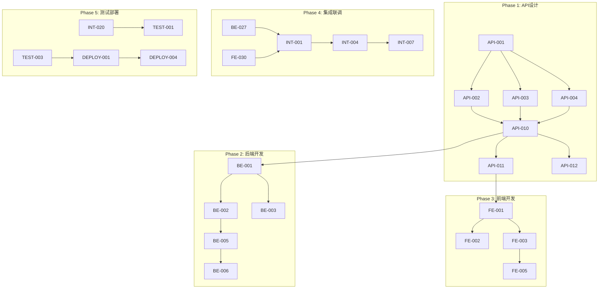

# TradeFlow MVP 前后端分离开发任务清单

## 📋 项目概览

- **开发模式**: 前后端分离
- **开发策略**: 接口先行、并行开发、持续集成
- **总任务数**: 215个
- **预计工期**: 10周
- **团队配置**: 前端团队 + 后端团队 + QA团队 + DevOps团队
- **文档版本**: v1.0
- **创建日期**: 2025-01-07

## 🏗️ Phase 1: API接口设计 (第1-2周)

### API-001: 接口规范制定
**工时**: 2天 | **依赖**: 无 | **负责**: 架构师
- [ ] 制定RESTful API设计规范
- [ ] 定义统一响应格式
- [ ] 制定错误码体系
- [ ] 制定版本管理策略
**验收标准**: API设计规范文档完成，团队评审通过

### API-002: 认证授权接口设计
**工时**: 1天 | **依赖**: API-001 | **负责**: 后端架构师
```yaml
接口清单:
  - POST /api/v1/auth/oauth/{provider} - OAuth登录
  - POST /api/v1/auth/refresh - 刷新Token
  - POST /api/v1/auth/logout - 登出
  - GET /api/v1/auth/me - 获取当前用户
```
**验收标准**: OpenAPI规范定义完成，包含请求/响应示例

### API-003: 用户管理接口设计
**工时**: 1天 | **依赖**: API-001 | **负责**: 后端架构师
```yaml
接口清单:
  - GET /api/v1/users/profile - 用户资料
  - PUT /api/v1/users/profile - 更新资料
  - POST /api/v1/users/company - 企业认证
  - GET /api/v1/users/usage - 使用统计
```
**验收标准**: 完整的用户管理API文档

### API-004: Agent对话接口设计
**工时**: 2天 | **依赖**: API-001 | **负责**: AI架构师
```yaml
接口清单:
  - POST /api/v1/chat - 发起对话
  - GET /api/v1/chat/stream - SSE流式连接
  - GET /api/v1/chat/history - 对话历史
  - DELETE /api/v1/chat/session/{id} - 删除会话
```
**验收标准**: SSE事件流格式定义，消息格式规范

### API-005: 文件管理接口设计
**工时**: 1.5天 | **依赖**: API-001 | **负责**: 后端架构师
```yaml
接口清单:
  - POST /api/v1/files/upload - 文件上传
  - GET /api/v1/files/{id} - 获取文件元数据
  - GET /api/v1/files/{id}/download - 下载文件
  - GET /api/v1/files/{id}/preview - 文件预览
  - DELETE /api/v1/files/{id} - 删除文件
  - GET /api/v1/conversations/{id}/files - 对话文件列表
```
**验收标准**: 文件上传流程图，预览格式定义

### API-006: 买家开发接口设计
**工时**: 1天 | **依赖**: API-001 | **负责**: 业务架构师
```yaml
接口清单:
  - POST /api/v1/buyers/recommend - 买家推荐
  - GET /api/v1/buyers/{id} - 买家详情
  - POST /api/v1/buyers/{id}/contact - 生成联系模板
  - GET /api/v1/buyers/markets - 市场分析
```
**验收标准**: 业务数据模型定义完整

### API-007: 供应商匹配接口设计
**工时**: 1天 | **依赖**: API-001 | **负责**: 业务架构师
```yaml
接口清单:
  - POST /api/v1/suppliers/search - 搜索供应商
  - GET /api/v1/suppliers/{id} - 供应商详情
  - POST /api/v1/suppliers/compare - 供应商对比
  - POST /api/v1/suppliers/{id}/evaluate - 质量评估
```
**验收标准**: 搜索参数和评估指标定义

### API-008: 产品管理接口设计
**工时**: 0.5天 | **依赖**: API-001 | **负责**: 业务架构师
```yaml
接口清单:
  - POST /api/v1/products - 创建产品
  - GET /api/v1/products - 产品列表
  - PUT /api/v1/products/{id} - 更新产品
  - DELETE /api/v1/products/{id} - 删除产品
```
**验收标准**: 产品数据模型完整

### API-009: 支付订阅接口设计
**工时**: 1天 | **依赖**: API-001 | **负责**: 支付架构师
```yaml
接口清单:
  - GET /api/v1/subscription/plans - 订阅计划
  - POST /api/v1/subscription/create - 创建订阅
  - POST /api/v1/subscription/cancel - 取消订阅
  - POST /api/v1/payment/webhook - Stripe Webhook
```
**验收标准**: 支付流程图，Webhook事件定义

### API-010: OpenAPI规范文档生成
**工时**: 2天 | **依赖**: API-002到API-009 | **负责**: 架构师
- [ ] 整合所有接口定义到OpenAPI 3.0规范
- [ ] 生成Swagger UI文档
- [ ] 配置认证和授权说明
- [ ] 添加示例和说明
**验收标准**: 完整的OpenAPI规范文件，Swagger UI可访问

### API-011: Mock服务配置
**工时**: 2天 | **依赖**: API-010 | **负责**: 前端架构师
- [ ] 基于OpenAPI生成Mock服务
- [ ] 配置Mock数据场景
- [ ] 设置延迟模拟
- [ ] 错误场景模拟
**验收标准**: Mock服务运行，支持所有接口

### API-012: 契约测试框架搭建
**工时**: 1天 | **依赖**: API-010 | **负责**: QA架构师
- [ ] Pact框架集成
- [ ] 契约定义模板
- [ ] CI集成配置
- [ ] 契约发布流程
**验收标准**: 契约测试框架可用

### API-013: API版本管理策略
**工时**: 0.5天 | **依赖**: API-001 | **负责**: 架构师
- [ ] 版本命名规范
- [ ] 向后兼容策略
- [ ] 废弃策略
- [ ] 版本迁移指南
**验收标准**: 版本管理文档完成

### API-014: 接口安全设计
**工时**: 1天 | **依赖**: API-001 | **负责**: 安全架构师
- [ ] 认证机制设计(JWT)
- [ ] 授权策略(RBAC)
- [ ] API限流规则
- [ ] 数据加密要求
**验收标准**: 安全设计文档，威胁模型分析

### API-015: 错误处理规范
**工时**: 0.5天 | **依赖**: API-001 | **负责**: 架构师
- [ ] 错误码体系设计
- [ ] 错误响应格式
- [ ] 错误日志规范
- [ ] 客户端错误处理指南
**验收标准**: 错误处理规范文档

## 🔧 Phase 2: 后端API开发 (第3-6周)

### 基础设施搭建 (第3周)

### BE-001: FastAPI项目初始化
**工时**: 1天 | **依赖**: API-010 | **负责**: 后端团队
- [ ] FastAPI项目结构搭建
- [ ] 依赖管理(Poetry/pip)
- [ ] 环境配置管理
- [ ] 日志系统配置
**验收标准**: 项目能够启动，健康检查端点可用

### BE-002: 数据库连接配置
**工时**: 1天 | **依赖**: BE-001 | **负责**: 后端团队
- [ ] PostgreSQL连接池配置
- [ ] MongoDB客户端配置
- [ ] Redis连接配置
- [ ] 数据库迁移工具(Alembic)
**验收标准**: 所有数据库连接测试通过

### BE-003: MinIO集成
**工时**: 1天 | **依赖**: BE-001 | **负责**: 后端团队
- [ ] MinIO客户端配置
- [ ] Bucket创建和策略设置
- [ ] 文件上传下载基础功能
- [ ] 生命周期管理配置
**验收标准**: 文件CRUD操作测试通过

### BE-004: 中间件配置
**工时**: 1天 | **依赖**: BE-001 | **负责**: 后端团队
- [ ] CORS中间件
- [ ] 请求日志中间件
- [ ] 错误处理中间件
- [ ] 性能监控中间件
**验收标准**: 中间件链路测试通过

### 认证授权模块 (第3周)

### BE-005: OAuth集成
**工时**: 2天 | **依赖**: BE-001 | **负责**: 认证团队
- [ ] Google OAuth配置
- [ ] GitHub OAuth配置
- [ ] 回调处理实现
- [ ] 用户信息获取
**验收标准**: OAuth登录流程完整

### BE-006: JWT Token管理
**工时**: 1天 | **依赖**: BE-005 | **负责**: 认证团队
- [ ] Token生成和签名
- [ ] Token验证中间件
- [ ] Token刷新机制
- [ ] Token黑名单管理
**验收标准**: Token全生命周期测试通过

### BE-007: 用户管理API实现
**工时**: 1天 | **依赖**: BE-006 | **负责**: 后端团队
- [ ] 用户CRUD操作
- [ ] 资料更新接口
- [ ] 企业认证接口
- [ ] 使用统计接口
**验收标准**: 所有用户接口测试通过

### Agent服务开发 (第4周)

### BE-008: Google ADK环境配置
**工时**: 1天 | **依赖**: BE-001 | **负责**: AI团队
- [ ] ADK SDK安装配置
- [ ] API密钥管理
- [ ] 模型选择配置
- [ ] 错误处理机制
**验收标准**: ADK连接测试成功

### BE-009: Agent基础框架
**工时**: 2天 | **依赖**: BE-008 | **负责**: AI团队
- [ ] BaseAgent抽象类
- [ ] 工具系统架构
- [ ] Context管理
- [ ] Response格式化
**验收标准**: 基础Agent可实例化

### BE-010: 买家开发Agent实现
**工时**: 3天 | **依赖**: BE-009 | **负责**: AI团队
- [ ] 贸易数据搜索工具
- [ ] 买家推荐算法
- [ ] 邮件模板生成
- [ ] 文件生成集成
**验收标准**: 买家推荐功能测试通过

### BE-011: 供应商匹配Agent实现
**工时**: 2天 | **依赖**: BE-009 | **负责**: AI团队
- [ ] 供应商搜索工具
- [ ] 匹配算法实现
- [ ] 质量评估系统
- [ ] 对比分析功能
**验收标准**: 供应商匹配功能测试通过

### BE-012: Agent Gateway服务
**工时**: 1天 | **依赖**: BE-010, BE-011 | **负责**: AI团队
- [ ] 请求路由
- [ ] Agent调度
- [ ] 负载均衡
- [ ] 错误恢复
**验收标准**: Gateway路由测试通过

### 对话管理模块 (第4-5周)

### BE-013: SSE流式响应实现
**工时**: 2天 | **依赖**: BE-012 | **负责**: 后端团队
- [ ] SSE端点实现
- [ ] 消息队列管理
- [ ] 连接池管理
- [ ] 心跳机制
**验收标准**: SSE流式传输稳定

### BE-014: 对话历史管理
**工时**: 1天 | **依赖**: BE-013 | **负责**: 后端团队
- [ ] MongoDB对话存储
- [ ] 历史查询接口
- [ ] 会话管理
- [ ] 上下文维护
**验收标准**: 对话持久化测试通过

### BE-015: 对话统计分析
**工时**: 1天 | **依赖**: BE-014 | **负责**: 后端团队
- [ ] Token使用统计
- [ ] 响应时间分析
- [ ] 用户行为分析
- [ ] 成本计算
**验收标准**: 统计数据准确

### 文件管理模块 (第5周)

### BE-016: 文件上传服务
**工时**: 1.5天 | **依赖**: BE-003 | **负责**: 后端团队
- [ ] 多部分上传处理
- [ ] 文件类型检测
- [ ] 病毒扫描集成
- [ ] 元数据提取
**验收标准**: 大文件上传测试通过

### BE-017: 文件预览服务
**工时**: 2天 | **依赖**: BE-016 | **负责**: 后端团队
- [ ] 文本文件预览
- [ ] 代码高亮处理
- [ ] 图片缩略图生成
- [ ] PDF预览支持
**验收标准**: 10+种文件格式预览正常

### BE-018: 文件关联管理
**工时**: 1天 | **依赖**: BE-016 | **负责**: 后端团队
- [ ] 对话文件关联
- [ ] 文件标签管理
- [ ] 文件搜索功能
- [ ] 批量操作支持
**验收标准**: 文件关联查询正确

### 业务功能模块 (第5-6周)

### BE-019: 产品管理API
**工时**: 1天 | **依赖**: BE-002 | **负责**: 业务团队
- [ ] 产品CRUD实现
- [ ] 产品搜索
- [ ] 分类管理
- [ ] 图片管理
**验收标准**: 产品管理功能完整

### BE-020: 买家推荐API
**工时**: 1.5天 | **依赖**: BE-010 | **负责**: 业务团队
- [ ] 推荐接口实现
- [ ] 结果缓存
- [ ] 推荐排序
- [ ] 反馈收集
**验收标准**: 推荐结果质量达标

### BE-021: 供应商搜索API
**工时**: 1.5天 | **依赖**: BE-011 | **负责**: 业务团队
- [ ] 搜索接口实现
- [ ] 过滤器支持
- [ ] 排序功能
- [ ] 分页处理
**验收标准**: 搜索功能测试通过

### 支付订阅模块 (第6周)

### BE-022: Stripe集成
**工时**: 2天 | **依赖**: BE-001 | **负责**: 支付团队
- [ ] Stripe SDK配置
- [ ] 支付流程实现
- [ ] Webhook处理
- [ ] 订阅管理
**验收标准**: 支付流程端到端测试通过

### BE-023: 积分和限额管理
**工时**: 1天 | **依赖**: BE-022 | **负责**: 支付团队
- [ ] 积分系统实现
- [ ] 使用限额控制
- [ ] 计费统计
- [ ] 账单生成
**验收标准**: 积分扣减逻辑正确

### 性能和安全 (第6周)

### BE-024: API限流实现
**工时**: 1天 | **依赖**: BE-001 | **负责**: 后端团队
- [ ] Redis限流器
- [ ] 用户级限流
- [ ] IP级限流
- [ ] 自定义限流规则
**验收标准**: 限流规则生效

### BE-025: 缓存策略实现
**工时**: 1天 | **依赖**: BE-002 | **负责**: 后端团队
- [ ] Redis缓存层
- [ ] 缓存键设计
- [ ] 失效策略
- [ ] 缓存预热
**验收标准**: 缓存命中率>80%

### BE-026: 安全加固
**工时**: 1天 | **依赖**: BE-001 | **负责**: 安全团队
- [ ] SQL注入防护
- [ ] XSS防护
- [ ] CSRF防护
- [ ] 敏感数据加密
**验收标准**: 安全扫描无高危漏洞

### BE-027: 监控集成
**工时**: 1天 | **依赖**: BE-001 | **负责**: DevOps团队
- [ ] Prometheus metrics
- [ ] 日志收集配置
- [ ] 健康检查端点
- [ ] 性能追踪
**验收标准**: 监控数据正常采集

## 💻 Phase 3: 前端界面开发 (第3-6周，与后端并行)

### 项目搭建 (第3周)

### FE-001: React项目初始化
**工时**: 1天 | **依赖**: API-011 | **负责**: 前端团队
- [ ] Create React App + TypeScript
- [ ] 项目结构规划
- [ ] ESLint + Prettier配置
- [ ] Git hooks配置
**验收标准**: 项目启动成功，代码规范检查通过

### FE-002: 路由和状态管理
**工时**: 1天 | **依赖**: FE-001 | **负责**: 前端架构师
- [ ] React Router配置
- [ ] Context API / Redux配置
- [ ] 持久化存储设置
- [ ] 路由守卫实现
**验收标准**: 路由跳转和状态管理正常

### FE-003: UI组件库集成
**工时**: 0.5天 | **依赖**: FE-001 | **负责**: 前端团队
- [ ] Ant Design / MUI选择和集成
- [ ] 主题配置
- [ ] 自定义组件规划
- [ ] 图标库集成
**验收标准**: 组件库正常使用

### FE-004: Mock服务连接
**工时**: 1天 | **依赖**: API-011, FE-001 | **负责**: 前端团队
- [ ] Axios配置
- [ ] Mock API连接
- [ ] 请求拦截器
- [ ] 错误处理
**验收标准**: 能够成功调用Mock API

### 布局和导航 (第3周)

### FE-005: 三栏布局实现
**工时**: 1.5天 | **依赖**: FE-003 | **负责**: 前端团队
- [ ] 左侧导航栏
- [ ] 中间内容区
- [ ] 右侧面板区
- [ ] 响应式适配
**验收标准**: 布局在不同屏幕尺寸正常显示

### FE-006: 导航菜单组件
**工时**: 1天 | **依赖**: FE-005 | **负责**: 前端团队
- [ ] 菜单项配置
- [ ] 路由联动
- [ ] 权限控制
- [ ] 折叠展开
**验收标准**: 导航功能完整

### FE-007: 顶部Header组件
**工时**: 0.5天 | **依赖**: FE-005 | **负责**: 前端团队
- [ ] Logo和标题
- [ ] 用户信息显示
- [ ] 通知图标
- [ ] 设置入口
**验收标准**: Header组件功能完整

### 认证模块 (第3-4周)

### FE-008: 登录页面
**工时**: 1天 | **依赖**: FE-002 | **负责**: 前端团队
- [ ] OAuth登录按钮
- [ ] 登录表单(预留)
- [ ] 记住我功能
- [ ] 错误提示
**验收标准**: 登录流程完整

### FE-009: OAuth集成
**工时**: 1.5天 | **依赖**: FE-008 | **负责**: 前端团队
- [ ] Google登录集成
- [ ] GitHub登录集成
- [ ] Token存储管理
- [ ] 自动刷新机制
**验收标准**: OAuth登录成功

### FE-010: 用户中心页面
**工时**: 1天 | **依赖**: FE-009 | **负责**: 前端团队
- [ ] 个人信息展示
- [ ] 资料编辑表单
- [ ] 企业认证表单
- [ ] 使用统计展示
**验收标准**: 用户信息CRUD功能正常

### 对话界面 (第4周)

### FE-011: 对话主界面
**工时**: 2天 | **依赖**: FE-005 | **负责**: 前端团队
- [ ] 消息列表组件
- [ ] 输入框组件
- [ ] 发送按钮
- [ ] 对话历史侧边栏
**验收标准**: 对话界面布局完整

### FE-012: SSE客户端实现
**工时**: 2天 | **依赖**: FE-011 | **负责**: 前端团队
- [ ] EventSource连接管理
- [ ] 消息流处理
- [ ] 断线重连机制
- [ ] 连接状态显示
**验收标准**: SSE连接稳定，消息实时显示

### FE-013: 消息渲染组件
**工时**: 1.5天 | **依赖**: FE-011 | **负责**: 前端团队
- [ ] Markdown渲染
- [ ] 代码高亮
- [ ] 表格显示
- [ ] 图片预览
**验收标准**: 多种消息格式正确渲染

### FE-014: 打字机效果
**工时**: 0.5天 | **依赖**: FE-013 | **负责**: 前端团队
- [ ] 流式文本动画
- [ ] 速度控制
- [ ] 暂停/继续
- [ ] 跳过动画
**验收标准**: 打字机效果流畅

### 文件预览系统 (第5周)

### FE-015: 文件列表组件
**工时**: 1天 | **依赖**: FE-005 | **负责**: 前端团队
- [ ] 文件列表展示
- [ ] 文件图标
- [ ] 文件信息
- [ ] 操作按钮
**验收标准**: 文件列表功能完整

### FE-016: 文件上传组件
**工时**: 1.5天 | **依赖**: FE-015 | **负责**: 前端团队
- [ ] 拖拽上传
- [ ] 进度显示
- [ ] 多文件上传
- [ ] 文件类型限制
**验收标准**: 文件上传功能正常

### FE-017: 代码预览组件
**工时**: 1天 | **依赖**: FE-015 | **负责**: 前端团队
- [ ] 语法高亮(Prism.js)
- [ ] 行号显示
- [ ] 主题切换
- [ ] 复制功能
**验收标准**: 代码文件预览正常

### FE-018: Markdown预览组件
**工时**: 1天 | **依赖**: FE-015 | **负责**: 前端团队
- [ ] Markdown渲染
- [ ] TOC生成
- [ ] 代码块支持
- [ ] 图片显示
**验收标准**: Markdown文件预览正常

### FE-019: 数据表格组件
**工时**: 1天 | **依赖**: FE-015 | **负责**: 前端团队
- [ ] CSV解析显示
- [ ] 表格分页
- [ ] 排序功能
- [ ] 筛选功能
**验收标准**: CSV文件预览正常

### FE-020: 图片预览组件
**工时**: 0.5天 | **依赖**: FE-015 | **负责**: 前端团队
- [ ] 图片显示
- [ ] 缩放功能
- [ ] 全屏查看
- [ ] 图片信息
**验收标准**: 图片预览功能正常

### 业务功能页面 (第5-6周)

### FE-021: 买家推荐页面
**工时**: 1.5天 | **依赖**: FE-002 | **负责**: 前端团队
- [ ] 搜索表单
- [ ] 推荐结果列表
- [ ] 买家详情卡片
- [ ] 联系模板生成
**验收标准**: 买家推荐流程完整

### FE-022: 供应商搜索页面
**工时**: 1.5天 | **依赖**: FE-002 | **负责**: 前端团队
- [ ] 搜索过滤器
- [ ] 结果列表
- [ ] 供应商对比
- [ ] 详情展示
**验收标准**: 供应商搜索功能正常

### FE-023: 产品管理页面
**工时**: 1天 | **依赖**: FE-002 | **负责**: 前端团队
- [ ] 产品列表
- [ ] 产品表单
- [ ] 图片上传
- [ ] 分类管理
**验收标准**: 产品CRUD功能完整

### FE-024: 订阅管理页面
**工时**: 1天 | **依赖**: FE-002 | **负责**: 前端团队
- [ ] 套餐展示
- [ ] 支付按钮
- [ ] 订阅状态
- [ ] 使用统计
**验收标准**: 订阅管理流程完整

### 国际化和主题 (第6周)

### FE-025: i18n配置
**工时**: 1天 | **依赖**: FE-001 | **负责**: 前端团队
- [ ] react-i18next集成
- [ ] 语言文件结构
- [ ] 语言切换组件
- [ ] 持久化存储
**验收标准**: 中英文切换正常

### FE-026: 多语言资源
**工时**: 1.5天 | **依赖**: FE-025 | **负责**: 前端团队
- [ ] 中文翻译
- [ ] 英文翻译
- [ ] 动态加载
- [ ] 缺失翻译处理
**验收标准**: 所有界面文本国际化

### FE-027: 主题系统
**工时**: 1天 | **依赖**: FE-003 | **负责**: 前端团队
- [ ] 亮色主题
- [ ] 暗色主题
- [ ] 主题切换
- [ ] 自定义颜色
**验收标准**: 主题切换功能正常

### 优化和错误处理 (第6周)

### FE-028: 性能优化
**工时**: 1.5天 | **依赖**: FE-001 | **负责**: 前端团队
- [ ] 代码分割
- [ ] 懒加载
- [ ] 缓存策略
- [ ] 图片优化
**验收标准**: 首屏加载<3秒

### FE-029: 错误边界
**工时**: 0.5天 | **依赖**: FE-001 | **负责**: 前端团队
- [ ] 全局错误边界
- [ ] 错误日志上报
- [ ] 友好错误页面
- [ ] 错误恢复
**验收标准**: 错误处理机制完善

### FE-030: Loading状态
**工时**: 0.5天 | **依赖**: FE-001 | **负责**: 前端团队
- [ ] 全局Loading
- [ ] 骨架屏
- [ ] 按钮Loading
- [ ] 进度条
**验收标准**: Loading状态体验良好

## 🔗 Phase 4: 前后端集成联调 (第7-8周)

### 环境准备 (第7周前半)

### INT-001: 集成环境搭建
**工时**: 1天 | **依赖**: BE-027, FE-030 | **负责**: DevOps团队
- [ ] Docker Compose配置
- [ ] 网络配置
- [ ] 环境变量统一
- [ ] 日志聚合
**验收标准**: 前后端在同一环境运行

### INT-002: CORS配置调试
**工时**: 0.5天 | **依赖**: INT-001 | **负责**: 全栈团队
- [ ] CORS策略配置
- [ ] 预检请求处理
- [ ] Cookie设置
- [ ] 跨域错误处理
**验收标准**: 跨域请求正常

### INT-003: 代理配置
**工时**: 0.5天 | **依赖**: INT-001 | **负责**: 前端团队
- [ ] 开发环境代理
- [ ] 生产环境配置
- [ ] WebSocket代理
- [ ] 静态资源处理
**验收标准**: 代理转发正常

### 认证流程联调 (第7周前半)

### INT-004: OAuth登录联调
**工时**: 1天 | **依赖**: BE-006, FE-009 | **负责**: 全栈团队
- [ ] 登录跳转流程
- [ ] 回调处理
- [ ] Token存储
- [ ] 用户信息同步
**验收标准**: OAuth登录端到端成功

### INT-005: Token刷新联调
**工时**: 0.5天 | **依赖**: INT-004 | **负责**: 全栈团队
- [ ] Token过期检测
- [ ] 自动刷新流程
- [ ] 并发请求处理
- [ ] 刷新失败处理
**验收标准**: Token刷新机制正常

### INT-006: 权限验证联调
**工时**: 0.5天 | **依赖**: INT-004 | **负责**: 全栈团队
- [ ] 路由权限验证
- [ ] API权限验证
- [ ] 权限错误处理
- [ ] 重定向逻辑
**验收标准**: 权限控制正常

### SSE流式通信联调 (第7周后半)

### INT-007: SSE连接调试
**工时**: 1.5天 | **依赖**: BE-013, FE-012 | **负责**: 全栈团队
- [ ] 连接建立
- [ ] 消息传输
- [ ] 心跳检测
- [ ] 断线重连
**验收标准**: SSE通信稳定

### INT-008: 并发连接管理
**工时**: 1天 | **依赖**: INT-007 | **负责**: 后端团队
- [ ] 连接池管理
- [ ] 6连接限制处理
- [ ] 连接复用
- [ ] 资源释放
**验收标准**: 并发连接正常

### INT-009: 流式响应优化
**工时**: 0.5天 | **依赖**: INT-007 | **负责**: 全栈团队
- [ ] 缓冲区优化
- [ ] 分块传输
- [ ] 背压处理
- [ ] 性能监控
**验收标准**: 流式响应流畅

### 文件管理联调 (第7周后半)

### INT-010: 文件上传联调
**工时**: 1天 | **依赖**: BE-016, FE-016 | **负责**: 全栈团队
- [ ] 大文件上传
- [ ] 进度同步
- [ ] 错误处理
- [ ] 断点续传
**验收标准**: 文件上传成功率>99%

### INT-011: 文件预览联调
**工时**: 1天 | **依赖**: BE-017, FE-017 | **负责**: 全栈团队
- [ ] 预览接口调用
- [ ] 格式兼容性
- [ ] 缓存策略
- [ ] 错误处理
**验收标准**: 10+种格式预览正常

### INT-012: 文件关联联调
**工时**: 0.5天 | **依赖**: INT-010 | **负责**: 全栈团队
- [ ] 对话文件关联
- [ ] 文件列表同步
- [ ] 删除级联
- [ ] 权限验证
**验收标准**: 文件关联正确

### 业务功能联调 (第8周前半)

### INT-013: Agent对话联调
**工时**: 1.5天 | **依赖**: BE-012, FE-011 | **负责**: 全栈团队
- [ ] 对话请求发送
- [ ] 响应接收处理
- [ ] 错误处理
- [ ] 超时处理
**验收标准**: Agent对话流程完整

### INT-014: 买家推荐联调
**工时**: 1天 | **依赖**: BE-020, FE-021 | **负责**: 全栈团队
- [ ] 推荐请求
- [ ] 结果展示
- [ ] 分页处理
- [ ] 反馈收集
**验收标准**: 推荐功能正常

### INT-015: 供应商搜索联调
**工时**: 1天 | **依赖**: BE-021, FE-022 | **负责**: 全栈团队
- [ ] 搜索请求
- [ ] 过滤器联动
- [ ] 结果排序
- [ ] 详情展示
**验收标准**: 搜索功能正常

### 支付功能联调 (第8周前半)

### INT-016: Stripe支付联调
**工时**: 1.5天 | **依赖**: BE-022, FE-024 | **负责**: 全栈团队
- [ ] 支付流程
- [ ] Webhook处理
- [ ] 状态同步
- [ ] 错误处理
**验收标准**: 支付流程完整

### INT-017: 订阅管理联调
**工时**: 0.5天 | **依赖**: INT-016 | **负责**: 全栈团队
- [ ] 订阅创建
- [ ] 订阅取消
- [ ] 状态更新
- [ ] 限额控制
**验收标准**: 订阅管理正常

### 性能优化 (第8周后半)

### INT-018: API响应优化
**工时**: 1天 | **依赖**: INT-013 | **负责**: 全栈团队
- [ ] 响应时间分析
- [ ] 查询优化
- [ ] 缓存调优
- [ ] 并发优化
**验收标准**: API P95<200ms

### INT-019: 前端性能优化
**工时**: 1天 | **依赖**: FE-028 | **负责**: 前端团队
- [ ] Bundle优化
- [ ] 渲染优化
- [ ] 内存泄漏检查
- [ ] 网络请求优化
**验收标准**: LCP<2.5s, FID<100ms

### INT-020: 端到端测试
**工时**: 1天 | **依赖**: INT-001 | **负责**: QA团队
- [ ] 核心流程测试
- [ ] 跨浏览器测试
- [ ] 移动端测试
- [ ] 性能测试
**验收标准**: 所有核心流程测试通过

## 🧪 Phase 5: 系统测试和部署 (第9-10周)

### 集成测试 (第9周前半)

### TEST-001: API集成测试
**工时**: 1天 | **依赖**: INT-020 | **负责**: QA团队
- [ ] 接口测试套件
- [ ] 数据一致性测试
- [ ] 事务测试
- [ ] 并发测试
**验收标准**: API测试覆盖率>90%

### TEST-002: 契约测试验证
**工时**: 0.5天 | **依赖**: API-012 | **负责**: QA团队
- [ ] 契约生成
- [ ] 契约验证
- [ ] 版本兼容性
- [ ] 破坏性变更检测
**验收标准**: 契约测试全部通过

### TEST-003: E2E自动化测试
**工时**: 2天 | **依赖**: INT-020 | **负责**: QA团队
- [ ] Playwright测试编写
- [ ] 关键路径覆盖
- [ ] 截图对比
- [ ] 测试报告
**验收标准**: E2E测试通过率>95%

### 性能测试 (第9周后半)

### TEST-004: 负载测试
**工时**: 1天 | **依赖**: INT-020 | **负责**: 性能团队
- [ ] JMeter脚本编写
- [ ] 并发用户测试
- [ ] 响应时间分析
- [ ] 资源使用监控
**验收标准**: 支持100并发用户

### TEST-005: 压力测试
**工时**: 1天 | **依赖**: TEST-004 | **负责**: 性能团队
- [ ] 极限负载测试
- [ ] 崩溃点识别
- [ ] 恢复测试
- [ ] 内存泄漏检测
**验收标准**: 系统稳定性达标

### TEST-006: Agent性能测试
**工时**: 0.5天 | **依赖**: INT-013 | **负责**: AI团队
- [ ] 响应时间测试
- [ ] Token使用分析
- [ ] 并发处理能力
- [ ] 成本分析
**验收标准**: Agent响应<4秒

### 安全测试 (第9周后半)

### TEST-007: 安全扫描
**工时**: 1天 | **依赖**: INT-020 | **负责**: 安全团队
- [ ] OWASP扫描
- [ ] 依赖漏洞扫描
- [ ] 代码安全审计
- [ ] 配置安全检查
**验收标准**: 无高危漏洞

### TEST-008: 渗透测试
**工时**: 1天 | **依赖**: TEST-007 | **负责**: 安全团队
- [ ] 认证绕过测试
- [ ] 注入攻击测试
- [ ] XSS测试
- [ ] CSRF测试
**验收标准**: 所有攻击防护有效

### TEST-009: 数据安全验证
**工时**: 0.5天 | **依赖**: TEST-007 | **负责**: 安全团队
- [ ] 加密传输验证
- [ ] 存储加密验证
- [ ] 密钥管理检查
- [ ] 日志脱敏验证
**验收标准**: 敏感数据保护到位

### 部署准备 (第10周前半)

### DEPLOY-001: Docker镜像构建
**工时**: 1天 | **依赖**: TEST-003 | **负责**: DevOps团队
- [ ] 前端镜像构建
- [ ] 后端镜像构建
- [ ] 镜像优化
- [ ] 镜像扫描
**验收标准**: 镜像构建成功，无安全漏洞

### DEPLOY-002: CI/CD流水线
**工时**: 1.5天 | **依赖**: DEPLOY-001 | **负责**: DevOps团队
- [ ] GitHub Actions配置
- [ ] 自动化测试集成
- [ ] 镜像推送
- [ ] 部署触发
**验收标准**: CI/CD流水线正常运行

### DEPLOY-003: 环境配置管理
**工时**: 0.5天 | **依赖**: DEPLOY-001 | **负责**: DevOps团队
- [ ] 环境变量管理
- [ ] 配置文件模板
- [ ] Secret管理
- [ ] 配置验证
**验收标准**: 配置管理规范

### 生产部署 (第10周后半)

### DEPLOY-004: Cloud Run部署
**工时**: 1天 | **依赖**: DEPLOY-002 | **负责**: DevOps团队
- [ ] 服务部署
- [ ] 域名配置
- [ ] SSL证书
- [ ] CDN配置
**验收标准**: 服务成功部署

### DEPLOY-005: 数据库迁移
**工时**: 0.5天 | **依赖**: DEPLOY-004 | **负责**: DBA团队
- [ ] 数据库初始化
- [ ] 数据迁移
- [ ] 备份配置
- [ ] 主从配置
**验收标准**: 数据库正常运行

### DEPLOY-006: 监控告警配置
**工时**: 1天 | **依赖**: DEPLOY-004 | **负责**: DevOps团队
- [ ] Prometheus配置
- [ ] Grafana仪表板
- [ ] 告警规则
- [ ] 日志收集
**验收标准**: 监控系统正常

### DEPLOY-007: 灰度发布
**工时**: 0.5天 | **依赖**: DEPLOY-004 | **负责**: DevOps团队
- [ ] 流量切分配置
- [ ] 版本控制
- [ ] 回滚机制
- [ ] 监控验证
**验收标准**: 灰度发布成功

### DEPLOY-008: 性能基准建立
**工时**: 0.5天 | **依赖**: DEPLOY-006 | **负责**: 性能团队
- [ ] 基准测试
- [ ] 指标记录
- [ ] 告警阈值
- [ ] 优化建议
**验收标准**: 性能基准文档完成

### DEPLOY-009: 文档完善
**工时**: 1天 | **依赖**: DEPLOY-004 | **负责**: 全体团队
- [ ] API文档更新
- [ ] 部署文档
- [ ] 运维手册
- [ ] 故障处理指南
**验收标准**: 文档齐全

### DEPLOY-010: 上线验证
**工时**: 0.5天 | **依赖**: DEPLOY-007 | **负责**: 全体团队
- [ ] 功能验证
- [ ] 性能验证
- [ ] 监控验证
- [ ] 回滚演练
**验收标准**: 系统正式上线

## 📊 任务依赖关系图



## 🎯 关键里程碑

| 里程碑 | 时间节点 | 交付物 | 验收标准 |
|--------|---------|--------|----------|
| M1 | 第2周末 | API设计完成 | OpenAPI文档、Mock服务就绪 |
| M2 | 第4周末 | 后端核心功能完成 | 认证、Agent、SSE功能可用 |
| M3 | 第4周末 | 前端核心界面完成 | 登录、对话、文件预览可用 |
| M4 | 第6周末 | 前后端独立开发完成 | 各自测试通过率>90% |
| M5 | 第8周末 | 集成联调完成 | E2E测试通过 |
| M6 | 第10周末 | 生产环境上线 | 系统稳定运行 |

## ⚠️ 风险管理

| 风险项 | 概率 | 影响 | 缓解措施 |
|--------|------|------|----------|
| API变更频繁 | 高 | 高 | 版本控制、契约测试、向后兼容 |
| SSE连接不稳定 | 中 | 高 | 连接池管理、重连机制、降级方案 |
| Mock数据不足 | 中 | 中 | 完善Mock场景、真实数据样本 |
| 集成问题多 | 中 | 高 | 持续集成、增量联调、契约测试 |
| 性能不达标 | 低 | 高 | 早期性能测试、优化预留时间 |
| 安全漏洞 | 低 | 极高 | 安全左移、定期扫描、代码审查 |

## 📈 质量指标

| 指标类型 | 目标值 | 测量方法 |
|---------|--------|----------|
| API设计完整性 | 100% | OpenAPI覆盖所有端点 |
| Mock服务可用性 | 100% | 所有接口可Mock |
| 契约测试覆盖率 | 100% | 所有接口有契约 |
| 单元测试覆盖率 | >80% | Jest/Pytest报告 |
| 集成测试通过率 | >95% | 测试报告 |
| API响应时间 | P95<200ms | 性能监控 |
| 前端加载时间 | <3秒 | Lighthouse |
| 系统可用性 | 99.9% | 监控系统 |

## 🛠️ 工具链

### 开发工具
- **API设计**: OpenAPI 3.0 + Swagger UI
- **Mock服务**: Mock Service Worker / json-server
- **契约测试**: Pact
- **后端框架**: FastAPI + Uvicorn
- **前端框架**: React 18 + TypeScript
- **状态管理**: Context API / Redux Toolkit
- **UI组件**: Ant Design / Material-UI

### 测试工具
- **单元测试**: Jest (前端) + Pytest (后端)
- **集成测试**: Supertest + React Testing Library
- **E2E测试**: Playwright
- **性能测试**: JMeter + K6
- **安全测试**: OWASP ZAP

### DevOps工具
- **容器化**: Docker + Docker Compose
- **CI/CD**: GitHub Actions
- **部署**: Cloud Run
- **监控**: Prometheus + Grafana
- **日志**: ELK Stack / Loki

## 📚 参考文档

- [技术设计文档](../design/tradeflow_technical_design.md)
- [需求文档](../requirements/tradeflow_mvp_requirements.md)
- [OpenAPI规范](../api/openapi_specification.yaml)
- [Mock服务配置](../api/mock_service_config.md)
- [契约测试指南](../api/contract_testing_guide.md)

## 🔄 更新记录

| 版本 | 日期 | 内容 | 作者 |
|------|------|------|------|
| v1.0 | 2025-01-07 | 初始版本，前后端分离任务拆分 | AI Assistant |

---

*本文档遵循前后端分离开发最佳实践，确保团队并行开发效率最大化*